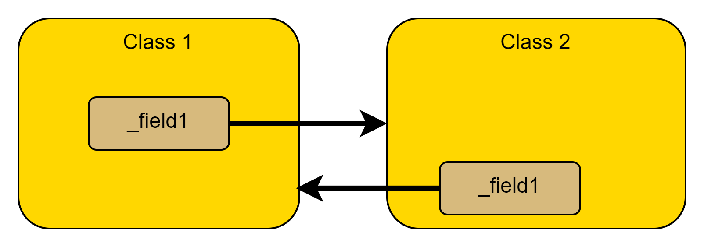
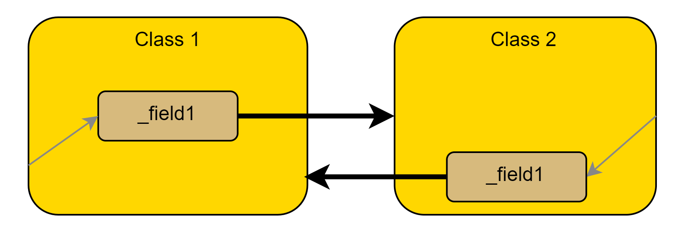
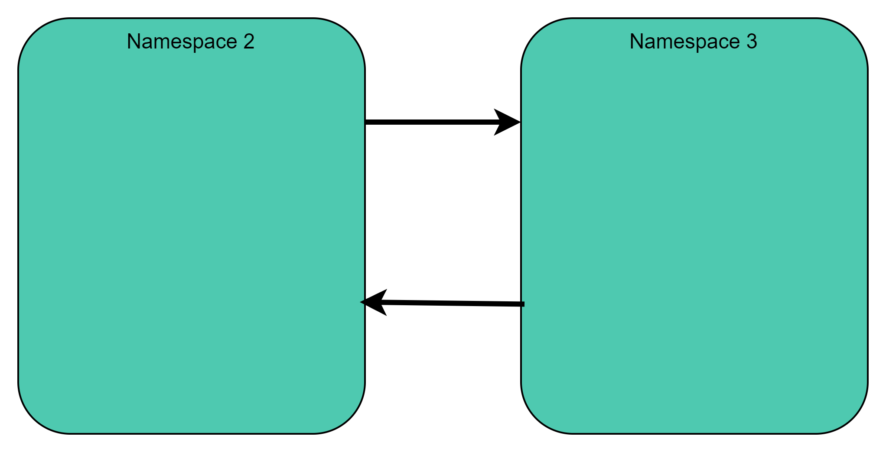

# Cycle detection

## Introduction

The current cycle detection algorithm for code graphs has room for improvement. It becomes slow with larger graphs and may be overly complicated. This document outlines the current approach, its background, and the steps involved in detecting cycles.

## Background

Initially, we attempted to detect cycles between code elements based on dependencies analyzed by the code parser. The naive assumption was that cycles between dependencies would induce cycles in higher-level containers (e.g., classes, namespaces). 

The two classes reference each other by their fields and form a class cycle. If the classes are in different namespaces there would be a cycle between the namespaces. The dependency arrows would cross the namespace boundaries.

The algorithm could do this automatically if we include the parent-child relationships in the search graph.

However other situations do not automatically connect all related elements. In the image below there is no cycle formed, even by including the parent-child relationships.

Adding artificial **is-child-of** dependencies would cause cycles everywhere. 

Therefore the current algorithm does some transformation, searches cycles in a search graph, and at the end transforms everything back to a code graph.

## Solution (V1)

### Step 1 - Code graph

Assume the following code graph is extracted from the source code.

There is a cycle between **Namespace 2** and **Namespace 3,** caused by **Method 1** calling **Method 2** and **_field1** holding a reference to **Class 1.**

### Step 2 - Building a search graph

I create a search graph that includes all code elements from the original code graph but omits dependencies and parent-child relationships. Instead, for each dependency in the code graph, we calculate a proxy dependency between the highest involved code elements.

Process:

1. For each dependency, identify the chain of code elements up to the Assembly node for both the source and target elements.
2. Starting at the top level, remove the shared code elements **including** the least common ancestor.
3. Create a proxy dependency between the remaining highest-level elements in the search graph.

Here is what the search graph looks like:

Assume the call from **Method 1** to **Method 2.** The least common ancestor is **Namespace 1**, which is excluded. This results in **Namespace 2** and **Namespace 3** being the highest involved code elements in this **call** dependency.

### Step 3 - Finding strongly connected components (SCCs) in the search graph

This is done via Tarjan's Algorithm, a standard algorithm for this problem. Tarjan's algorithm finds all strongly connected components in a graph. These are subgraphs where a path exists between any two nodes. If cycles exist they are restricted to the SCCs. It is possible however that more than one elementary cycle is contained in an SCC. Thats fine.

### Step 4 - Transforming the SCCs back to code graphs

In this step, we have to undo the original transformation

For each SCC found:

1. Create a new code graph including all code elements in the SCC.
2. Replace proxy dependencies with the original dependencies from the code graph that caused them. So one proxy dependency may get expanded to multiple dependencies from the original graph.
3. Add any additional code elements (methods, fields, etc.) that are the source or target of the added dependencies.

That's the basic idea.

However, some edge cases need to be covered. These have to do with cycles with inner elements.

### Handling containment edge cases

Assume the following code graph. Here we have a namespace cycle between **Namespace 1** and **Namespace 2**, an inner and an outer namespace.

**Class 2** in outer **Namespace 1** depends on **Class 1** in inner **Namespace 2**.

**Class 1** in inner **Namespace 2** depends on **Class 2** in outer **Namespace 1.**

#### Handling containment in step 1

In the given scenario, **Namespace 1** is identified as the least common ancestor of the cycle. In the base scenario described above we remove this container. However, we cannot do this in this scenario. We cannot remove the least common ancestor because it is involved in the cycle.

Now, when we exclude the least common ancestor we end with a proxy dependency between a class and a namespace. If this happens we also include the parent namespace of the class such that the proxy dependency is between equal containers. Here: **Namespace 1** and **Namespace 2**.

**Note 1:**  

If **Class 2** was contained in **Namespace X** then we are in the base case again. The proxy dependency would be between 
**Namespace X** and **Namespace 2**.

**Note 2:** 

This also means if there is a class cycle inside the namespace cycle we choose the namespace cycle. The class cycle is later not shown separately. It is part of a larger strongly connected component where everything is glued together.

#### Handling containment in step 4

In the base case, when expanding a proxy dependency, we would gather all children (including self) of the source and target and take all dependencies between them. However, if one namespace is contained within another we have to restrict the dependencies we consider. In the example provided the "unrelated namespace" and none of its children should be included the resulting code graph.

Assume the proxy source is **Namespace 2** and the proxy target is **Namespace 1**. We have a dependency from the inner to the outer code element.

1. For the inner code element proceed as in the base case. Retrieve all children of **Namespace 2**, including self. This is the set of valid sources $S$ (blue).
2. For the outer code element (the target in this case), select itself and all children with a **lower container type** as the starting point. This means: if the outer code element is a namespace, include all the types in this namespace but not other namespaces. Expand this collection of code elements to include all children. Let's call this set $C$. Therefore, the set of valid targets is $T = C/S$ (green). 

Following this procedure, only the green elements in the image below are considered valid targets for resolving the proxy dependency.

**Note 3:**

The set difference operation is necessary because the sources should not be included in the targets, as **Namespace 2** is a child of **Namespace 1**.

### Other edge cases

In the previously discussed scenario, namespaces play a crucial role. Is it possible to recreate the same example using classes and subclasses, considering that they are also containers? No, it's not possible. Classes, or types in general, are not distinguishable from one another. As a result, we cannot replicate the example using classes. In this algorithm there is only one exceptional case to consider, which involves a namespace containing a type and a nested namespace with code elements that interact with that type. Consequently, I believe that the algorithm can be simplified in the next version.

Assume following scenario:

The outer class is removed as least common ancestor and we end up with two classes involved. No special handling. 

The proxy dependencies are between **DirectClass** and **MiddleClass**.

The resulting cycle looks like this

## Conclusion

While the current algorithm successfully detects cycles in code graphs, there is room for optimization in terms of performance and simplicity.