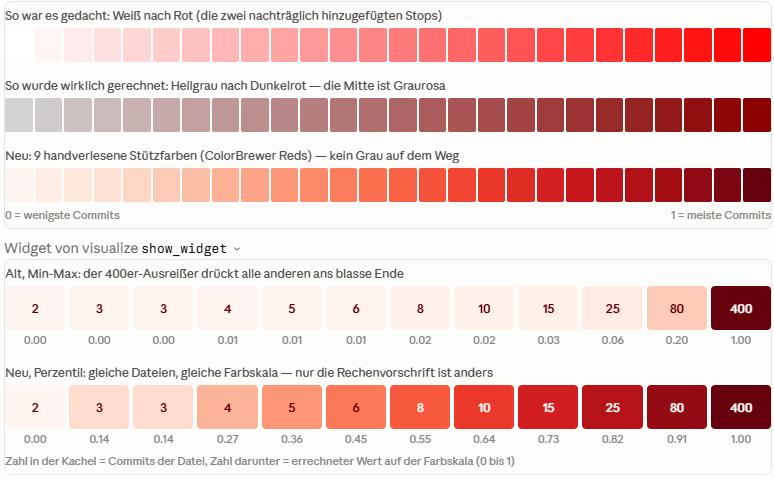

# Code Review 2026-07-09

## Lines of code counter

**Review-Fazit:** Der Scanner-Kern ist aus meiner Sicht solide — die Zustandsmaschine, die Escape-Strategien und die Delimiter-Arithmetik sind korrekt, und die dokumentierten Konventionen (Blank vor Region, Code vor Kommentar) sind konsistent umgesetzt. Drei Punkte habe ich gefunden, die ich **nicht** angefasst habe, weil du erst dein Okay geben sollst:

1. **Echter Bug:** In `LinesOfCodeProvider.cs:128` filtert `AnalyzeDirectory` nur nach `_fileTypes` — ein per `RegisterCustomProvider` registrierter Handler für eine Extension, die *nicht* in den FileTypes steht (z. B. `.rs`), wird nie aufgerufen, die Dateien werden stillschweigend übersprungen. Fix: `_fileTypes.ContainsKey(ext) || _handlers.ContainsKey(ext)`.
2. **Randfall:** `@"""text"` (Verbatim-String, der mit einer escaped Quote beginnt) wird als Raw String geparst, weil der Raw-String-Eintrag kein `RequiresPrefix` hat, das ein vorangehendes `@` ablehnt. Die Region schließt dann falsch und Folgezeilen werden fehlklassifiziert.
3. **Trade-off:** XML/HTML nutzen `EscapeStyle.Backslash`, obwohl es dort kein Backslash-Escaping gibt (`Path="C:\Temp\"` hält den String offen), und ein Apostroph in HTML-Fließtext (`don't`) öffnet eine nie schließende Single-Quote-Region, die nachfolgende `<!-- -->`-Kommentare als Code zählt. Für XML/HTML wäre `EscapeStyle.None` sicherer.

**Erweiterung umgesetzt** in `LinesOfCodeFileTypes.cs`:

- **`.java`** — `//`, `/* */`, Text Blocks (`"""` mit Backslash-Escaping, vor dem Plain-String-Eintrag), Strings/Chars.
- **`.ts`** — teilt sich die Instanz mit `.js` (gleiche Syntax auf dieser Detailebene; gleiches Muster wie `.htm`/`.html`).
- **`.css`** — nur `/* */`; bewusst kein `//` (ist in Standard-CSS kein Kommentar), Strings mit Backslash-Escaping laut CSS-Spec.

Was geändert wurde:

1. **Custom-Handler-Filter** (`LinesOfCodeProvider.cs:127`): `AnalyzeDirectory` akzeptiert jetzt auch Dateien, deren Extension nur in `_handlers` registriert ist. Ein `RegisterCustomProvider(".rs", ...)` funktioniert damit auch ohne eingebauten FileType. Test: legt ein Temp-Verzeichnis mit einer `.rs`-Datei an und prüft, dass der Handler aufgerufen wird.
2. **`@"""`-Kollision** (`LinesOfCodeFileTypes.cs`): Der Raw-String-Eintrag hat jetzt `RequiresPrefix = (line, i) => !IsVerbatimStringPrefix(line, i)` — nach `@`, `$@` oder `@$` kann es kein Raw String sein (die Sprache erlaubt dort kein `@`-Präfix), also fällt der Match korrekt auf den Verbatim-Eintrag durch. Test: `var s = @"""escaped start";` gefolgt von einem echten Kommentar.
3. **XML/HTML-Escaping**: Neue geteilte Styles `XmlDoubleQuoteString`/`XmlSingleQuoteString` mit `EscapeStyle.None` — ein `Path="C:\Temp\"` schließt jetzt korrekt an der letzten Quote. Zusätzlich hat HTML keine Single-Quote-Region mehr, damit Apostrophe im Fließtext (`don't`) keine nie schließende Region öffnen, die nachfolgende `<!-- -->`-Kommentare verschluckt. XML behält beide Quote-Regionen (Attribute mit `'...'` sind dort üblich und in der Regel gepaart). Beides mit eigenem Test.

## TreeMapView Darstellung

### Warum die Farben stumpf wirken

**1. Der Gradient ist nicht der, den du glaubst definiert zu haben.** In `DefaultDrawingPrimitives.cs:22` erzeugt der Konstruktor `new LinearGradientBrush(Colors.LightGray, Colors.DarkRed, ...)` bereits zwei GradientStops (LightGray@0, DarkRed@1). Danach fügst du White@0 und Red@1 *zusätzlich* hinzu — die Collection hat also vier Stops. `GetRelativeColor` nimmt per `First(...)` den jeweils *ersten* Stop bei Min-/Max-Offset, und das sind die Konstruktor-Stops. Effektiv interpolierst du **LightGray → DarkRed**; die White/Red-Stops sind toter Code. Eine lineare Interpolation von einem neutralen Grau in ein dunkles Rot läuft zwangsläufig durch entsättigte, graubraune Mauve-Töne — exakt das "Stumpfe und Trübe" auf deinem Screenshot.

**2. Grau→Rot ist auch konzeptionell nicht ideal.** Die übliche Regel für Magnitude-Skalen: *ein* Farbton, hell→dunkel, mit durchgehend vorhandener Sättigung — oder eine mehrstufige, wahrnehmungsoptimierte Rampe. Der Klassiker für Hotspots ist **Hellgelb → Orange → Tiefrot** (ColorBrewer "YlOrRd") oder eine reine Rot-Rampe ("Reds": warmes Fast-Weiß `#FFF5F0` → sattes `#99000D`). Beide sind farbfehlsichtigkeits-getestet und haben keine trübe Mitte. Das Schöne: `GetRelativeColor` unterstützt bereits beliebig viele Stops — der Fix ist eine reine Datenänderung in `DefaultDrawingPrimitives`, kein neuer Code.

**3. Der größere Hebel ist aber die Normalisierung, nicht die Farben.** `HotspotNode.cs:140` macht Min-Max-Normalisierung, und Hotspot-Scores sind extrem schief verteilt — dein Tooltip zeigt `Hotspot: 0.00097`. Ein einzelner Ausreißer bekommt Rot, und 95 % der Kacheln landen im untersten Prozent der Skala, also alle im fast gleichen Blassgrau. Deshalb sieht die Map so uniform aus. Selbst die perfekte Farbrampe ändert daran nichts. Abhilfe: vor der Normalisierung eine **Wurzel- oder Log-Transformation**, oder gleich **Rang-/Perzentil-Mapping** (der Median liegt dann in der Mitte der Rampe). Damit bekämst du sichtbare Abstufung über die ganze Map.

### Tooltip

Auch hier stimme ich dir zu — das wirkt improvisiert. Konkret (`TreeMapView.xaml:22`): nackter `TextBlock`, `Background="Yellow"`, `Opacity="0.7"`. Drei Probleme:

- `Opacity` auf dem Element macht auch den **Text** halbtransparent — das kostet direkt Lesbarkeit.
- Kein Padding, kein Rand, keine Rundung — der Text klebt an der Kante.
- Gelb kollidiert semantisch mit deinem `HighlightBrush` (ebenfalls Yellow): Der Nutzer kann Tooltip und Hervorhebung verwechseln.

Professioneller Standard wäre: opakes Tooltip als `Border` — z. B. dunkler Hintergrund (`#2D2D30`, weiße Schrift) oder Weiß mit 1px grauem Rand — 8–10px Padding, 3–4px Eckenradius, dezenter Schlagschatten, und den Inhalt strukturiert (Dateiname fett in der ersten Zeile, darunter Commits/LOC/Hotspot als Label-Wert-Paare statt vier gleichförmiger Textzeilen).

### Kleinigkeit am Rande

`GetBrush` erzeugt pro Kachel und Renderdurchlauf einen neuen `SolidColorBrush` und `GetRelativeColor` macht pro Aufruf mehrere LINQ-Durchläufe — es gibt ja schon einen `BrushCache`, der hier ungenutzt bleibt. Bei deinen Kachelzahlen unkritisch, aber wenn du eh dran arbeitest, günstig mitzunehmen.

### Was geändert wurde

**1. Farbrampe** (`DefaultDrawingPrimitives.cs`): Der Gradient ist jetzt eine 9-stufige ColorBrewer-"Reds"-Rampe — warmes Fast-Weiß (`#FFF5F0`) über sattes Orange-Rot bis Tiefrot (`#67000D`). Die Zwischenstops halten die Sättigung über den ganzen Verlauf hoch, dadurch verschwindet die trübe Grau-Mauve-Mitte. Die doppelten/toten GradientStops und der ungenutzte `RedToWhiteGradient` sind entfernt.

**2. Perzentil-Normalisierung** (`HotspotNode.cs`): `NormalizeWeightMetrics` mappt die Leaf-Gewichte jetzt rang-basiert statt min-max — der Median liegt in der Mitte der Farbskala, gleiche Commit-Zahlen bekommen exakt dieselbe Farbe (Average-Rank bei Ties), und der Alle-gleich-Fall liefert 0,5 statt einer Division durch Null. Zusätzlich habe ich die Min-Max-Renormalisierung in der TreeMap-View (`HierarchicalData.cs:380`) gegen Range 0 abgesichert (nach dem Filtern können alle Rest-Leaves gleich gewichtet sein → vorher NaN-Farbe).

**3. Tooltip** (`TreeMapView.xaml`): Opaker dunkler Kasten (`#2D2D30`, helle Schrift) mit 1px-Rand, abgerundeten Ecken, Padding und dezentem Schlagschatten — keine Transparenz auf dem Text mehr, kein Gelb (das kollidierte auch semantisch mit dem gelben Highlight).

**Nebenbei:** Der Renderer nutzt jetzt den vorhandenen `BrushCache` statt pro Kachel einen neuen `SolidColorBrush` zu erzeugen.

### Was du sehen wirst

Der Gesamteindruck ändert sich deutlich: Statt "fast alles blassgrau, eine rote Kachel" bekommst du eine echte Heat-Abstufung über die ganze Map — die Hälfte der Dateien liegt farblich unterhalb, die Hälfte oberhalb der Rampenmitte. Beachte die geänderte Semantik: **Die Farbe kodiert jetzt den Rang (Perzentil) der Commit-Anzahl, nicht mehr die absolute Größe.** Die zweitheißeste Datei bekommt fast das gleiche Rot wie die heißeste, auch wenn sie absolut viel weniger Commits hat. Für "Welche Dateien soll ich mir zuerst anschauen?" ist das genau richtig; falls du lieber Größenverhältnisse sehen willst, wäre eine Wurzel-/Log-Skalierung die Alternative — lässt sich in `NormalizeWeightMetrics` leicht austauschen.

**Der Preis der Perzentil-Methode** — damit du die Entscheidung bewusst mittragen kannst: Die Farbe zeigt jetzt nur noch die *Reihenfolge*, nicht mehr die *Abstände*. In der unteren Zeile sehen die 80er- und die 400er-Datei fast gleich dunkel aus, obwohl die eine fünfmal so viele Commits hat — sie sind eben Platz 11 und Platz 12 von 12. Für die Frage, die eine Hotspot-Ansicht beantworten soll ("welche Dateien soll ich mir zuerst ansehen?"), ist das genau richtig. Wenn dir die Größenverhältnisse wichtiger wären, gäbe es als Mittelweg die Wurzel- oder Logarithmus-Skalierung: Sie staucht große Werte zusammen, erhält aber echte Abstände. Das wäre in `NormalizeWeightMetrics` ein Einzeiler-Tausch — die genauen Zahlen stehen ja im Tooltip, die Farbe muss also nicht alles allein leisten.

Kurz zusammengefasst: Die alte Map war trüb, weil (a) der Verlauf versehentlich durch Grau lief und (b) fast alle Dateien rechnerisch am selben Ende der Skala klebten. Fix (a) macht die einzelnen Farben sauber, Fix (b) sorgt dafür, dass sie auch alle benutzt werden.

Gern — zuerst der Kommentar im Code, dann die Schritt-für-Schritt-Erklärung.

Der Kommentar ist drin ([HotspotNode.cs](https://claude.ai/epitaxy/CSharpCodeAnalyst.History/Analyzer/HotspotNode.cs), direkt vor dem `leaves.Sort`), das Projekt baut. Jetzt die Erklärung der Berechnung — ich gehe den Code von oben nach unten durch, mit einem durchgängigen Beispiel: sechs Dateien mit den Commit-Zahlen **5, 2, 9, 5, 5, 30**.

### Wie die Perzentil-Berechnung funktioniert

**Schritt 1 — Blätter einsammeln (`CollectLeaves`).** Die Methode läuft rekursiv durch den Baum und sammelt nur die Blattknoten ein, also die Dateien. Ordnerknoten haben kein eigenes Gewicht — ihre "Farbe" ergibt sich in der TreeMap ja aus den Kacheln ihrer Kinder. Danach kommen zwei Sonderfälle: keine Blätter → nichts zu tun; genau ein Blatt → es bekommt 1,0, denn eine Rangfolge mit nur einem Teilnehmer ist bedeutungslos.

**Schritt 2 — Sortieren.** Die Blätter werden aufsteigend nach Commit-Zahl sortiert. Unser Beispiel wird zu:

| Position (Rang) | 0    | 1    | 2    | 3    | 4    | 5    |
| --------------- | ---- | ---- | ---- | ---- | ---- | ---- |
| Commits         | 2    | 5    | 5    | 5    | 9    | 30   |

Die Position in dieser sortierten Liste heißt **Rang**. Die Grundidee ist jetzt simpel: Der normalisierte Wert einer Datei ist ihr Rang geteilt durch den höchsten Rang, hier also `Rang / 5`. Die ruhigste Datei bekommt 0/5 = 0, die heißeste 5/5 = 1, und dazwischen verteilt sich alles in gleichmäßigen Schritten — egal, wie krumm die Commit-Zahlen selbst verteilt sind. Deshalb steht im Code `count - 1` im Nenner: bei 6 Dateien ist der höchste Rang 5.

**Schritt 3 — das Gleichstand-Problem.** Mit der simplen Formel hätten die drei Dateien mit je 5 Commits die Werte 1/5 = 0,2, 2/5 = 0,4 und 3/5 = 0,6 — drei verschieden rote Kacheln für identische Daten, und *welche* Datei welchen Wert bekommt, hinge vom Zufall der Sortierung ab. Das darf nicht sein: Gleicher Input muss gleiche Farbe ergeben. Die Lösung: Alle Dateien mit demselben Gewicht bekommen den **Durchschnitt ihrer Ränge**. Die drei 5er belegen die Ränge 1, 2 und 3; der Durchschnitt ist 2; alle drei bekommen 2/5 = 0,4.

Genau das macht die `while`-Schleife im Code: `index` zeigt auf den Anfang einer Gruppe gleicher Werte, die innere Schleife schiebt `last` bis ans Ende der Gruppe (solange der nächste Wert noch gleich ist). Da die Liste sortiert ist, sind die Ränge einer Gruppe immer lückenlos aufeinanderfolgend — der Durchschnitt ist deshalb einfach `(erster + letzter) / 2`, ohne alle aufsummieren zu müssen. Dann bekommen alle Gruppenmitglieder denselben Wert, und `index` springt hinter die Gruppe.

Das komplette Beispiel durchgerechnet:

| Commits | Ränge   | Durchschnittsrang | Wert (÷ 5) |
| ------- | ------- | ----------------- | ---------- |
| 2       | 0       | 0                 | 0,00       |
| 5, 5, 5 | 1, 2, 3 | 2                 | 0,40       |
| 9       | 4       | 4                 | 0,80       |
| 30      | 5       | 5                 | 1,00       |

Nebeneffekt, den du im Test `AllWeightsEqual` siehst: Sind *alle* Werte gleich, ist die ganze Liste eine einzige Gruppe mit Durchschnittsrang `(0 + count−1) / 2`, geteilt durch `count−1` ergibt das immer 0,5 — die Mitte der Farbskala, ganz ohne Sonderbehandlung.

### Die Alternative im Kommentar

Die Tausch-Variante ersetzt den kompletten Rang-Block durch zwei Schritte: erst die alte Min-Max-Formel (Position zwischen kleinstem und größtem Wert), dann `Math.Sqrt` auf das Ergebnis. Die Wurzel hebt kleine Werte an und lässt große fast unverändert: aus 0,04 wird 0,2, aus 0,25 wird 0,5, aus 0,81 wird 0,9. Damit bleiben die echten Größenverhältnisse sichtbar (doppelt so viele Commits ist dunkler, 400 ist klar dunkler als 80), aber das blasse Ende wird entzerrt. Zum Vergleich mit konkreten Zahlen aus dem 2-bis-400-Beispiel von vorhin, für die Datei mit 10 Commits: Min-Max pur 0,02 → mit Wurzel 0,14 → mit Logarithmus (die härtere Stauchung, steht auch im Kommentar) 0,37 → Perzentil 0,64. Du siehst die Abstufung: Je weiter rechts, desto mehr "Gerechtigkeit" für die kleinen Werte, desto weniger Information über die tatsächlichen Abstände.

Beim Ausprobieren beachte: Die Wurzel-Variante erbt die Ausreißer-Empfindlichkeit von Min-Max — *ein* extremer Ausreißer staucht weiterhin alle anderen, nur milder. Wenn dein Repository so einen hat (und `df4ff64`-artige Hotspot-Daten haben fast immer einen), wird die Map merklich blasser aussehen als jetzt. Die Log-Variante liegt dazwischen und ist bei Commit-Daten meist der bessere Kompromiss, falls dir Perzentil zu "flach" vorkommt.