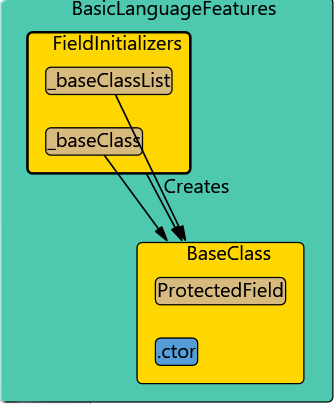

# Corrections and updates

## Field initializers

Constructors may be called as part of a field initialization.

It looks strange if we add a constructor invocation to a field. When a field is initialized we do not have a calling method.

Therefore I handle this case as shown in the image:

- I add two "uses" relationships from the field to the created class. (Field type and type of created class)

- I move the "creates" relationship up to the containing class.

```
public class FieldInitializers
{
    private BaseClass _baseClass = new BaseClass();

    private static List<BaseClass> _baseClassList = [new()];
}
```




## Implicit object creation

```
new()
new Class(); 
```

**new()** is ImplicitObjectCreationExpressionSyntax, **new Class()** is ObjectCreationExpressionSyntax.

But both expressions derive from BaseObjectCreationExpressionSyntax

They are different cases in the MethodBodyWalker, but I can handle them in the equally.


## Lambdas

Lambdas inside a method are treated special. The method gets a "uses" relationship to all types in the lambda.

However method call are not considered. This is because I know that the method depends on these but when the lambda is actually called is unknown.

That would mean to analyze the code flow.