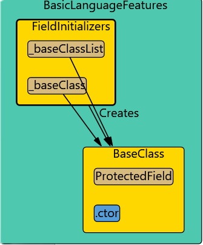

# Corrections and updates

## Field initializers

Constructors may be called as part of a field initialization.

It looks strange if we add a constructor invocation to a field. When a field is initialized we do not have a calling method.

Therefore I handle this case as shown in the image:

- I add two "uses" relationships from the field to the created class. (Field type and type of created class)

- I move the "creates" relationship up to the containing class.

```
public class FieldInitializers
{
    private BaseClass _baseClass = new BaseClass();

    private static List<BaseClass> _baseClassList = [new()];
}
```




## Implicit object creation

```
new()
new Class(); 
```

**new()** is ImplicitObjectCreationExpressionSyntax, **new Class()** is ObjectCreationExpressionSyntax.

But both expressions derive from BaseObjectCreationExpressionSyntax

They are different cases in the MethodBodyWalker, but I can handle them in the equally.

## Lambdas

Lambdas inside a method are treated specially. The method that creates the lambda gets a "uses" relationship with all types in the lambda. It needs to know these types to make the lambda.
However, method calls in the lambda are not considered. This is because I don't know when the lambda is actually invoked.
That would mean to analyze the code flow.

(Method and constructor *references* inside a lambda do get `Uses` edges - see *Object creation inside lambdas* below. Only a `Calls` edge is never asserted.)

**Nested lambdas** (`() => () => Compute()`) are walked with the same `Uses` semantics: the inner body is "deferred twice", which is still deferred, so nothing changes for the modelling. They used to be skipped entirely, which silently lost every dependency inside the inner lambda.

## Constructors of generic types not detected

The problem was that constructors are never generic in C#. 

So **ISymbol.IsGeneric** returns always false. But for Generics we need the **OriginalDefinition** found in Phase 1.

TestCase in TestSuit: GenericUtilities.GenericPair in TestSuite.

## Property accessors (get/set split)

A property is a single symbol to Roslyn, but merging its getter and setter onto one node in the dependency graph creates **phantom cycles**: if type A only *reads* `B.Value` while type B only *writes* `A.Other`, the merged property nodes carry edges that never occur together. Cycle detection then reports a cycle that does not actually exist, because in reality the getter and the setter are independent.

To fix this each property is split into separate `get_Prop` / `set_Prop` accessor nodes. This is gated behind the `SplitPropertyAccessors` parser option (on by default, because cycle accuracy is the main goal).

### The Roslyn side: the symbol does not tell you get vs set

When code accesses a property — `obj.Prop` or `Prop = x` — `GetSymbolInfo` returns the **`IPropertySymbol`**, never the accessor method. The information "this is a getter access" or "this is a setter access" is not part of the bound symbol; on the semantic level a property access is a single unit. The accessor methods only exist as `propertySymbol.GetMethod` / `SetMethod` (each an `IMethodSymbol` named `get_Prop` / `set_Prop`), and the split into two methods happens later, at IL generation.

So we have to combine semantic and syntactic information:

```
obj.Prop = x
   │
   ├─ GetSymbolInfo  → IPropertySymbol            (which property?)
   └─ Classify(node) → Write                       (get or set?)
        │
        └─ Lookup propertySymbol.SetMethod.Key()  → node "set_Prop"
```

### Classifying read vs write is purely syntactic - and small

`PropertyAccessClassifier` decides get / set / both from the syntax position alone, no semantic model needed. The key simplification: **C# does not allow passing a property by `ref` / `out`** (CS0206). That leaves only three write contexts; everything else is a read:

- assignment target `Prop = x` → setter
- compound assignment / increment `Prop += 1`, `Prop++`, `--Prop` → getter **and** setter (read-modify-write)
- everything else (`x = Prop`, `M(Prop)`, `Prop.Field`, ...) → getter

Because a property can never be a `ref`/`out` argument, "is the node the left side of an assignment or the operand of `++`/`--`?" is all we need to look at.

### How it is wired into the two phases

- **Phase 1** creates the `get_` / `set_` child nodes from `GetMethod` / `SetMethod` (symbol-based, so auto-properties, indexers and synthesized record accessors are covered too) and maps each accessor's `Key()` so phase 2 can resolve it. The accessor symbols are deliberately **not** added to the phase-2 work list (`ElementIdToSymbolMap`): the property container drives body analysis and routes each accessor body to its node. Adding the accessor symbol there as well would make phase 2 walk the bodies a second time.
- **Phase 2** routes outgoing edges (the accessor body) to the matching accessor node, and incoming property accesses to `get_` / `set_` based on the classifier. If no internal accessor node exists (external property), it falls back to a relationship to the property / containing type as before.
- **Implements / Overrides** are modeled at the accessor level (a getter implements/overrides a getter, a setter a setter), mirroring how methods work. This keeps the "follow incoming calls" abstraction walk and the cycle classifier treating accessors exactly like methods.

Now a pure read and a pure write of the same property end up on different nodes, and the phantom cycle disappears. The algorithms (Tarjan SCC, the explorer traversal) stay completely transparent to this - they only ever see more nodes and edges.


## `nameof(...)` references are compile-time, not accesses

`nameof(Prop)` looks like it touches the property, but it does not: nameof is a compile-time construct that yields a string. No getter is invoked, nothing is read or written. Yet there **is** a real dependency - it is enforced by the compiler: rename or remove `Prop` without updating the `nameof`, and the code no longer compiles.

So the reference should be modelled, but as a plain `Uses` edge to the **property symbol itself** (the container node), not as a `Calls` to the getter. This is consistent with how fields and methods inside nameof were already handled (`nameof(_field)` → `Uses` field).

Detecting it is purely structural: the path from the referenced name up to the enclosing nameof can only run through member access (for qualified names), the argument and the argument list. `SyntaxExtensions.IsInsideNameOf` walks exactly those, then checks for an `InvocationExpressionSyntax` whose expression is the identifier `nameof` **and** that binds to no symbol - the null-symbol check rules out the pathological case of a real method literally named `nameof`.

Without this the property would be classified as a read and routed to `get_Prop` - a getter call that never happens. (The split only made the issue visible; before it, the same reference was a spurious `Calls` to the property container.)


## Object creation inside lambdas

A lambda body is recorded with `Uses` edges, not `Calls`/`Creates`, because we don't know when (or whether) the lambda runs - see *Lambdas* above. For method calls inside a lambda this already produced a `Uses` edge to the **method**. Object creation, however, only recorded a `Uses` to the **type**, never to the constructor:

```csharp
imbalances.Select(i => new EventImbalanceViewModel(i));
```

That left the constructor looking unused - nobody referenced it - even though it is clearly referenced in source.

The fix records the constructor too, as a `Uses` edge (mirroring the method-call case). The model is now symmetric:

|             | type edge     | member edge          |
|-------------|---------------|----------------------|
| normal body | `Creates` → T | `Calls` → `T..ctor`  |
| lambda body | `Uses` → T    | `Uses` → `T..ctor`   |

Both relationships are downgraded from "hard" to "soft" inside a lambda. We deliberately do **not** emit a `Calls` between the constructors (some tools, e.g. NDepend, do): the outer constructor only *builds* the lambda; that `Select` later invokes it is library knowledge the parser does not have. A `Calls` would assert a control-flow edge that does not exist. `Uses` is the honest relationship - a real compile-time dependency (rename/remove the constructor and the lambda no longer compiles) without claiming a run-time call.

Same guard as the normal path (see `AnalyzeObjectCreation`): only explicit, internal constructors get the edge; implicit/primary/external constructors are already covered by the type `Uses`.


## Indexer access (element access expressions)

`store[key]` invokes an indexer - a property spelled with brackets. The declaration side was always modelled (phase 1 creates a `this[]` property element, overload-aware via the parameter list in the symbol key, and phase 2 walks its accessor bodies), but the **usage** side was not: no walker visited `ElementAccessExpressionSyntax`, so no caller ever got an edge to the indexer. Internal indexers always looked unused.

The syntax is tricky in two ways:

1. The conditional form `store?[key]` is **not** an `ElementAccessExpressionSyntax`. Like `obj?.Member` (member binding), the `[key]` part is a separate node type, `ElementBindingExpressionSyntax`, sitting under the `ConditionalAccessExpressionSyntax`. Both node types resolve to the indexer's `IPropertySymbol` via `GetSymbolInfo` and are routed to the same handler (`AnalyzeElementAccess`).
2. Array element access (`_data[i]`) is the same syntax but resolves to **no** property symbol - arrays have no indexer in the C# semantic model. The `IsIndexer` pattern check filters it out naturally.

Since an indexer access *is* a property access, it runs through the exact same routing as identifiers and member accesses: `PropertyAccessClassifier` decides read/write/read-write (`x = store[1]` → getter, `store[2] = v` → setter, `store[3] += 1` → both; the classifier had documented element access as an expected input all along), the accessor split routes to `get_Item`/`set_Item` when enabled (Roslyn names indexer accessors after the metadata name `Item`, not `this[]`), and external indexers fall back to a `Uses` edge to the containing type. In lambda bodies the access is recorded as `Uses` instead of `Calls`, consistent with the lambda modelling above.


## User-defined operators and conversions

Applying an operator is a method call without call syntax. `a + b`, `-a`, `a == b`, `a += b`, an explicit cast `(double)celsius` and even a plain initializer `Celsius c = 21.5;` can all invoke a user-defined operator method (`op_Addition`, `op_UnaryNegation`, `op_Equality`, `op_Explicit`, `op_Implicit`, ...). The declarations were always modelled (phase 1 creates method elements for `OperatorDeclarationSyntax` / `ConversionOperatorDeclarationSyntax` and walks their bodies), but no usage ever produced an edge - user-defined operators always looked unused.

Two different Roslyn APIs are needed, because the two cases are visible in different ways:

1. **The operator is bound to a syntax node.** Binary/unary expressions, compound assignments and explicit casts bind directly: `GetSymbolInfo` on the expression returns the operator as `IMethodSymbol` with `MethodKind.UserDefinedOperator` (operators) or `MethodKind.Conversion` (casts). Built-in operators (`int +`, string concatenation, delegate `+=`) come back as `MethodKind.BuiltinOperator` and are filtered out - they are not code elements. This also naturally keeps the event `+=` handling separate: an event assignment does not bind to a user-defined operator.
2. **The conversion is invisible in the syntax.** An *implicit* user-defined conversion (`Celsius c = 21.5;`) has no node of its own; it hangs on the converted expression and is only reachable via `SemanticModel.GetConversion(expression)` (`IsUserDefined`, `MethodSymbol`). Since checking every expression would be wasteful, the walkers ask exactly at the positions where an implicit conversion can occur: initializers (`EqualsValueClause`), the right side of assignments, `return` values, arguments and expression bodies (`ArrowExpressionClause`). So the field/property initializer walks now start at the `EqualsValueClause` / arrow clause instead of the bare value expression. Not covered (accepted): conversions of operands inside larger expressions (e.g. `money + 5` converting `5`), collection-initializer entries and `foreach` element conversions.

The edge is a normal `Calls` to the operator method, `Uses` inside a lambda body (deferred execution, consistent with the lambda modelling). External operators (decimal arithmetic, `DateTime` subtraction - user-defined in metadata!) take the usual fallback to a `Uses` edge on the containing type when externals are enabled.


## Generic method groups and the Delegate-conversion quirk

Method groups (`Register(HandleString)`) have been modelled for a long time: a `Uses` edge with the `IsMethodGroup` attribute (see `IsMethodGroupReference`). Two holes remained.

**Generic method groups are a different node type.** `Create<Widget>` is a `GenericNameSyntax`, not an `IdentifierNameSyntax`, so `VisitIdentifierName` never fired for it and a standalone generic method group produced no edge at all. `AnalyzeIdentifier` now takes the common base `SimpleNameSyntax` and the walkers visit generic names too. This is safe against double handling: generic names in type positions (`List<Foo> x`) resolve to a type symbol which `AnalyzeIdentifier` ignores, as invocation target (`Create<Widget>()`) the method-group guard rejects it, and the `.Name` of a member access is owned by `AnalyzeMemberAccess` and never visited separately. The type arguments of a generic method group (`Widget` in `Create<Widget>`) are recorded as `Uses`, mirroring the generic handling of invocations - for the qualified form (`Producer.Produce<Widget>`) as well, which previously lost them.

**A method group converted to `System.Delegate` binds to no symbol.** For a `Func<...>`/`Action`-typed position (`Func<Widget> f = Create<Widget>;`) `GetSymbolInfo` returns the method. But when the target type is plain `System.Delegate` (or the conversion goes through the C# 10 natural function type), Roslyn reports `CandidateReason.OverloadResolutionFailure` with the group's members as candidates - **even though the code compiles without errors**. This affected non-generic method groups too (`Register(MakeWidget)` with a `Delegate` parameter silently produced no edge). When the symbol is null and there is exactly one method candidate, the reference is unambiguous and we use the candidate (`SingleMethodGroupCandidate`). A side benefit: in code with real overload-resolution errors (partially loaded solutions), a single-candidate reference now still yields its edge instead of nothing.

## LINQ query syntax

`from value in source where value > Threshold() select Shift(value)` is compiled into
`source.Where(value => ...).Select(value => ...)` - method calls and lambdas that never appear in the
syntax tree. No walker looked at query clauses, so two things were wrong: the implicit query-pattern
calls (`Where`, `Select`, `OrderBy`, `Join`, `Cast`, ...) were never recorded, and the clause
expressions ran through the normal method-body walker, giving `Threshold()`/`Shift(...)` a `Calls`
edge even though they only execute if and when the query is enumerated.

The modelling mirrors the compiler translation:

- **The query-pattern methods get `Calls` edges** (with `IsExtensionMethodCall` when they bind to an
  extension method). Building the query really does call `Where`/`Select` - deferred is only what
  happens *inside* the resulting sequence. Roslyn exposes the bound methods per clause:
  `GetQueryClauseInfo(clause).OperationInfo` (plus `.CastInfo` for a typed `from Foo x in ...`),
  `GetSymbolInfo(ordering)` for each `orderby` ordering, `GetSymbolInfo(body.SelectOrGroup)` for the
  final `select`/`group by` (empty for a degenerate `select x`), recursively through
  `... into g ...` continuations.
- **The clause expressions get lambda (`Uses`) semantics** - they are lambdas after translation. The
  method-body walker hands the whole query body to a `LambdaBodyWalker`; only the source of the
  *first* `from` clause keeps method-body semantics, because it is evaluated eagerly when the query
  is built. (Simplification: the inner sequence of a `join` is also evaluated at build time but
  currently gets `Uses` like the rest of the body.)
- A query nested inside a lambda is deferred as a whole: there, the operator edges are `Uses` too.
- Sub-queries nested in clause expressions are handled when the lambda walker reaches them, so their
  operators are correctly `Uses`, never `Calls`.

For the typical `IEnumerable` case the operators live in `System.Linq.Enumerable` (external →
fallback `Uses` edge to the containing type when externals are enabled); for a custom query provider
the edges point at the internal `Where`/`Select` implementations.


## Smaller implicit dependencies (batch)

A collection of smaller cases, fixed together. Common theme: the dependency is real and compiler-enforced, but either the syntax node was never visited or the declaration carrying it has no body walk.

**Attribute arguments on classes, properties, fields, events.** `[Handler(typeof(Payload))]` on a *method* was captured, because phase 2 walks the whole method declaration including its attribute lists. Types, properties, fields and events have no such declaration walk - only the `UsesAttribute` edge to the attribute class existed and the `typeof` argument was lost. `AnalyzeAttributeRelationships` now walks the attribute argument list for all non-method symbols (methods stay covered by their declaration walk, so nothing is processed twice).

A consequence worth knowing (observed on the Jellyfin reference repo, accepted deliberately): a **named attribute argument** like `[JellyfinMigrationBackup(JellyfinDb = true)]` runs through the normal property-access classification and therefore yields a `Calls` edge from the decorated element to the attribute's *property* (`JellyfinDb`), classified as a write. That is technically accurate - instantiating the attribute really does set the property - even though no user code spells out the call. We keep it: special-casing attribute arguments to `Uses` would add a context check for little gain, and the edge makes attribute properties visible as used.

**Enum member initializers.** Enum members are deliberately not code elements, but that also meant `enum Level { Highest = Limits.Max }` was never walked. The initializer expressions are now walked with the dependencies anchored on the enum element itself. Note: a member referencing another member of the same enum (`All = A | B`) falls back to the containing type and yields a self-edge - consistent with recursive methods.

**Primary-constructor base-call arguments.** `class Derived() : Base(Helper.DefaultSize())` - the primary constructor has no method element and type declarations have no body walk, so the argument expressions were lost (with a classic `: base(...)` they are part of the walked constructor declaration). The arguments are now walked anchored on the type element, consistent with the primary-constructor parameter types; the call to the base constructor itself gets a `Calls` edge with `IsBaseCall`, same guard as constructor initializers (explicit, internal constructors only).

**Type arguments of constructed generics in expression position.** `Registry<Token>.Instance` - the member edge is found via normalization to `Registry<T>`, but `Token` was lost: the receiver is a `GenericNameSyntax` whose type-argument identifiers resolve to plain type symbols, which the identifier analysis ignores. A constructed generic type named in expression position now records `Uses` edges for its type arguments. In type positions (declarations, casts, creations) the same edges are already produced by the declaration handlers and simply merge.

**stackalloc.** `stackalloc Sample[2]` in expression position (e.g. as an argument) had no handler; the element type is now recorded like an array creation (the expression type `Span<Sample>`/`Sample*` resolves down to the element type). Covers the implicit form `stackalloc[] { ... }` too.

**Compiler-invoked pattern methods.** A deconstruction (`var (x, y) = point;`, including nested patterns and the `foreach (var (x, y) in ...)` form) calls the user-defined `Deconstruct`; a `foreach` calls `GetEnumerator` (or `GetAsyncEnumerator` for `await foreach`). Neither appears as an invocation in the syntax tree; Roslyn exposes them via `GetDeconstructionInfo` and `GetForEachStatementInfo`. Both now get `Calls` edges (`Uses` in lambda bodies). Deliberately **not** recorded: `MoveNext`/`Current`/`Dispose` of the enumeration pattern - they live on the enumerator type and would be noise; the `GetEnumerator` entry point carries the dependency. Pure tuple deconstructions (`(a, b) = (b, a)`) bind no method and produce no edge. All of these route through the same helper as the query-pattern operators (`AddSynthesizedCallRelationship`): extension methods are reduced, generics normalized, externals fall back to the containing type.