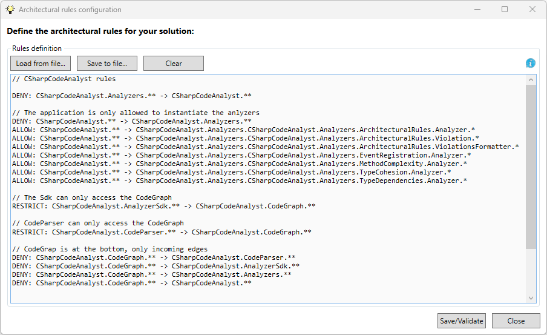
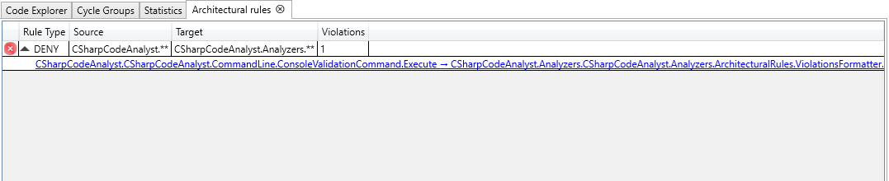

# Validate architectural rules

Codebases tend to decay over time if no one monitors the boundaries. With Architectural Rules, you can define strict guardrails (like "UI must not touch the Data layer") and automatically check your solution for violations.

To set them up, open the **Analyzers** tab in the ribbon and click **Architectural Rules**.



## 1. Dependency Restrictions

These rules control which parts of your application are allowed to talk to each other.

| Rule     | Meaning                                                      |
| -------- | ------------------------------------------------------------ |
| DENY     | Forbids dependencies from source to target.<br />DENY is the only rule that can restrict access to external/third-party code. |
| RESTRICT | Allows **only** the specified target dependencies<br /><br />If multiple `RESTRICT` rules overlap (like `A.**` and `A.B.**`), their allowed targets are merged together. The permitted set widens to the union of the targets. Dependencies to system libraries (like `System.*`) are always allowed automatically. |
| ISOLATE  | Completely isolates the source from external dependencies. Only incoming dependencies are allowed.<br />Dependencies to external code (e.g. System.*) are always allowed. |
| ALLOW    | Defines an architectural exception. An `ALLOW` rule never reports violations on its own. Instead, it suppresses violations triggered by a `DENY` or `RESTRICT` rule. |

## 2. Cycles

| Rule     | Meaning                                                      |
| -------- | ------------------------------------------------------------ |
| NOCYCLES | `NOCYCLES MyApp.Domain`.  Enforces that the specified assembly/namespace and everything below is 100% free of dependency cycles. The path is written without a wildcard. <br /><br />This rule finds cycles that exist between namespaces, unlike MAXCYCLICITY, which measures the plain type graph. <br /><br />If a cycle is found, it reports the same group name as used in the Cycles view, where you can analyze it further. A cycle that lies only partly below the named element is not reported by this rule; write the rule on a higher element to catch it.<br /><br /> ALLOW exceptions do not apply, and violations are not baselined. |

## 3. Metric-based restrictions

**See also [Metrics](Metrics.md)**

A metric rule limits a measured value instead of a dependency. It is written as `RULE = value`. `ALLOW` exceptions never affect it. There are two kinds.

**System metric rules** describe the code base as a whole. They take no pattern.

| Rule         | Meaning                                                      |
| ------------ | ------------------------------------------------------------ |
| MAXCYCLICITY | Limits the total percentage of types entangled in cycles.<br />`MAXCYCLICITY = 15` means at most 15% of all types can be part of a cycle. Measured strictly on the type graph, cycles that only exist between namespaces do not count here. Use NOCYCLES for those. |

When accepting a baseline, a system metric rule gets its threshold raised to the currently measured value, so the rule line is rewritten in place.

**Code element metric rules** limit a metric value of every code element they match.

| Rule     | Meaning                                                      |
| -------- | ------------------------------------------------------------ |
| MAXLINES | Limits the maximum lines of code (LOC) for a single method (excluding blanks/comments).  <br />For example, <br />`MAXLINES: MyApp.Business.** = 50` flags every method in the business layer that is longer than 50 lines.<br />`MAXLINES = 50` limits all methods in the system to 50 lines.<br /><br />*Note: The Lines of Code (LOC) metric for methods currently serves as a built-in example of how element-level metrics are enforced. More metrics will follow.* |

Two metric rules of the same kind never override each other. If `MAXLINES = 50` and `MAXLINES MyApp.Legacy.** = 200` are both present, a 120-line legacy method violates the first rule.

When accepting a baseline, a code element metric rule remains untouched. Lifting its limit to the worst offender would repeal it for every other element. This is not a baseline but a repeal. This is different from the system metric rules.

## How patterns work

The source and target side of a rule is a **full path** in the code graph. It starts with the **assembly name**, followed by namespaces, types etc. If the assembly is named like its root namespace, the name appears twice (e.g. `MyApp.MyApp.Business`). This is intentional and correct.

You don't have to type out long C# paths by hand. Just right-click any element in the tree view or canvas and select **"Copy Full Path"** to get the exact string the rules engine expects.

A pattern can end with a wildcard suffix:

- `MyApp.MyApp.Business` → Matches exactly this specific namespace element.
- `MyApp.MyApp.Business.*` → Matches the element and its *direct* children.
- `MyApp.MyApp.Business.**` → Matches the element and *all* deep descendants.

The part before the wildcard is an **anchor**. It must exactly match the full path of one element (the whole path, not a prefix). The wildcard then expands along the tree. It collects the children of that anchor element, not everything whose name merely starts with the same text. For example, `MyApp.**` matches everything inside the assembly `MyApp` but nothing in a sibling assembly `MyApp.Utils` because that assembly is a separate root in the tree and not a child of the anchor.

The `global` namespace is optional in a pattern
Both spellings therefore resolve to the same element:

```
RESTRICT MyApp.Business.** -> MyApp.Data.**
RESTRICT MyApp.global.Business.** -> MyApp.global.Data.**
```
## Examples

In these examples, the assembly is called `MyApp` and contains the namespaces `Business`, `Data`, ... directly — so the paths start with `MyApp.Business`, not with a duplicated name.

```
// Business layer should not access the Data layer directly
DENY MyApp.Business.** -> MyApp.Data.**

// Controllers may only access Services
RESTRICT MyApp.Controllers.** -> MyApp.Services.**

// Core components may not depend on UI
DENY MyApp.Core.** -> MyApp.UI.**

// Keys should be completely isolated. Use ALLOW to define exceptions.
ISOLATE MyApp.Keys.**

// Specific class restrictions
DENY MyApp.Models.User -> MyApp.Data.Database

// Exceptions: the reporting module may access the Data layer
// even though the Business layer as a whole may not
DENY MyApp.Business.** -> MyApp.Data.**
ALLOW MyApp.Business.Reporting.** -> MyApp.Data.**

// At most 15% of all types may sit inside a dependency cycle
MAXCYCLICITY = 15

// The domain - the element and everything below it - must be free of
// dependency cycles, including cycles that only exist between namespaces
NOCYCLES MyApp.Domain

// No method in the business layer longer than 50 code lines
MAXLINES MyApp.Business.** = 50
```

The result of the analysis is shown in the table output for analyzers.

If a pattern does not match any code element (for example due to a typo), the rule has no effect. The analysis reports a warning for every such pattern, making silently dead rules visible.



## Accept a baseline

Introducing rules into an existing codebase is hard. The first check often flags hundreds of violations, making it tempting to give up. The **Accept Baseline** button solves this. It becomes available once validation finds violations. Clicking it freezes the *current* state: every violation turns into an explicit `ALLOW` exception appended to your rules (grouped by the rule it came from). Afterward, the rules are re-validated so you immediately see a clean result.

After that, only new violations are reported. The existing ones are treated as technical debt you can fix over time. This makes the feature practical for real projects, not just new code. You can start using architectural rules right away without having to fix everything first.

The exceptions are exact paths down to the member level, so a baseline freezes precisely what exists today. Overloaded methods (which share one path) are all covered by the single exception generated for them.

## Remove unused rules

Over time, after refactoring or deleting baselined elements, some rules might no longer match anything. **Remove unused rules** deletes every rule that currently has no effect (its source or target pattern matches no code element). The cleanup is careful: it never removes a rule that still enforces something, so your checks stay strong.

## Command-line

To integrate the tool into a build pipeline, you can call it without a user interface. You can find the syntax of the command-line here:

[Command-line arguments](command-line-arguments.md)