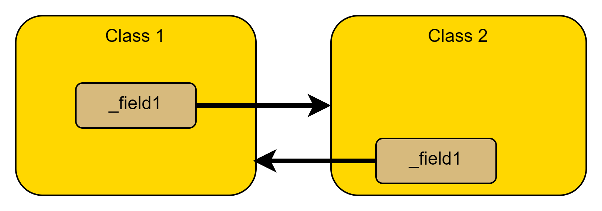
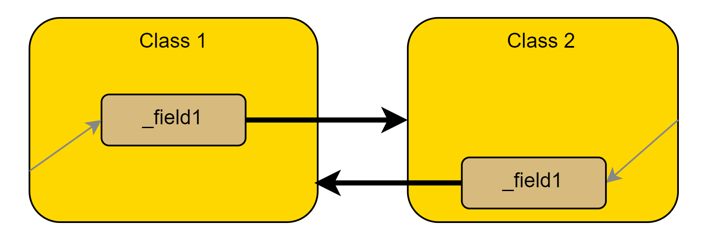
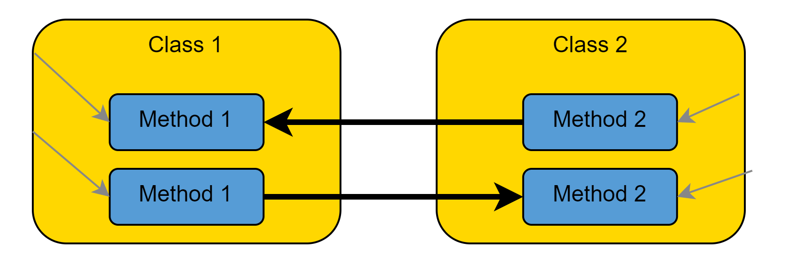
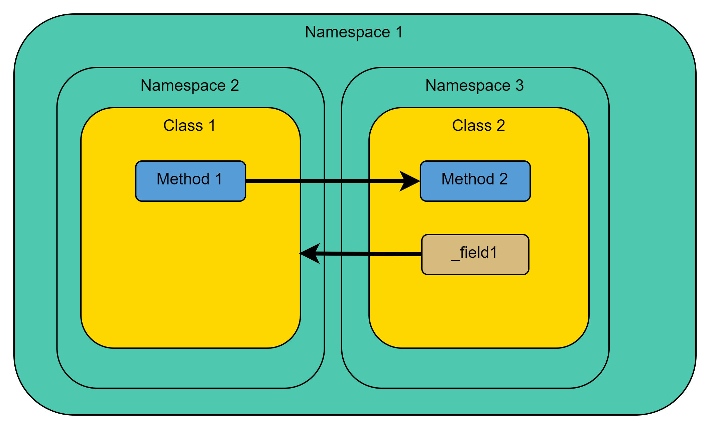
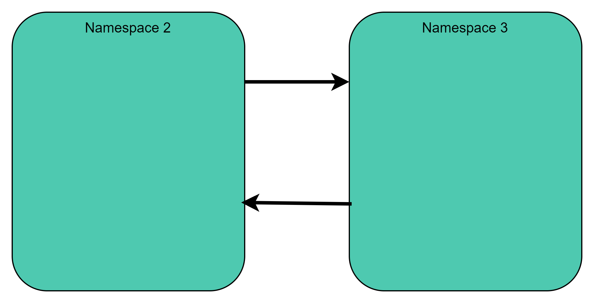
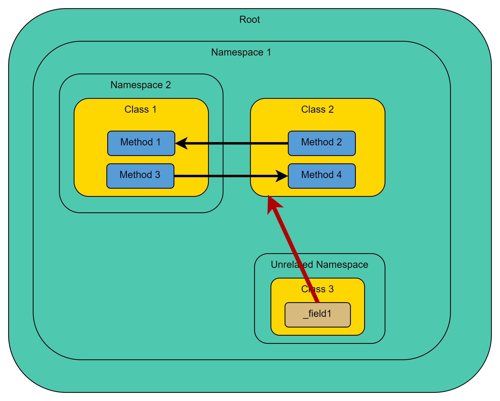
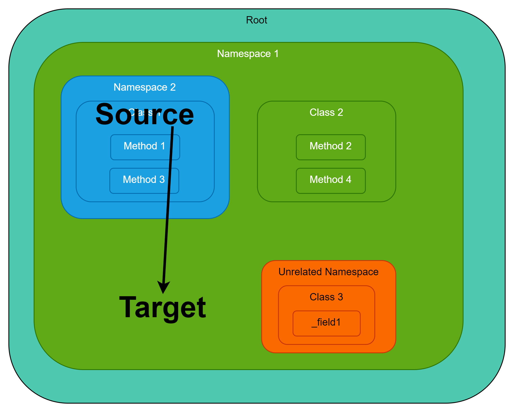
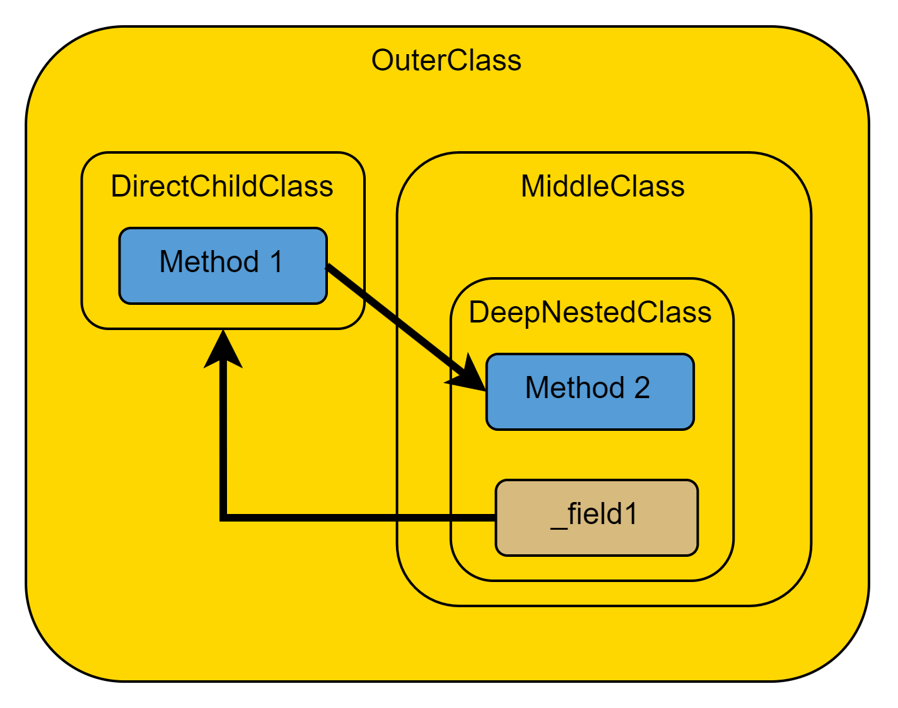
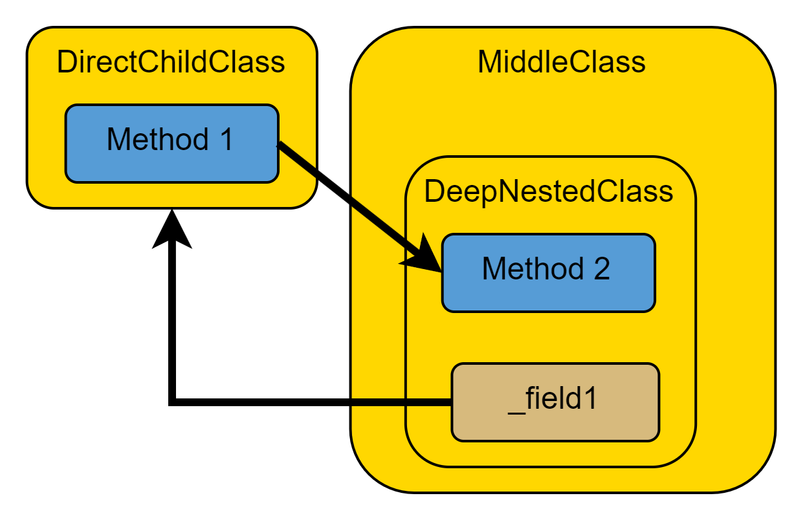

# Cycle detection

## Introduction

The current cycle detection algorithm for code graphs has room for improvement. It may be too complicated. This document outlines the current approach, its background, and the steps involved in detecting cycles.

## Background

Initially, I attempted to detect cycles between code elements based on dependencies analyzed by the code parser. The naive assumption was that cycles between dependencies would automatically induce cycles in higher-level containers (for example, classes, namespaces).

The two classes in the image below reference each other through their fields, forming a class cycle. If the classes are in different namespaces, a cycle would occur between the namespaces. The dependency arrows would cross the namespace boundaries. However, by just following the dependency arrows, there is no cycle between the classes and namespaces.

We could try to repair this by including parent-child relationships in the search graph. (adding "contains" or "is-parent-of" arrows)

However, there are situations when even this is not enough. In the image below, no cycle is formed, even when including the parent-child relationships. However, the methods of the two classes call each other, showing that a class cycle must exist.

An attempt to add additional artificial **is-child-of** dependencies would cause cycles everywhere.

**Therefore, an algorithm that only traverses the edges in the code graph is not practical.** Thus, the current algorithm performs a transformation on the graph to get a search graph. The cycle search is then performed on this search graph, and once completed, the result is transformed back into a code graph.

## Solution (V1)

### Step 1 - Code graph

Assume you extracted the following code graph from the source code.

There is a cycle between **Namespace 2** and **Namespace 3,** caused by **Method 1** calling **Method 2** and **_field1** holding a reference to **Class 1.**

### Step 2 - Building a search graph (base case)

I create a search graph that includes all code elements from the original code graph but omits dependencies and parent-child relationships. Instead, for each dependency in the code graph, we calculate a proxy dependency between the highest-level code elements involved.

Process:

1. For each dependency, identify the chain of code elements up to the Assembly node for both the source and target elements.
2. Starting at the top level, remove the shared code elements, **including** the least common ancestor code element.
3. Create a proxy dependency between the remaining highest-level elements in the search graph.

Here is what the search graph looks like:

Assume the call from **Method 1** to **Method 2.** The least common ancestor is **Namespace 1**, which is excluded. This results in **Namespace 2** and **Namespace 3** being the highest involved code elements in this **call** dependency.

To clarify: The search graph contains all code elements from the original code graph. But dependencies may be replaced by proxy dependencies.

### Step 3 - Finding strongly connected components (SCCs) in the search graph

Finding the strongly connected components in the search graph is done via Tarjan's Algorithm, a standard algorithm for this problem. Strongly connected components are subgraphs where a path exists between any two nodes. If cycles exist they are restricted to the SCCs. It is possible, however, that an SCC contains more than one elementary cycle. That's fine.

### Step 4 - Transforming the SCCs back to code graphs (base case)

In this step, we have to undo the original transformation. 

For each SCC found:

1. Create a new code graph including all code elements in the SCC.
2. For each proxy dependency in the SCC, add all the original dependencies from the code graph that were used to create this proxy dependency. This means finding all dependencies where the source element is contained within (or is) the proxy source, and the target element is contained within (or is) the proxy target. One proxy dependency may expand to multiple original dependencies.
3. Add any additional code elements (methods, fields, etc.) that are the source or target of the added dependencies.

That's the basic idea.

However, some edge cases need to be discussed. These relate to cycles with inner elements.

### Handling containment edge cases

In the given scenario, we identify **Namespace 1** as the least common ancestor of the cycle. In the base scenario described above, we remove this container. However, we cannot simply do this in this scenario because **Namespace 1** is involved in the cycle itself.

#### Handling containment when building the search graph (Step 2)

In the given scenario, we identify **Namespace 1** as the least common ancestor of the cycle. In the base scenario described above, we remove this container. However, we cannot simply do this in this scenario because **Namespace 1** is involved in the cycle itself.

When we exclude **Namespace 1** (the least common ancestor), we're left with a proxy dependency between a class and a namespace—containers at different levels of the hierarchy. To maintain consistency, we need the proxy dependency to exist between containers at the same level. Therefore, we also include **Namespace 2** (the parent namespace of the class), so that the proxy dependency is between **Namespace 1** and **Namespace 2**—two namespaces at the same level.

**Note 1:**  

If **Class 2** is contained in **Namespace X** then we are in the base case again. The proxy dependency would be between **Namespace X** and **Namespace 2**.

**Note 2:** 

If there is a class cycle inside the namespace cycle, we choose the namespace cycle. The class cycle is not relevant in the search graph. It is part of a larger, strongly connected component where everything is glued together.

#### Handling containment when transforming back (Step 4)

In the base case, when expanding a proxy dependency, we collect all children of the source and target (including self) and take all original dependencies between them. However, if one namespace is contained within another, we have to restrict the dependencies we consider. In the example provided, the "unrelated namespace" and none of its children should be included in the resulting code graph.

Assume the proxy source is **Namespace 2** and the proxy target is **Namespace 1**. We have a dependency from the inner to the outer namespace.

1. For the inner code element, proceed as in the base case. Retrieve all children of **Namespace 2**, including self. These code elements are the set of valid sources $S$ (blue).
2. For the outer code element (the target in this case), select itself and all children with a **lower container type** as the starting point. This means that if the outer code element is a namespace, include all types in this namespace but not those in other namespaces. Expand this collection of code elements to include all children. Let's call this set $C$. Therefore, the set of valid targets is $T = C/S$ (green). 

   The set difference operation ($C$ without $S$) to get the valid targets is necessary because the sources should not be included in the targets, as **Namespace 2** is a child of **Namespace 1**.

Following this procedure, only the green elements in the image below are considered valid targets for resolving the proxy dependency.

### Other edge cases

In the previously discussed scenario, namespaces play a crucial role. Can we recreate the same example using classes and subclasses, considering that they are also containers? No, it's not possible. Classes, or types in general, are not distinguishable from one another. As a result, we cannot replicate the example using classes. In this algorithm, there is only one exceptional case to consider, which involves a namespace containing a type and a nested namespace with code elements that interact with that type. I believe that the algorithm can be simplified.
Assume following scenario:

The outer class is removed as least common ancestor and we end up with two classes involved. No special handling.

The proxy dependencies are between **DirectClass** and **MiddleClass**.

The resulting cycle looks like this:

## Conclusion

While the current algorithm successfully detects cycles in code graphs, there is room for optimization in terms of simplicity. However, after using it for a while, I found that it is performant even with larger code bases.