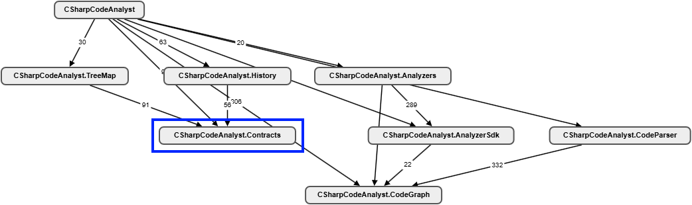

# DSMs lesen

## Was eine Dependency-Matrix über ein System verrät

Viele Tutorials erklären, was eine Zelle bedeutet, und hören dann auf. Dieses Tutorial geht den Schritt weiter: Es zeigt, welche *Muster* in einer DSM stecken, wie man sie systematisch findet, und was sie über die Architektur aussagen.

Alle Beispiele beziehen sich auf diese Konvention:

> **Eine Zahl in Zelle (Zeile R, Spalte C) bedeutet: C hängt von R ab. C benutzt R.**

Daraus folgen zwei Leserichtungen, die du dir einprägen solltest, bevor du irgendetwas anderes tust:

* **Eine Zeile quer lesen** beantwortet die Frage: *„Wer benutzt mich?"* Das ist der Fan-in, die afferente Kopplung. Eine volle Zeile heißt: Dieses Element trägt viele andere auf den Schultern.
* **Eine Spalte herunterlesen** beantwortet die Frage: *„Was benutze ich?"* Das ist der Fan-out, die efferente Kopplung. Eine volle Spalte heißt: Dieses Element greift überall hin und hängt deshalb von allem anderen ab.

Die meisten DSM-Tools sortieren die Zeilen so, dass Konsumenten oben stehen und Producer unten. Diese Sortierung wird gleich noch wichtig.

Achtung: Etwa die Hälfte der Literatur verwendet die gespiegelte Konvention (Zeile hängt von Spalte ab). Wenn dir ein Tutorial „unlogisch" vorkommt, prüfe zuerst die Konvention. Alles Folgende ist konsequent in *dieser* Konvention geschrieben.

---

## 1. Der erste Blick: Die Gestalt der Matrix

Bevor du einzelne Zellen liest, tritt einen Schritt zurück und betrachte die Matrix wie ein Bild. Kneif die Augen zusammen. Die Gesamtgestalt verrät mehr als jede Einzelzahl.

**Das Dreieck.** Eine gesunde, geschichtete Architektur lässt sich so sortieren, dass alle Einträge auf *einer* Seite der Diagonale liegen. In unserer Konvention und mit der üblichen Sortierung (Konsumenten oben, Fundament unten) heißt das: Alle Einträge liegen im **unteren linken Dreieck**. Jeder Eintrag dort sagt: Ein weiter oben stehendes Element benutzt ein weiter unten stehendes. Die Abhängigkeiten fließen wie Wasser nur bergab.

Die Matrix oben ist dafür ein Bilderbuchbeispiel: Sämtliche Einträge liegen unterhalb der Diagonale. Auf Assembly-Ebene ist das System **zyklenfrei und sauber geschichtet**. Genieße den Anblick kurz, bevor wir gleich diskutieren, warum das noch nicht das Ende der Analyse ist.

**Die Blockdiagonale.** Das zweite gesunde Muster: dichte Blöcke entlang der Diagonale (viel Kommunikation *innerhalb* von Modulen), dazwischen wenige, gezielte Einträge (wenig Kommunikation *zwischen* Modulen). Das ist die visuelle Definition von „hohe Kohäsion, lose Kopplung". Wenn deine Matrix hierarchisch ist (Namespaces aufklappbar), siehst du das erst beim Aufklappen: Innerhalb von `DsmViewer.ViewModel` darf es wimmeln, zwischen `ViewModel` und `CodeParser` sollte gähnende Leere herrschen.

**Der Sternenhimmel.** Das kranke Gegenstück: Einträge gleichmäßig über die ganze Fläche verstreut, ohne erkennbare Struktur, auf beiden Seiten der Diagonale. Jedes Element redet mit jedem. Ein solches System hat keine Architektur, es hat nur Code. Wenn deine Matrix so aussieht, brauchst du keine Feinanalyse mehr — dann ist die erste Maßnahme, überhaupt Schichten zu etablieren.

Merksatz für den ersten Blick: **Ein gesundes System sieht in der DSM langweilig aus.** Dreieck, Blöcke, viel Weißraum. Alles, was das Auge sofort anzieht — Ausreißer im oberen Dreieck, Quadrate, Kreuzmuster, einsame Zahlen weit weg von allem — ist ein möglicher Befund.

Anmerkung:
In **C# Code Analyst** werden aufgeklappte Module als farblich abgestufte Quadrate entlang der Diagonalen dargestellt. Das dient der Lesbarkeit. Jede Abstufung eine Verschachtelungsebene. Die eigentlichen Abhängigkeiten sind die einzelnen Einträge bzw. Punkte in einer Zelle, und manche Färbung trägt Zusatzinformation (z. B. zyklusbeteiligte Zellen). Aus der Hierarchie-Färbung liest du also Modulgrößen und Verschachtelungstiefe, **nicht** Kopplung oder Kohäsion.

---

## 2. Schichten ablesen

Die Sortierung, die das Dreieck erzeugt, heißt Triangularisierung; viele DSM-Tools sprechen schlicht von Sortierung und machen das per Knopfdruck. Danach kannst du die Schichten direkt ablesen.

Eine Schicht besteht aus Elementen, die sich **nicht** gegenseitig benutzen. In der Matrix findest du sie so: Gehe die Zeilen von oben nach unten durch und suche Gruppen benachbarter Elemente. Wenn der Schnittbereich dieser Elemente (ihr Quadrat auf der Diagonale) leer ist, bilden sie eine Schicht. Die leeren Zellen bedeuten schlicht: Kein Mitglied benutzt ein anderes Mitglied. Was diese Elemente außerhalb des Quadrats treiben — wer sie benutzt, was sie benutzen — spielt für die Schichtfrage keine Rolle. Da keine Abhängigkeit zwischen den Mitgliedern besteht, erzwingt auch nichts ihre Reihenfolge. Man könnte sie beliebig untereinander vertauschen, und die Matrix bliebe unteres Dreieck.

Beispiel aus der Matrix (rot): `CodeParser` (387), `Analyzers` (416), `TreeMap` (480) und `History` (527). Jede dieser Zeilen hat Einträge im Rest der Matrix (alle vier werden z.B. von der Anwendung benutzt). Aber im 4×4-Diagonalquadrat, wo die vier *sich gegenseitig* treffen würden, steht nichts. Vier unabhängige Features auf gleicher Höhe — das ist eine Schicht. Der Gegenfall steht direkt darüber: `View` (215) und `ViewModel` (265). In deren 2×2-Quadrat steht die 35 — View benutzt ViewModel. Diese beiden sind *keine* Schicht; die 35 erzwingt, dass View über ViewModel einsortiert wird.

In der Matrix ergibt sich — grob gerastert — ein Dreischichtenbild:

**Oben die Konsumenten:** ApprovalTestTool und CSharpCodeAnalyst. Ihre Zeilen sind vollständig leer — niemand hängt von ihnen ab. Genau so soll es sein: Anwendungen und Tests stehen ganz oben; eine Anwendung mit voller Zeile wäre ein Alarmsignal. Bei den Spalten trennen sich die beiden aber deutlich: CSharpCodeAnalyst (der Orchestrator) hat eine volle Spalte und benutzt fast alles. ApprovalTestTool hat nur zwei gezielte Einträge — ein präziser Komponententest, der gezielt die Parser-Ausgabe prüft und dafür nur das Ergebnisformat kennen muss.

**In der Mitte die Fachlogik:** `Parser`, `Analyzer`, `TreeMap`, `History`, die Viewer-Schichten. Hier findet die eigentliche Arbeit statt. Diese Elemente haben typischerweise sowohl Einträge in der Zeile (sie werden benutzt) als auch in der Spalte (sie benutzen das Fundament).

**Unten das Fundament:** Hier gibt es zwei Sorten. `Common.Util` und `CodeGraph` sind ein breites Fundament: volle Zeilen, leere Spalten. `Contracts` hingegen hat ebenfalls eine leere Spalte, aber nur drei gezielte Konsumenten — das ist kein breites Fundament, sondern ein schmales Schnittstellenpaket. `Contracts` liegt nur so tief, weil die meisten Tools bei der Sortierung versuchen, jede Zeile so tief wie möglich anzuordnen. Eine Änderung an `CodeGraph` erschüttert das halbe System, eine Änderung an `Contracts` betrifft drei bekannte Stellen. Dazu gleich mehr.

Die Sortierung ist wie gesagt innerhalb einer Schicht **nicht eindeutig**. Ob `TreeMap` über oder unter `History` steht, ist bedeutungslos, solange keine Abhängigkeit zwischen ihnen besteht. Lies also nicht zu viel in die exakte Reihenfolge hinein — die Schichtgrenzen zählen, nicht die Plätze innerhalb einer Schicht.

### Warum steht Contracts dann ganz unten? (Die Tücken der Sortierung)

Achtung, eine *Matrix-Schicht* ist noch keine *Architektur-Schicht*.

Logische Schichten in der Architektur stehen nicht unbedingt untereinander in der DSM.

Die Sortierung darf innerhalb der erlaubten Reihenfolgen frei wählen, und Tools sortieren Elemente oft „so tief wie möglich" ein.

Ein schönes Beispiel dafür ist `Contracts` (760): Es wird nur von weit oben benutzt und benutzt selbst nichts — logisch gehört es auf die Höhe von `AnalyzerSdk`, steht aber fast ganz unten. Die Regel würde `Contracts` und `CodeGraph` sogar formal zu einer Schicht erklären (ihr gemeinsames Quadrat ist leer), obwohl das eine das Fundament des halben Systems ist und das andere drei lokale Konsumenten hat. „Gleiche Schicht" nach dieser Regel heißt also nur *gegenseitig unabhängig und benachbart*, nicht *architektonisch auf gleicher Höhe*.

Der Graph unten zeigt die architektonischen Layer an. `Contracts` liegt hier auf der Ebene des `Analyzer.Sdk`, auch wenn es technisch genauso gut auf der Ebene von `CodeGraph` einsortiert werden kann.

Wer die echten Höhen will, berechnet **topologische Ebenen**: Jedes Element liegt eine Ebene tiefer als sein tiefster Konsument.

**Wonach du suchst:** Jeder Eintrag, der nach der Sortierung im *oberen rechten* Dreieck übrig bleibt, ist eine Schichtverletzung — ein tiefer liegendes Element benutzt ein höher liegendes. Da die Zeilen sortiert sind, bedeutet das einen Zyklus (nächstes Kapitel).

---

## 3. Zyklen und das berüchtigte Quadrat

Zyklen sind der wichtigste Einzelbefund in einer DSM, denn ein Zyklus bedeutet: Die beteiligten Elemente sind in Wahrheit **ein einziges untrennbares Modul**, egal was die Namespace-Struktur behauptet. Man kann keines davon isoliert verstehen, testen, ersetzen oder ausliefern.

### Der kleinste Zyklus: das gespiegelte Paar

Ein direkter Zweierzyklus zwischen A und B sieht in der Matrix so aus: Sowohl Zelle (Zeile A, Spalte B) als auch Zelle (Zeile B, Spalte A) sind gefüllt. B benutzt A, und A benutzt B. Die beiden Zellen liegen **spiegelbildlich zur Diagonale**. Das kannst du sogar ohne Sortierung finden: Lege gedanklich die Matrix an der Diagonale um — überall, wo zwei Einträge aufeinanderfallen, hast du einen direkten Zyklus. Und merke dir gleich eine Konsequenz: Ein gespiegeltes Paar erzwingt **immer genau eine Zelle über der Diagonale**, egal in welcher Reihenfolge man die beiden sortiert. Eines der beiden Elemente muss oben stehen.

### Das Quadrat als Suchgebiet

Ein Zyklus über mehr als zwei Elemente (A → B → C → A) hat keine gespiegelten Paare und versteckt sich, solange die Beteiligten weit auseinander sortiert sind. Deshalb beginnt die Zyklensuche mit der Sortierung: Das Tool ordnet die Elemente so, dass möglichst alle Einträge unter die Diagonale rutschen. Was danach **über** der Diagonale übrig bleibt, ist Teil eines Zyklus. In einem azyklischen gerichteten Graphen (DAG) ist immer eine Reihenfolge möglich, bei der alle Abhängigkeiten unter der Diagonalen liegen.

Nimm so eine verbliebene Zelle in (Zeile i, Spalte j): Ein tiefer sortiertes Element benutzt ein höher sortiertes — eine Kante bergauf. Zieh von der Zelle die Horizontale und die Vertikale zur Diagonalen; das aufgespannte Quadrat umfasst genau die Elemente zwischen den beiden Beteiligten. Das Argument, das diese Konstruktion trägt: Wenn die Matrix ansonsten unteres Dreieck ist, laufen alle übrigen Abhängigkeiten bergab durch die Sortierung. Ein Rückpfad vom oberen Element hinab zum unteren kann die Spanne deshalb nicht verlassen. **Ein Zyklus liegt vollständig im Quadrat.** Das Quadrat ist das Suchgebiet, das den Zyklus begrenzt. Die belegten Zellen darin sind aber nicht automatisch beteiligt!

Genauer — und das folgt direkt aus dem DAG-Argument oben: Zellen **über** der Diagonale sind garantiert an einem Zyklus beteiligt, sonst hätte die Sortierung sie unter die Diagonale geschoben. Offen ist die Mitgliedschaft nur bei den gefüllten Zellen **unterhalb** der Diagonale innerhalb des Quadrats: Sie sind Kandidaten für den Rückpfad, mehr nicht.

### Mehrere Verletzungen: Quadrate verschmelzen

Sobald mehrere Zellen über der Diagonale stehen, reicht ein Quadrat pro Zelle eventuell nicht mehr, denn Verletzungen können sich zu größeren Kreisen verketten — ein Rückpfad darf dann ja über eine *andere* Bergauf-Kante klettern und die Einzelspanne verlassen. Die Regel dafür ist einfach: Zeichne für jede Zelle über der Diagonale ihr Quadrat. Teilen zwei Quadrate Elemente, verschmilz sie zu einem größeren. Wiederhole, bis nichts mehr verschmilzt. Das Ergebnis ist die Region, in der alle verketteten Kreise liegen.

`DsmSuite.DsmViewer.Application.Actions` ist dafür ein perfektes Beispiel. Sortierung: `Snapshot`, `Filtering`, `Management`, `Element`, `Relation`, `Base`. Über der Diagonale stehen vier Zellen: (`Snapshot`, `Management`), (`Filtering`, `Management`), (`Management`, `Element`), (`Management`, `Relation`) — `Management` benutzt `Snapshot` und `Filtering`, `Element` und `Relation` benutzen `Management`. Die Einzelregel liefert vier Quadrate — es gibt kein kanonisches Einzelquadrat mehr. Aber alle vier teilen `Management`, also verschmelzen sie zu **einem** 5×5-Quadrat von `Snapshot` bis `Relation`.

Zwei Beobachtungen an diesem Beispiel, die über den Einzelfall hinaus tragen:

**Erstens:** Jede der vier Verletzungen hat eine gefüllte Spiegelzelle — das sind vier direkte Zweierzyklen, alle durch `Management`. Der Zyklenverbund ist hier kein langer Ring, sondern ein **Stern um einen Vermittler**: ein Manager, der seine Teile kennt und aufruft und von ihnen zurückgekannt wird (typisch bei Callbacks). Alle vier Paare haben dieselbe Rückrichtung zum selben Hub, und oft lassen sich alle mit demselben Mittel invertieren (Interface, Event). Dann zerfällt der Stern in eine saubere Hierarchie mit `Management` oben.

**Zweitens:** Das verschmolzene Quadrat ist eine *Hülle* — die Mitgliedschaft ist Kandidatenstatus, kein Urteil. Hier sind tatsächlich alle fünf Elemente beteiligt (jedes hängt im Paar mit `Management`, und über `Management` schließen sich auch Kreise zwischen den Außenposten, etwa `Snapshot` → `Management` → `Element` → `Management` → `Snapshot`). Aber im Allgemeinen können in einer verschmolzenen Hülle Zuschauer liegen: Wäre `Base` zwischen `Filtering` und `Management` einsortiert, läge es mitten im Quadrat, ohne an irgendeinem Kreis beteiligt zu sein.

---

## 4. Steckbriefe: Rollen an Zeilen- und Spaltenprofil erkennen

Jedes Element hat in der DSM einen Fingerabdruck aus zwei Werten: Wie voll ist meine Zeile (Fan-in), wie voll meine Spalte (Fan-out)? Aus der Kombination ergeben sich Archetypen.

**Das Fundament (volle Zeile, leere Spalte).** Viele benutzen es, es benutzt nichts. In der Matrix sind das zum Beispiel `CodeGraph` (Zeile mit Einträgen 1, 153, 47, 85, 11 — praktisch jeder braucht ihn), und `Common.Util`. Das ist zunächst gesund: Stabile, abstraktionsarme Bausteine gehören nach unten. Die kritische Anschlussfrage lautet aber: **Ist es ein kohärentes Fundament oder eine Müllhalde?** Ein `CodeGraph` mit klarem fachlichem Zweck ist ein legitimes Herzstück. Ein `Common.Util`, das über die Jahre zum Sammelbecken für „wusste nicht wohin damit" wurde, ist ein getarnter Kopplungsverstärker. Und weil alles Mögliche drinliegt, wird oft darin geändert. Test: Klapp `Common.Util` auf. Zerfällt es innen in unabhängige Grüppchen (Logging hier, Stringkram da, Dateisystem dort), die jeweils von *verschiedenen* Konsumenten benutzt werden, dann ist es kein Modul, sondern drei — und sollte gesplittet werden.

**Der Orchestrator (leere Zeile, volle Spalte).** Benutzt alles, wird von niemandem benutzt. `CSharpCodeAnalyst` selbst ist das Musterexemplar: In seiner Spalte stapeln sich 14, 9, 9, 24, 89, 153 … Für die Wurzel einer Anwendung ist das die korrekte, erwartete Signatur — irgendjemand muss die Teile ja zusammenstecken. Verdächtig wird das Muster erst, wenn es **mitten in der Fachlogik** auftaucht: Eine „Service"-Klasse mit leerer Zeile und voller Spalte ist häufig ein Gott-Orchestrator, der Logik enthält, die eigentlich in die benutzten Module gehört.

**Die Gottklasse (volle Zeile UND volle Spalte — das Kreuz).** Das gefährlichste Muster überhaupt. Das Element wird von vielen benutzt *und* benutzt selbst viele. In der Matrix sieht das aus wie ein Kreuz aus horizontalen und vertikalen Einträgen, das sich in der Diagonale schneidet. Warum das so toxisch ist, kann man direkt aus der DSM ableiten: Die volle Spalte bedeutet viele Gründe, sich zu ändern (jede Änderung in den benutzten Elementen kann durchschlagen). Die volle Zeile bedeutet viele Betroffene, wenn es sich ändert. Eine Gottklasse ist also ein **Änderungsverstärker**: Sie fängt Instabilität von unten ein und strahlt sie nach oben ab. In der Beispielmatrix existiert auf Namespace-Ebene kein Kreuz — such es auf Klassenebene, dort verstecken sie sich gern hinter Namen wie `Manager`, `Context`, `Engine` oder `Helper`.

**Die Insel (leere Zeile, leere Spalte).** Niemand benutzt es, es benutzt nichts. Drei Erklärungen, in absteigender Wahrscheinlichkeit: toter Code (löschen!), ein Plugin, das per Reflection geladen wird (die DSM sieht nur statische Abhängigkeiten), oder ein Einstiegspunkt, den der Parser nicht erfasst hat.

**Das Schnittstellenpaket (dünne, gezielte Zeile, fast leere Spalte).** `Contracts` und `AnalyzerSdk` in der Matrix sind schöne Beispiele: wenige, aber strategisch platzierte Konsumenten. `AnalyzerSdk` wird von `CSharpCodeAnalyst` (89) und `Analyzers` (87) benutzt — es sitzt sichtbar als Vertrag zwischen Host und Analyzern. Genau so sieht eine **bewusst entworfene** Abhängigkeit aus: hohes Gewicht, aber an exakt der Stelle, wo die Architektur es vorsieht. Vergleiche das mit derselben Zahl an einer unerwarteten Stelle — das Gewicht allein sagt nichts, der Ort sagt alles.

---

## 5. Die öffentliche Schnittstelle eines Moduls finden

Das ist eine der stärksten und am seltensten erklärten DSM-Analysen. Vorgehen:

1. Klapp einen Namespace auf, z. B. `CSharpCodeAnalyst.CodeParser`, sodass du seine Klassen als einzelne Zeilen siehst.
2. Ignoriere alle Einträge *innerhalb* des eigenen Diagonalblocks — das ist Innenleben.
3. Schau, welche Zeilen des Moduls Einträge in Spalten **außerhalb** des Blocks haben. Diese Klassen werden von der Außenwelt benutzt. Das ist die **De-facto-Schnittstelle** des Moduls — unabhängig davon, was `public` deklariert ist oder was die Dokumentation behauptet.

Jetzt wird es interessant, denn du kannst drei Dinge vergleichen:

**De-facto-Schnittstelle vs. gewollte Schnittstelle.** Ein gut gekapseltes Modul exponiert eine Handvoll Klassen (eine Fassade, ein paar Datentypen, ein Interface). Wenn von 20 Klassen eines Moduls 15 von außen benutzt werden, gibt es faktisch kein Modul — die Namespace-Grenze ist Dekoration. Faustregel: Je größer der Anteil der von außen benutzten Zeilen an allen Zeilen des Moduls, desto durchlöcherter die Kapselung.

**Konkret vs. abstrakt.** Prüfe, *welche* Klassen die Außenwelt greift. Hängt sie an Interfaces und DTOs (im Beispiel an `Contracts`) oder an konkreten Implementierungsklassen? Die Struktur mit einem eigenen `Contracts`-Namespace deutet auf bewusstes Design hin — die DSM verrät dir, ob sich alle daran halten. Jede Abhängigkeit, die an `Contracts` *vorbei* direkt in ein Implementierungsmodul greift, ist eine Umgehung der offiziellen Tür.

**Breite vs. Tiefe der Nutzung.** Zwei Konsumenten, die dieselbe eine Fassadenklasse benutzen: gut. Fünf Konsumenten, die jeweils andere, tief innenliegende Klassen benutzen: Das Modul leckt aus fünf verschiedenen Wunden.

---

## 6. Gewichte lesen: 153 und die einsame 1

Die Zahlen in den Zellen (Anzahl der Referenzen) haben zwei völlig verschiedene Aussagen, je nachdem, wo sie stehen.

**Hohe Zahlen an erwarteten Stellen:** Die 153 zwischen `CSharpCodeAnalyst` und `CodeGraph` oder die 74 zwischen `DsmViewer.Model` und `DsmViewer.Application` sagen: Hier verläuft eine tragende Wand. Solche Abhängigkeiten wirst du nie los und sollst du auch nicht loswerden — aber du solltest wissen, wo sie sind, denn an tragenden Wänden refaktoriert man nicht nebenbei. Eine hohe Zahl *quer* durch das System, zwischen zwei Modulen, die laut Architektur nichts voneinander wissen sollten, bedeutet dagegen: Diese beiden Module sind in Wahrheit verschmolzen, die Trennung existiert nur auf dem Papier.

**Niedrige Zahlen an unerwarteten Stellen:** Eine einsame 1 oder 2 weit weg von allen anderen Einträgen ist fast immer eine Geschichte: ein vergessener Import, eine Abkürzung unter Termindruck, eine Testreferenz im Produktivcode. Das Schöne: Sie ist *billig zu entfernen* — eine Referenz statt hundertfünfzig. Im Beispiel springt genau so ein Fall ins Auge: `CSharpCodeAnalyst` hängt mit Gewicht 1 von `DsmSuite.DsmViewer.View` ab. Damit greift das Analyse-Werkzeug in die Viewer-Suite hinüber — hier jedoch mit der vollen Absicht, den Viewer zu verwenden (Stichwort deep modules). Es hätte aber auch eine einzelne Klasse sein können, die im falschen Projekt wohnt. Genau solche Fragen soll die DSM aufwerfen. Beantworten musst du sie im Code.

Eine nützliche Priorisierungsregel daraus: **Zum Aufräumen sortiere Befunde nach „Schaden geteilt durch Gewicht".** Eine Schichtverletzung mit Gewicht 2 behebst du in einer Stunde; dieselbe Verletzung mit Gewicht 90 ist ein Projekt. Fang bei den Einsen an — jede entfernte macht die Matrix lesbarer und deckt die nächste Schicht Befunde auf.

---

## 7. Änderungsauswirkung: „Wenn ich hier anfasse, wer zittert?"

Die DSM ist nicht nur ein Diagnose-, sondern ein Planungsinstrument. Angenommen, du willst `CodeGraph` umbauen:

1. Lies die Zeile von `CodeGraph`: alle direkten Betroffenen (im Beispiel: praktisch alle Analyse-Namespaces plus die App).
2. Für jeden Betroffenen lies wiederum *dessen* Zeile: die indirekt Betroffenen.
3. Wiederhole, bis nichts Neues dazukommt. Das Ergebnis ist die **transitive Hülle** — die maximale Schockwelle einer Änderung.

> **C# Code Analyst** berechnet diese transitive Hülle übrigens für alle Typen als "Propagation Cost" in den System Metriken (durchschnittlicher Anteil des Systems, der von einer zufälligen Änderung potenziell betroffen ist). Der Absolutwert ist schwer zu interpretieren, aber als **Trend über Releases** ist er Gold wert: Steigt er, verfilzt das System, egal wie gut sich die einzelnen Commits anfühlten.

In einem sauber geschichteten System (unteres Dreieck) breitet sich die Welle nur nach oben aus und endet spätestens an der Anwendung. In einem System mit Zyklen kann die Welle **im Kreis laufen** — das ist eine der Begründungen, warum Zyklen Änderungen so teuer machen: Die Auswirkungsanalyse terminiert nicht bei einer Schicht, sondern erfasst den kompletten Zyklenverbund — alle Elemente des Quadrats, egal wo darin du anfasst.

---

## 8. Gut vs. schlecht: das Blickdiagramm

Zusammengefasst als Sehtest — was du bei drei Sekunden Betrachtung sehen willst und was nicht:

**Ein gutes modulares System:** Alle Einträge unterhalb der Diagonale. Dichte, kompakte Blöcke auf der Diagonale, dazwischen viel Weißraum. Querverbindungen zwischen Modulen sind wenige, laufen bevorzugt durch erkennbare Schnittstellenpakete (`Contracts`, `Sdk`), und die dicken Gewichte sitzen genau dort. Ganz unten wenige, fachlich kohärente Fundament-Zeilen; ganz oben Anwendungen mit leeren Zeilen. Die Matrix ist, mit einem Wort, **vorhersagbar**: Wer die Architektur kennt, kann raten, wo Einträge sind, und liegt richtig.

**Ein schlechtes System:** Einträge auf beiden Seiten der Diagonale, die auch nach dem Sortieren nicht verschwinden. Ein oder mehrere große Quadrate. Kreuzmuster mitten in der Fachlogik. Ein `Common`/`Util`/`Shared` mit der vollsten Zeile des Systems. Gleichmäßige Streuung statt Blöcken. Und das subtilste Symptom: viele kleine Gewichte an vielen unerwarteten Stellen — der Kies, der sich in jedes Getriebe setzt, weil niemand je eine einzelne 1 für ein Problem hielt.

---

## 9. Übungen an deiner eigenen Matrix

Zum Abschluss vier konkrete Fragen, die du direkt am Beispiel-Screenshot beantworten kannst:

**1. Warum ist es gut, dass die Zeile von `CSharpCodeAnalyst` fast leer ist?**
Weil eine Anwendung die Spitze der Nahrungskette sein soll. Einträge in ihrer Zeile würden bedeuten, dass Bibliothekscode von der Applikation abhängt — die Abhängigkeitsrichtung wäre invertiert, und die Bibliothek wäre ohne die App nicht wiederverwendbar.

**2. `Analyzers` hat in seiner Spalte die Einträge 87 (bei `AnalyzerSdk`) und 85 (bei `CodeGraph`). Was erzählt das über das Plugin-Design?**
Die Analyzer reden fast ausschließlich mit dem SDK und dem Graphmodell — nicht mit der App, nicht mit dem Viewer. Das ist die Matrix-Signatur einer sauberen Plugin-Architektur: Erweiterungen kennen den Vertrag und die Daten, sonst nichts.

**3. `Common.Util` wird von `ViewModel`, `Application`, `Analyzer.Model`, `DsmViewer.Model` und `Common.Model` benutzt — alles `DsmSuite`-Namespaces. Was folgt daraus?**
Dass `Common.Util` faktisch ein `DsmSuite`-internes Utility ist, kein systemweites. Die `CSharpCodeAnalyst`-Seite kommt ohne aus. Das ist nützliches Wissen für einen eventuellen Split der beiden Suiten in getrennte Repositories: `Util` gehört dann eindeutig auf die eine Seite.

**4. Wie interpretierst du das Gesamtbild**

Die Architektur ist grundsätzlich sauber geschichtet (Block-diagonal, kaum Zyklen), aber stark asymmetrisch: ein dominantes erstes Modul fungiert als zentrale Abhängigkeit für fast das gesamte System. Das wären für mich die zwei Stellen, die ich mir bei einer Refactoring-Betrachtung zuerst genauer ansehen würde: das übergroße erste Modul (evtl. weiter aufteilen) und die roten Marker unten rechts (mögliche Zyklen, sieht man in der Zoomstufe allerdings kaum).

---

## Anhang: Was die DSM dir verschweigt

Damit du ihr nicht mehr glaubst, als sie verspricht:

Die DSM zeigt **statische** Abhängigkeiten. Kopplung über Reflection, Konfigurationsdateien, Message-Queues oder Datenbankschemata ist für sie unsichtbar — deine „Insel" kann in Wahrheit das meistgeladene Plugin sein. Und sie zeigt keine **semantische oder zeitliche** Kopplung: Zwei Module, die keine Referenz teilen, aber in der Git-Historie in 80 % der Commits gemeinsam angefasst werden, sind gekoppelt — nur eben an einer Stelle, die der Compiler nicht sieht.

Die DSM ist ein Röntgenbild: Sie zeigt das Skelett vollständig und die Weichteile gar nicht. Aber Skelette lügen selten — und Brüche sieht man auf keinem anderen Bild so früh.
