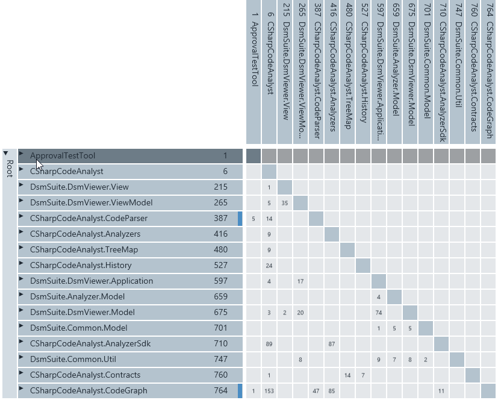
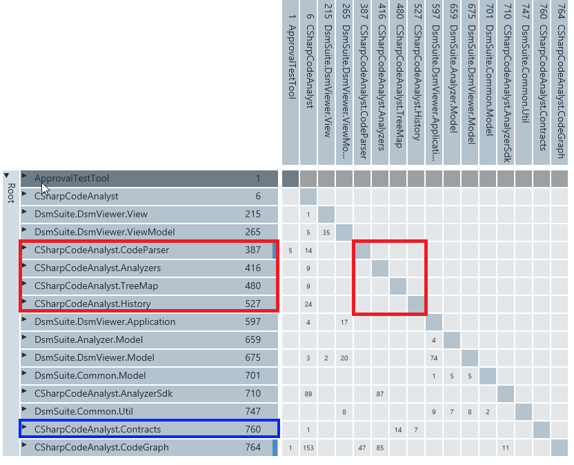
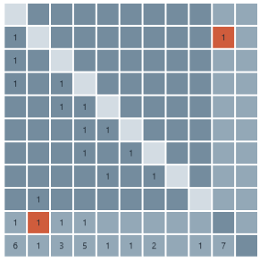
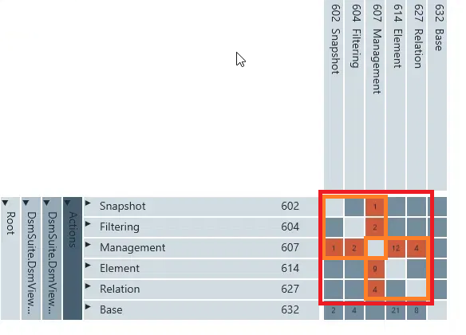
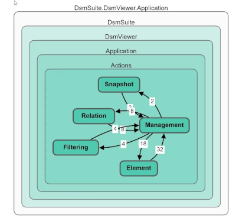
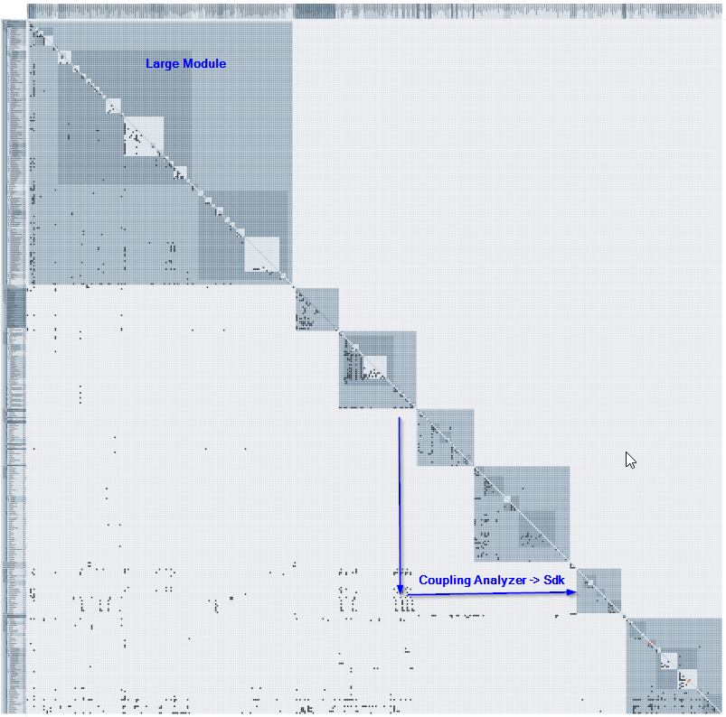

# Reading DSMs

## What a Dependency Matrix Reveals About a System

Many tutorials explain what a cell means and then stop. This tutorial takes the next step: it shows which *patterns* live inside a DSM, how to find them systematically, and what they say about the architecture.

All examples follow this convention:

> **A number in cell (row R, column C) means: C depends on R. C uses R.**

Two reading directions follow from this, and you should internalize them before doing anything else:

* **Reading a row across** answers the question: *"Who uses me?"* That is the fan-in, the afferent coupling. A full row means: this element carries many others on its shoulders.
* **Reading a column down** answers the question: *"What do I use?"* That is the fan-out, the efferent coupling. A full column means: this element reaches everywhere and therefore depends on everything else.

Most DSM tools sort the rows so that consumers sit at the top and producers at the bottom. This sort order will become important shortly.

Careful: roughly half the literature uses the mirrored convention (rows depend on columns). If a tutorial seems "illogical", check the convention first. Everything below is written consistently in *this* convention.

---

## 1. The First Look: The Shape of the Matrix

Before reading individual cells, step back and look at the matrix like a picture. Squint. The overall shape reveals more than any single number.

**The triangle.** A healthy, layered architecture can be sorted so that all entries lie on *one* side of the diagonal. In our convention, with the usual sort order (consumers on top, foundation at the bottom), that means: all entries lie in the **lower left triangle**. Every entry there says: an element listed higher up uses an element listed further down. Dependencies flow downhill like water.

The matrix above is a textbook example: every single entry lies below the diagonal. At the assembly level, the system is **cycle-free and cleanly layered**. Enjoy the sight for a moment before we discuss why this is not yet the end of the analysis.

**The block diagonal.** The second healthy pattern: dense blocks along the diagonal (lots of communication *within* modules), with few, deliberate entries in between (little communication *between* modules). That is the visual definition of "high cohesion, loose coupling". If your matrix is hierarchical (namespaces can be expanded), you only see this after expanding: inside `DsmViewer.ViewModel` things may swarm, between `ViewModel` and `CodeParser` there should be a yawning void.

**The starry sky.** The sick counterpart: entries scattered evenly across the whole surface, without recognizable structure, on both sides of the diagonal. Every element talks to every other. Such a system has no architecture, it only has code. If your matrix looks like this, you no longer need fine-grained analysis — the first measure is to establish layers at all.

Mnemonic for the first look: **A healthy system looks boring in the DSM.** Triangle, blocks, lots of whitespace. Everything that immediately attracts the eye — outliers in the upper triangle, squares, cross patterns, lonely numbers far away from everything — is a possible finding.

Note:
In **C# Code Analyst**, expanded modules are rendered as shaded squares of varying color along the diagonal. This serves readability. Each shade is one nesting level. The actual dependencies are the individual entries or dots in a cell, and some coloring carries extra information (e.g., cells participating in cycles). From the hierarchy shading you therefore read module sizes and nesting depth, **not** coupling or cohesion.

---

## 2. Reading Off Layers

The sort order that produces the triangle is called triangularization; many DSM tools simply call it sorting and do it at the push of a button. Afterward, you can read the layers directly.

A layer consists of elements that do **not** use each other. In the matrix, you find them like this: walk the rows from top to bottom and look for groups of adjacent elements. If the intersection area of these elements (their square on the diagonal) is empty, they form a layer. The empty cells mean: no member uses any other member. Whatever these elements do outside the square — who uses them, what they use — is irrelevant to the layer question. Since no dependency exists between the members, nothing forces their order. You could swap them among themselves arbitrarily, and the matrix would remain lower triangular.

Example from the matrix (red): `CodeParser` (387), `Analyzers` (416), `TreeMap` (480), and `History` (527). Each of these rows has entries in the rest of the matrix (for instance, all four are used by the application). But in the 4×4 diagonal square where the four would meet *each other*, there is nothing. Four independent features at the same height — that is a layer. The counter-case sits directly above: `View` (215) and `ViewModel` (265). In their 2×2 square sits the 35 — View uses ViewModel. These two are *not* a layer; the 35 forces View to be sorted above ViewModel.

In the matrix — coarsely rasterized — a three-layer picture emerges:

**At the top, the consumers:** ApprovalTestTool and CSharpCodeAnalyst. Their rows are empty — nobody depends on them. That is exactly how it should be: applications and tests sit at the very top; an application with a full row would be an alarm signal. In their columns, however, the two part ways distinctly: CSharpCodeAnalyst (the orchestrator) has a full column and uses almost everything. ApprovalTestTool has only two targeted entries — a precise component test that specifically verifies the parser output and only needs to know the result format to do so.

**In the middle, the domain logic:** `Parser`, `Analyzer`, `TreeMap`, `History`, the viewer layers. This is where the actual work happens. These elements typically have both entries in their row (they are used) and in their column (they use the foundation).

**At the bottom, the foundation:** here there are two flavors. `Common.Util` and `CodeGraph` are a broad foundation: full rows, empty columns. `Contracts`, by contrast, also has an empty column but only three targeted consumers — that is not a broad foundation but a narrow interface package. `Contracts` only sits this deep because most tools try to place every row as deep as possible when sorting. A change to `CodeGraph` shakes half the system. A change to `Contracts` affects three known places. More on this shortly.

As mentioned, the sort order within a layer is **not unique**. Whether `TreeMap` sits above or below `History` is meaningless as long as no dependency exists between them. So do not read too much into the exact order — the layer boundaries matter, not the positions within a layer.

### Why Does Contracts Sit at the Very Bottom, Then? (The Pitfalls of Sorting)

Careful: a *matrix layer* is not yet an *architecture layer*.

Logical layers in the architecture do not necessarily sit next to each other in the DSM.

The sorting may choose freely among the permitted orders, and tools often place elements "as deep as possible".

A fine example of this is `Contracts` (760): it is used only from far above and uses nothing itself — logically, it belongs at the height of `AnalyzerSdk`, yet it sits almost at the very bottom. The rule would even formally declare `Contracts` and `CodeGraph` one layer (their shared square is empty), although one is the foundation of half the system and the other has three local consumers. "Same layer" by this rule therefore only means *mutually independent and adjacent*, not *architecturally at the same height*.

The graph below shows the architectural layers. `Contracts` sits here at the `Analyzer.Sdk` level, even though it could just as well be placed at the `CodeGraph` level.

If you want the true heights, compute **topological levels**: each element sits one level below its deepest consumer.

**What you are looking for:** every entry that remains in the *upper right* triangle after sorting is a layering violation — a lower element using a higher one. Since the rows are sorted, that means a cycle (next chapter).

---

## 3. Cycles and the Notorious Square

Cycles are the most important single finding in a DSM, because a cycle means: the elements involved are in truth **one single inseparable module**, whatever the namespace structure claims. None of them can be understood, tested, replaced, or shipped in isolation.

### The Smallest Cycle: The Mirrored Pair

A direct two-cycle between A and B looks like this in the matrix: both cell (row A, column B) and cell (row B, column A) are filled. B uses A, and A uses B. The two cells lie **mirror-symmetrically across the diagonal**. You can even find this without any sorting: mentally fold the matrix along the diagonal — wherever two entries land on each other, you have a direct cycle. And note a consequence right away: a mirrored pair forces **exactly one cell above the diagonal, always**, no matter in which order you sort the two. One of the two elements has to sit on top.

### The Square as a Search Area

A cycle over more than two elements (A → B → C → A) has no mirrored pairs and stays hidden as long as its participants are sorted far apart. That is why cycle hunting starts with the sort: the tool orders the elements so that as many entries as possible slide below the diagonal. Whatever remains **above** the diagonal afterwards is part of a cycle. In a directed acyclic graph (DAG), an order is always possible in which all dependencies lie below the diagonal.

Take such a remaining cell at (row i, column j): a lower-sorted element uses a higher-sorted one — an uphill edge. Draw the horizontal and the vertical from that cell to the diagonal; the square spanned contains exactly the elements between the two participants. The argument that supports this construction is that if the matrix is otherwise lower triangular, all remaining dependencies run downhill through the sort order. A return path from the upper element down to the lower one therefore cannot leave the span. **A cycle lies entirely within the square.** The square is the search area that bounds the cycle. The occupied cells inside, however, are not automatically involved!

More precisely — and this follows directly from the DAG argument above: cells **above** the diagonal are guaranteed to participate in a cycle, otherwise the sorting would have pushed them below the diagonal. Membership is only open for the filled cells **below** the diagonal inside the square: they are candidates for the return path, nothing more.

### Multiple Violations: Merging Squares

As soon as several cells sit above the diagonal, one square per cell may no longer suffice, because violations can chain into larger circles — a return path is then allowed to climb over a *different* uphill edge and leave the individual span. The rule is simple: draw its square for every cell above the diagonal. If two squares share elements, merge them into a larger one. Repeat until nothing merges anymore. The result is the region containing all chained circles.

`DsmSuite.DsmViewer.Application.Actions` is a perfect example. Sort order: `Snapshot`, `Filtering`, `Management`, `Element`, `Relation`, `Base`. Four cells sit above the diagonal: (`Snapshot`, `Management`), (`Filtering`, `Management`), (`Management`, `Element`), (`Management`, `Relation`) — `Management` uses `Snapshot` and `Filtering`, `Element` and `Relation` use `Management`. The single-cell rule yields four squares — there is no canonical single square anymore. But all four share `Management`, so they merge into **one** 5×5 square from `Snapshot` to `Relation`.

Two observations on this example that carry beyond the single case:

**First:** each of the four violations has a filled mirror cell — that is four direct two-cycles, all through `Management`. The cycle cluster here is not a long ring but a **star around a mediator**: a manager that knows and calls its parts and is known by them in return (typical with callbacks). All four pairs have the same return direction to the same hub, and often all of them can be inverted with the same tool (interface, event). Then the star collapses into a clean hierarchy with `Management` on top.

**Second:** the merged square is a *hull* — membership is candidate status, not a verdict. Here, all five elements really are involved (each is paired with `Management`, and through `Management` circles also close between the outposts, e.g. `Snapshot` → `Management` → `Element` → `Management` → `Snapshot`). But in general, bystanders can lie inside a merged hull. If `Base` were sorted between `Filtering` and `Management`, it would sit in the middle of the square without participating in any circle.

---

## 4. Profiles: Recognizing Roles from Row and Column Signatures

Every element has a fingerprint in the DSM, made up of two values: how full is my row (fan-in), and how full is my column (fan-out)? Archetypes emerge from the combination.

**The foundation (full row, empty column).** Many use it, it uses nothing. In the matrix, examples are `CodeGraph` (row with entries 1, 153, 47, 85, 11 — practically everyone needs it) and `Common.Util`. That is healthy at first: stable, abstraction-poor building blocks belong at the bottom. But the critical follow-up question is: **is it a coherent foundation or a dumping ground?** A `CodeGraph` with a clear domain purpose is a legitimate centerpiece. A `Common.Util` that has grown over the years into a collection bin for "didn't know where to put it" is a disguised coupling amplifier. And because all sorts of things live inside, it gets changed often. Test: expand `Common.Util`. If it decomposes internally into independent clusters (logging here, string stuff there, file system over there), each used by *different* consumers, then it is not one module but three — and should be split.

**The orchestrator (empty row, full column).** Uses everything, is used by no one. `CSharpCodeAnalyst` itself is the archetype: its column stacks up 14, 9, 9, 24, 89, 153 … For the root of an application, that is the correct, expected signature — someone has to plug the parts together. The pattern only becomes suspicious when it appears **in the middle of the domain logic**: a "service" class with an empty row and full column is frequently a god orchestrator holding logic that actually belongs in the modules it uses.

**The god class (full row AND full column — the cross).** The most dangerous pattern of all. The element is used by many *and* itself uses many. In the matrix, this looks like a cross of horizontal and vertical entries intersecting on the diagonal. Why this is so toxic can be derived directly from the DSM: the full column means many reasons to change (any change in the used elements can propagate in). The full row means many parties affected when it changes. A god class is therefore a **change amplifier**: it captures instability from below and radiates it upward. In the example matrix, no cross exists at the namespace level — look for it at the class level, where they like to hide behind names like `Manager`, `Context`, `Engine`, or `Helper`.

**The island (empty row, empty column).** Nobody uses it, it uses nothing. Three explanations, in descending probability: dead code (delete!), a plugin loaded via reflection (the DSM only sees static dependencies), or an entry point the parser did not capture.

**The interface package (thin, targeted row, almost empty column).** `Contracts` and `AnalyzerSdk` in the matrix are fine examples: few but strategically placed consumers. `AnalyzerSdk` is used by `CSharpCodeAnalyst` (89) and `Analyzers` (87) — it serves as the contract between the host and analyzers. That is exactly what a **deliberately designed** dependency looks like: heavy weight, but at precisely the spot where the architecture intends it. Compare that to the same number at an unexpected spot — the weight alone says nothing, the location says everything.

---

## 5. Finding a Module's Public Interface

This is one of the strongest and most rarely explained DSM analyses. Procedure:

1. Expand a namespace, e.g. `CSharpCodeAnalyst.CodeParser`, so that you see its classes as individual rows.
2. Ignore all entries *within* its own diagonal block — that is internals.
3. Look at which rows of the module have entries in columns **outside** the block. The outside world uses these classes. That is the module's **de facto interface** — regardless of what is declared `public` or what the documentation claims.

Now it gets interesting, because you can compare three things:

**De facto interface vs. intended interface.** A well-encapsulated module exposes a handful of classes (a facade, a few data types, an interface). If 15 of a module's 20 classes are used from outside, there effectively is no module — the namespace boundary is decoration. Rule of thumb: the larger the share of externally used rows among all rows of the module, the more perforated the encapsulation.

**Concrete vs. abstract.** Check *which* classes the outside world grabs. Does it hang on interfaces and DTOs (in the example, on `Contracts`) or on concrete implementation classes? The structure with a dedicated `Contracts` namespace suggests deliberate design — the DSM tells you whether everyone sticks to it. Every dependency that reaches *past* `Contracts` directly into an implementation module is a bypass of the official door.

**Breadth vs. depth of use.** Two consumers using the same single facade class: good. Five consumers each using different, deeply internal classes: the module is leaking from five different wounds.

---

## 6. Reading Weights: The 153 and the Lonely 1

The numbers in the cells (reference counts) carry two entirely different messages depending on where they sit.

**High numbers in expected places:** the 153 between `CSharpCodeAnalyst` and `CodeGraph` or the 74 between `DsmViewer.Model` and `DsmViewer.Application` say: a load-bearing wall runs here. You will never get rid of such dependencies and should not want to — but you should know where they are, because you do not refactor load-bearing walls casually. A high number *across* the system, between two modules that according to the architecture should know nothing of each other, means the opposite: these two modules are in truth fused, the separation exists only on paper.

**Low numbers in unexpected places:** a lonely 1 or 2 far away from all other entries is almost always a story: a forgotten import, a shortcut under deadline pressure, a test reference in production code. The nice part: it is *cheap to remove* — one reference instead of one hundred and fifty. In the example, exactly such a case catches the eye: `CSharpCodeAnalyst` depends with weight 1 on `DsmSuite.DsmViewer.View`. The analysis tool thereby reaches over into the viewer suite — here, however, with the full intent of using the viewer (keyword: deep modules). But it could just as well have been a single class living in the wrong project. Exactly such questions are what the DSM is supposed to raise. You have to answer them in the code.

A useful prioritization rule follows: **for cleanup, sort findings by "damage divided by weight".** A layering violation with weight 2 you fix in an hour; the same violation with weight 90 is a project. Start with the ones — every one removed makes the matrix more readable and uncovers the next layer of findings.

---

## 7. Change Impact: "If I Touch This, Who Trembles?"

The DSM is not only a diagnostic but a planning instrument. Suppose you want to rework `CodeGraph`:

1. Read `CodeGraph`'s row: all directly affected parties (in the example: practically all analysis namespaces plus the app).
2. For each affected party, read *its* row in turn: the indirectly affected.
3. Repeat until nothing new appears. The result is the **transitive closure** — the maximum shockwave of a change.

> Incidentally, **C# Code Analyst** computes this transitive closure for all types as "Propagation Cost" in the system metrics (the average share of the system potentially affected by a random change). The absolute value is hard to interpret, but as a **trend across releases** it is gold: if it rises, the system is felting up, however good the individual commits felt.

In a cleanly layered system (lower triangle), the wave only spreads upward and ends at the application at the latest. In a system with cycles, the wave can **run in circles** — that is one of the reasons why cycles make changes so expensive: the impact analysis does not terminate at a layer but captures the entire cycle cluster — all elements of the square, no matter where inside it you touch.

---

## 8. Good vs. Bad: The At-a-Glance Test

Summarized as an eye test — what you want to see after three seconds of looking, and what not:

**A good modular system:** all entries below the diagonal. Dense, compact blocks on the diagonal, lots of whitespace in between. Cross-connections between modules are few, preferably running through recognizable interface packages (`Contracts`, `Sdk`), and the heavy weights sit exactly there. At the very bottom, a few domain-coherent foundation rows; at the very top, applications with empty rows. The matrix is, in a word, **predictable**: whoever knows the architecture can guess where the entries are and will be right.

**A bad system:** entries on both sides of the diagonal that do not disappear even after sorting. One or more large squares. Cross patterns in the middle of the domain logic. A `Common`/`Util`/`Shared` with the fullest row in the system. Even scatter instead of blocks. And the subtlest symptom: many small weights in many unexpected places — the gravel that settles into every gearbox because nobody ever considered a single 1 a problem.

---

## 9. Exercises on Your Own Matrix

To close, four concrete questions you can answer directly on the example screenshot:

**1. Why is it good that the row of `CSharpCodeAnalyst` is almost empty?**
Because an application should be the top of the food chain, entries in its row would mean library code depends on the application — the dependency direction would be inverted. The library would not be reusable without the app.

**2. `Analyzers` has the entries 87 (at `AnalyzerSdk`) and 85 (at `CodeGraph`) in its column. What does that tell about the plugin design?**
The analyzers talk almost exclusively to the SDK and the graph model — not to the app, not to the viewer. That is the matrix signature of a clean plugin architecture: extensions know the contract and the data, nothing else.

**3. `Common.Util` is used by `ViewModel`, `Application`, `Analyzer.Model`, `DsmViewer.Model`, and `Common.Model` — all `DsmSuite` namespaces. What follows?**
That `Common.Util` is de facto a `DsmSuite`-internal utility, not a system-wide one. The `CSharpCodeAnalyst` side does without it. That is useful knowledge for an eventual split of the two suites into separate repositories: `Util` then clearly belongs to one side.

**4. How do you interpret the overall picture?**

The architecture is fundamentally cleanly layered (block-diagonal, hardly any cycles), but strongly asymmetric: a dominant first module acts as a central dependency for almost the entire system. For me, these would be the two places to look at more closely first in a refactoring review: the oversized first module (possibly split further) and the red markers at the bottom right (possible cycles, though barely visible at this zoom level).

---

## Appendix: What the DSM Keeps From You

So that you do not believe it more than it promises:

The DSM shows **static** dependencies. Coupling via reflection, configuration files, message queues, or database schemas is invisible to it — your "island" may in truth be the most-loaded plugin. And it shows no **semantic or temporal** coupling: two modules that share no reference but are touched together in 80% of commits in the Git history are coupled — just at a spot the compiler cannot see.

The DSM is an X-ray: it shows the skeleton completely and the soft tissue not at all. But skeletons rarely lie — and no other image shows fractures this early.