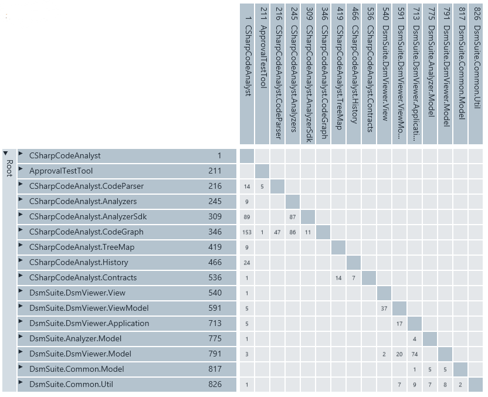
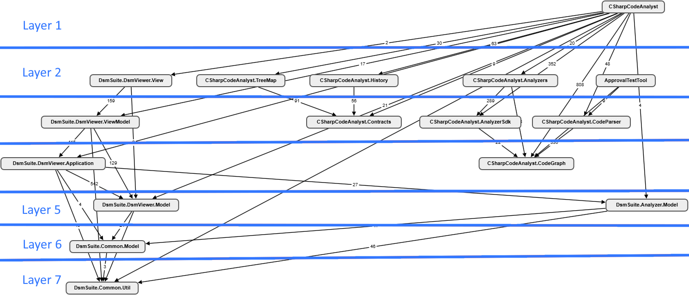
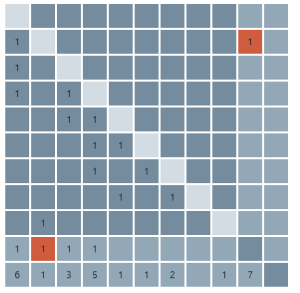
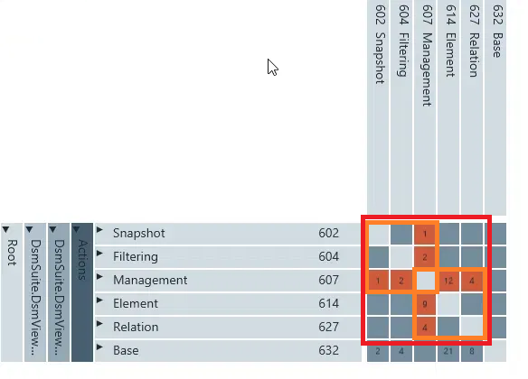
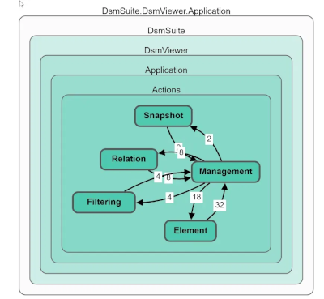
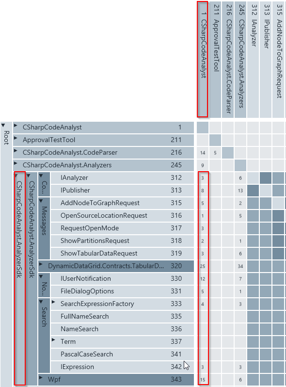
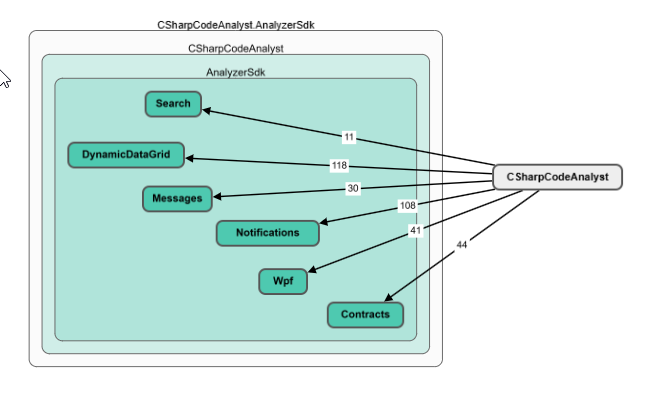
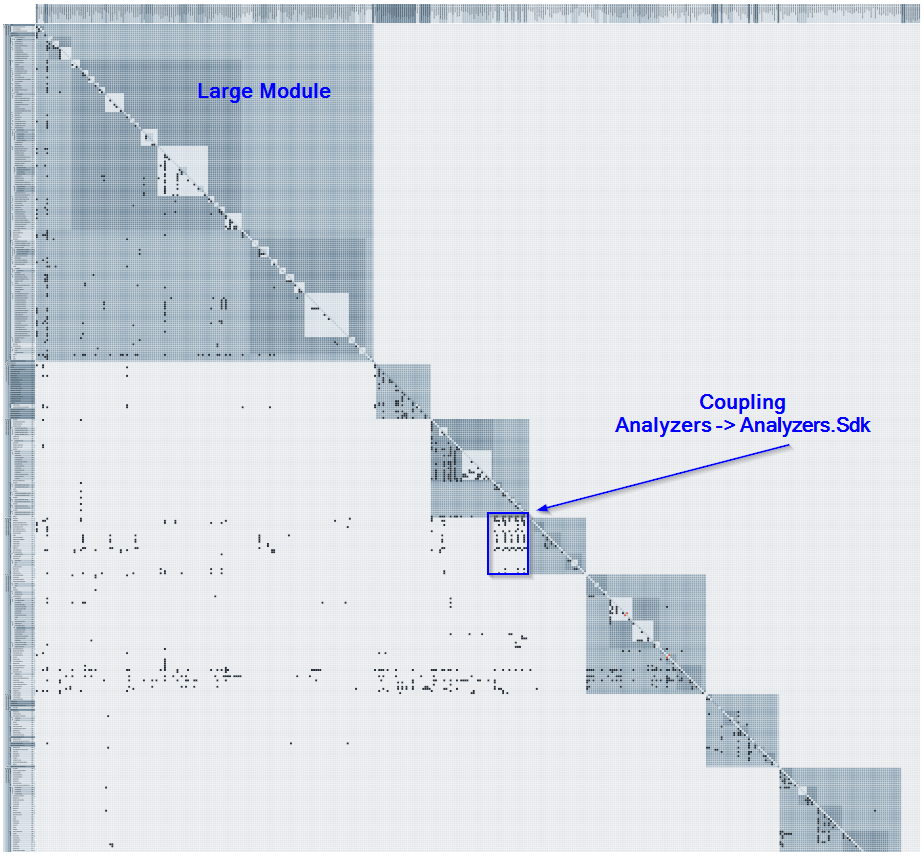

# Reading DSMs

[TOC]

## What a Dependency Matrix Reveals About a System

A cell in a DSM is quickly explained. What takes longer to learn is the level above it: which *patterns* live inside a matrix, how to find them systematically, and what they say about the architecture. That is what this tutorial is about.

All examples follow this convention:

> **A number in cell (row R, column C) means: C depends on R. C uses R.**

Two reading directions follow from this, and you should internalize them before doing anything else:

* **Reading a row across** answers the question: *"Who uses me?"* That is the fan-in, the afferent coupling. A full row means: this element carries many others on its shoulders.
* **Reading a column down** answers the question: *"What do I use?"* That is the fan-out, the efferent coupling. A full column means: this element reaches everywhere and therefore depends on everything else.

Most DSM tools sort the rows so that consumers sit at the top and producers at the bottom. This sort order will become important shortly.

Careful: roughly half the literature uses the mirrored convention (rows depend on columns). If a matrix seems to say the opposite of what you expect, check its convention first. Everything below is written consistently in *this* convention.

The screenshots come from the **DSM** tab of **C# Code Analyst**. If you want to follow along there: **Appendix A** describes what is in the matrix, what its colours mean and how to operate it.

---

## 1. The First Look: The Shape of the Matrix

Before reading individual cells, step back and look at the matrix like a picture. Squint. The overall shape reveals more than any single number.

**The triangle.** A healthy, layered architecture can be sorted so that all entries lie on *one* side of the diagonal. In our convention, with the usual sort order (consumers on top, foundation at the bottom), that means: all entries lie in the **lower left triangle**. Every entry there says: an element listed higher up uses an element listed further down. Dependencies flow downhill like water.

In the matrix above, every single entry lies below the diagonal. At the assembly level, the system is **cycle-free and cleanly layered**. That is the picture to compare against — and, as the following chapters show, not yet the end of the analysis.

**The block diagonal.** The second healthy pattern: dense blocks along the diagonal (lots of communication *within* modules), with few, deliberate entries in between (little communication *between* modules). That is the visual definition of "high cohesion, loose coupling". If your matrix is hierarchical (namespaces can be expanded), you only see this after expanding: inside `DsmViewer.ViewModel` things may swarm, between `ViewModel` and `CodeParser` there should be a yawning void.

**The starry sky.** The sick counterpart: entries scattered evenly across the whole surface, without recognizable structure, on both sides of the diagonal. Every element talks to every other. Such a system has no architecture, it only has code. If your matrix looks like this, you no longer need fine-grained analysis — the first measure is to establish layers at all.

Mnemonic for the first look: **A healthy system looks boring in the DSM.** Triangle, blocks, lots of whitespace. Everything that immediately attracts the eye — outliers in the upper triangle, squares, cross patterns, lonely numbers far away from everything — is a possible finding.

Note:
In **C# Code Analyst**, an expanded module is drawn as a shaded square along the diagonal, one shade per nesting level. That shading is a reading aid: from it you read module size and nesting depth, **not** coupling or cohesion. The dependencies themselves are the entries in the cells, and some cell colours carry extra information (e.g., cells participating in cycles). Appendix A has the details.

---

## 2. Reading Off Layers

My honest advice: forget reading layers off the DSM. Every DSM tool has an algorithm that produces the triangle — called triangularization, or often simply *sorting*. Different tools produce different orders. The only thing you can rely on: consumers end up at the top, producers at the bottom. If the application is layered (an acyclic dependency graph), a triangular form is always possible; if not, dependencies remain above the diagonal (a cycle). But the order that achieves the triangle is not unique, and the result looks different in every tool.

So use the graph to read off layers, with a hierarchical layout algorithm such as ELK.

**What you are looking for:** every entry that remains in the *upper right* triangle after sorting is a layering violation — a lower element using a higher one. Since the rows are sorted, that means a cycle (next chapter).

---

## 3. Cycles and the Notorious Square

Cycles are the most important single finding in a DSM, because a cycle means: the elements involved are in truth **one single inseparable module**, whatever the namespace structure claims. None of them can be understood, tested, replaced, or shipped in isolation.

### The Smallest Cycle: The Mirrored Pair

A direct two-cycle between A and B looks like this in the matrix: both cell (row A, column B) and cell (row B, column A) are filled. B uses A, and A uses B. The two cells lie **mirror-symmetrically across the diagonal**. You can even find this without any sorting: mentally fold the matrix along the diagonal — wherever two entries land on each other, you have a direct cycle. And note a consequence right away: a mirrored pair forces **exactly one cell above the diagonal, always**, no matter in which order you sort the two. One of the two elements has to sit on top.

### The Square as a Search Area

A cycle over more than two elements (A → B → C → A) has no mirrored pairs and stays hidden as long as its participants are sorted far apart. That is why cycle hunting starts with the sort: the tool orders the elements so that as many entries as possible slide below the diagonal. Whatever remains **above** the diagonal afterwards is part of a cycle. In a directed acyclic graph (DAG), an order is always possible in which all dependencies lie below the diagonal.

Take such a remaining cell at (row i, column j): a lower-sorted element uses a higher-sorted one — an uphill edge. Draw the horizontal and the vertical from that cell to the diagonal; the square spanned contains exactly the elements between the two participants. The argument that supports this construction is that if the matrix is otherwise lower triangular, all remaining dependencies run downhill through the sort order. A return path from the upper element down to the lower one therefore cannot leave the span. **A cycle lies entirely within the square.** The square is the search area that bounds the cycle. The occupied cells inside, however, are not automatically involved!

More precisely — and this follows directly from the DAG argument above: cells **above** the diagonal are guaranteed to participate in a cycle, otherwise the sorting would have pushed them below the diagonal. Membership is only open for the filled cells **below** the diagonal inside the square: they are candidates for the return path, nothing more.

### Multiple Violations: Merging Squares

As soon as several cells sit above the diagonal, one square per cell may no longer suffice, because violations can chain into larger circles — a return path is then allowed to climb over a *different* uphill edge and leave the individual span. The rule is simple: draw its square for every cell above the diagonal. If two squares share elements, merge them into a larger one. Repeat until nothing merges anymore. The result is the region containing all chained circles.

`DsmSuite.DsmViewer.Application.Actions` is a perfect example. Sort order: `Snapshot`, `Filtering`, `Management`, `Element`, `Relation`, `Base`. Four cells sit above the diagonal: (`Snapshot`, `Management`), (`Filtering`, `Management`), (`Management`, `Element`), (`Management`, `Relation`) — `Management` uses `Snapshot` and `Filtering`, `Element` and `Relation` use `Management`. The single-cell rule yields four squares — there is no canonical single square anymore. But all four share `Management`, so they merge into **one** 5×5 square from `Snapshot` to `Relation`.

Two observations on this example that carry beyond the single case:

**First:** each of the four violations has a filled mirror cell — that is four direct two-cycles, all through `Management`. The cycle cluster here is not a long ring but a **star around a mediator**: a manager that knows and calls its parts and is known by them in return (typical with callbacks). All four pairs have the same return direction to the same hub, and often all of them can be inverted with the same tool (interface, event). Then the star collapses into a clean hierarchy with `Management` on top.

**Second:** the merged square is a *hull* — membership is candidate status, not a verdict. Here, all five elements really are involved (each is paired with `Management`, and through `Management` circles also close between the outposts, e.g. `Snapshot` → `Management` → `Element` → `Management` → `Snapshot`). But in general, bystanders can lie inside a merged hull: if a sorter placed `Base` between `Filtering` and `Management`, it would sit in the middle of the square without participating in any circle.

This tool's partitioning rules that out: the members of a cycle cluster are always sorted as one **contiguous block**, so the merged square closes up to exactly the cycle cluster — every element inside it participates, and so does every filled cell inside the block (within a cycle cluster, every dependency lies on some circle). Keep the bystander caveat for matrices sorted by other tools.

---

## 4. Profiles: Recognizing Roles from Row and Column Signatures

Every element has a fingerprint in the DSM, made up of two values: how full is my row (fan-in), and how full is my column (fan-out)? Archetypes emerge from the combination.

**The foundation (full row, empty column).** Many use it, it uses nothing. In the matrix, examples are `CodeGraph` (row with entries 153, 1, 47, 86, 11 — practically everyone needs it) and `Common.Util`. That is healthy at first: stable, abstraction-poor building blocks belong at the bottom. But the critical follow-up question is: **is it a coherent foundation or a dumping ground?** A `CodeGraph` with a clear domain purpose is a legitimate centerpiece. A `Common.Util` that has grown over the years into a collection bin for "didn't know where to put it" is a disguised coupling amplifier. And because all sorts of things live inside, it gets changed often. Test: expand `Common.Util`. If it decomposes internally into independent clusters (logging here, string stuff there, file system over there), each used by *different* consumers, then it is not one module but three — and should be split.

**The orchestrator (empty row, full column).** Uses everything, is used by no one. `CSharpCodeAnalyst` itself is the archetype: its column stacks up 14, 9, 9, 24, 89, 153 … For the root of an application, that is the correct, expected signature — someone has to plug the parts together. The pattern only becomes suspicious when it appears **in the middle of the domain logic**: a "service" class with an empty row and full column is frequently a god orchestrator holding logic that actually belongs in the modules it uses.

**The god class (full row AND full column — the cross).** The most dangerous pattern of all. The element is used by many *and* itself uses many. In the matrix, this looks like a cross of horizontal and vertical entries intersecting on the diagonal. Why this is so toxic can be derived directly from the DSM: the full column means many reasons to change (any change in the used elements can propagate in). The full row means many parties affected when it changes. A god class is therefore a **change amplifier**: it captures instability from below and radiates it upward. In the example matrix, no cross exists at the namespace level — look for it at the class level, where they like to hide behind names like `Manager`, `Context`, `Engine`, or `Helper`.

**The island (empty row, empty column).** Nobody uses it, it uses nothing. Three explanations, in descending probability: dead code (delete!), a plugin loaded via reflection (the DSM only sees static dependencies), or an entry point the parser did not capture.

**The interface package (thin, targeted row, almost empty column).** `Contracts` and `AnalyzerSdk` in the matrix are fine examples: few but strategically placed consumers. `AnalyzerSdk` is used by `CSharpCodeAnalyst` (89) and `Analyzers` (87) — it serves as the contract between the host and analyzers. That is exactly what a **deliberately designed** dependency looks like: heavy weight, but at precisely the spot where the architecture intends it. Compare that to the same number at an unexpected spot — the weight alone says nothing, the location says everything.

---

## 5. Finding a Module's Public Interface

The DSM answers this question well, and it is worth walking through the procedure in detail:

1. Expand a namespace, e.g. `CSharpCodeAnalyst.CodeParser`, so that you see its classes as individual rows.
2. Ignore all entries *within* its own diagonal block — that is internals.
3. Look at which rows of the module have entries in columns **outside** the block. The outside world uses these classes. That is the module's **de facto interface** — regardless of what is declared `public` or what the documentation claims.

Now it gets interesting, because you can compare three things:

**De facto interface vs. intended interface.** A well-encapsulated module exposes a handful of classes (a facade, a few data types, an interface). If 15 of a module's 20 classes are used from outside, there effectively is no module — the namespace boundary is decoration. Rule of thumb: the larger the share of externally used rows among all rows of the module, the more perforated the encapsulation.

**Concrete vs. abstract.** Check *which* classes the outside world grabs. Does it hang on interfaces and DTOs (in the example, on `Contracts`) or on concrete implementation classes? The structure with a dedicated `Contracts` namespace suggests deliberate design — the DSM tells you whether everyone sticks to it. Every dependency that reaches *past* `Contracts` directly into an implementation module is a bypass of the official door.

**Breadth vs. depth of use.** Two consumers using the same single facade class: good. Five consumers each using different, deeply internal classes: the module is leaking from five different wounds.

If you want for example to know what are the classes `CSharpCodeAnalyst` application uses from the `CSharpCodeAnalyst.Analyzers.Sdk` you can see this at one glance in a single column.

Note: In the Code Graph Explorer, you need two steps to see the same result, and you have different options to choose from. 

Add both the `CSharpCodeAnalyst.Analyzers.Sdk`  and `CSharpCodeAnalyst` to the Code Graph Explorer. For the `CSharpCodeAnalyst.Analyzers.Sdk` click **"All incoming relationships (deep)"**. This however, finds too many relationships outside `CSharpCodeAnalyst` . So in a second step, we remove the unwanted ones. On the `CSharpCodeAnalyst` node click **"Focus on outgoing (deep)"**. This removes all dependencies not originating from `CSharpCodeAnalyst`. What remains is the same information as in the DSM.

---

## 6. Reading Weights: The 153 and the Lonely 1

The numbers in the cells (reference counts) carry two entirely different messages depending on where they sit.

**High numbers in expected places:** the 153 between `CSharpCodeAnalyst` and `CodeGraph` or the 74 between `DsmViewer.Model` and `DsmViewer.Application` say: a load-bearing wall runs here. You will never get rid of such dependencies and should not want to — but you should know where they are, because you do not refactor load-bearing walls casually. A high number *across* the system, between two modules that according to the architecture should know nothing of each other, means the opposite: these two modules are in truth fused, the separation exists only on paper.

**Low numbers in unexpected places:** a lonely 1 or 2 far away from all other entries is almost always a story: a forgotten import, a shortcut under deadline pressure, a test reference in production code. The nice part: it is *cheap to remove* — one reference instead of one hundred and fifty. In the example, exactly such a case catches the eye: `CSharpCodeAnalyst` depends with weight 1 on `DsmSuite.DsmViewer.View`. The analysis tool thereby reaches over into the viewer suite — here, however, with the full intent of using the viewer (keyword: deep modules). But it could just as well have been a single class living in the wrong project. Exactly such questions are what the DSM is supposed to raise. You have to answer them in the code.

A useful prioritization rule follows: **for cleanup, sort findings by "damage divided by weight".** A layering violation with weight 2 you fix in an hour; the same violation with weight 90 is a project. Start with the ones — every one removed makes the matrix more readable and uncovers the next layer of findings.

---

## 7. Change Impact: "If I Touch This, Who Trembles?"

The DSM is not only a diagnostic but a planning instrument. Suppose you want to rework `CodeGraph`:

1. Read `CodeGraph`'s row: all directly affected parties (in the example: practically all analysis namespaces plus the app).
2. For each affected party, read *its* row in turn: the indirectly affected.
3. Repeat until nothing new appears. The result is the **transitive closure** — the maximum shockwave of a change.

> Incidentally, **C# Code Analyst** computes this transitive closure for all types as "Propagation Cost" in the system metrics (the average share of the system potentially affected by a random change). The absolute value is hard to interpret, but the **trend across releases** is worth tracking: if it rises, the system is felting up, however good the individual commits felt.

In a cleanly layered system (lower triangle), the wave only spreads upward and ends at the application at the latest. In a system with cycles, the wave can **run in circles** — that is one of the reasons why cycles make changes so expensive: the impact analysis does not terminate at a layer but captures the entire cycle cluster — all elements of the square, no matter where inside it you touch.

---

## 8. Good vs. Bad: The At-a-Glance Test

Summarized as an eye test — what you want to see after three seconds of looking, and what not:

**A good modular system:** all entries below the diagonal. Dense, compact blocks on the diagonal, lots of whitespace in between. Cross-connections between modules are few, preferably running through recognizable interface packages (`Contracts`, `Sdk`), and the heavy weights sit exactly there. At the very bottom, a few domain-coherent foundation rows; at the very top, applications with empty rows. The matrix is, in a word, **predictable**: whoever knows the architecture can guess where the entries are and will be right.

**A bad system:** entries on both sides of the diagonal that do not disappear even after sorting. One or more large squares. Cross patterns in the middle of the domain logic. A `Common`/`Util`/`Shared` with the fullest row in the system. Even scatter instead of blocks. And the subtlest symptom: many small weights in many unexpected places — the gravel that settles into every gearbox because nobody ever considered a single 1 a problem.

---

## 9. Exercises on Your Own Matrix

To close, four concrete questions you can answer directly on the example screenshot:

**1. Why is it good that the row of `CSharpCodeAnalyst` is almost empty?**
Because an application should be the top of the food chain, entries in its row would mean library code depends on the application — the dependency direction would be inverted. The library would not be reusable without the app.

**2. `Analyzers` has the entries 87 (at `AnalyzerSdk`) and 86 (at `CodeGraph`) in its column. What does that tell about the plugin design?**
The analyzers talk almost exclusively to the SDK and the graph model — not to the app, not to the viewer. That is the matrix signature of a clean plugin architecture: extensions know the contract and the data, nothing else.

**3. `Common.Util` is used by `ViewModel`, `Application`, `Analyzer.Model`, `DsmViewer.Model`, and `Common.Model` — all `DsmSuite` namespaces — plus a single 1 from `CSharpCodeAnalyst`. What follows?**
That `Common.Util` is de facto a `DsmSuite`-internal utility, not a system-wide one. Apart from that one reference (the wiring of the embedded matrix view), the `CSharpCodeAnalyst` side does without it. That is useful knowledge for an eventual split of the two suites into separate repositories: `Util` then clearly belongs to one side.

**4. How do you interpret the overall picture?**

The architecture is fundamentally cleanly layered (block-diagonal, hardly any cycles), but strongly asymmetric: a dominant first module acts as a central dependency for almost the entire system. For me, these would be the two places to look at more closely first in a refactoring review: the oversized first module (possibly split further) and the red markers at the bottom right (possible cycles, though barely visible at this zoom level).

---

## Appendix A: The Matrix View in C# Code Analyst

What is in the matrix on the **DSM** tab, what its colours mean, and how to operate it. Most of it is not visible in the UI itself, so this is the place to look it up.

### What is in the matrix

- **One row per type.** Methods, fields and properties are not shown; their dependencies are counted towards the type that contains them. Types from outside the solution are left out entirely.
- **Namespaces that hold nothing but a single other namespace are merged into one row**, so a row can read `CSharpCodeAnalyst.CodeGraph` rather than forcing you through two expands that show one line each. A row label is always the namespace path relative to the element it sits in.
- **Rows and columns are ordered so dependencies fall below the diagonal**, and the members of a cycle cluster are kept as one contiguous block — that is what chapter 3 relies on when it merges squares.

Every dependency appears **once**: reading from a column at the top to a row on the left. The opposite direction is left empty; the colours there are used for nesting depth instead.

### The order number

Every row carries a number, and every column header repeats it. It is the cross reference between a column and its row — find the number at the top of a column, look for the same number on the left, and you have the element that column stands for.

It is numbered straight through the tree as it currently stands, so **it changes whenever you expand or collapse something**. Do not write it down or use it to refer to an element later.

The column header carries the element **name** next to the number as well, so a column is legible without the cross reference. That name is what makes the header tall. The **toggle button in the top-left corner** collapses the header back to the number alone, which reclaims that vertical space when you only need to read the shape.

### The blocks on the diagonal

Expanding an element paints a square block on the diagonal covering everything inside it:

> **Inside the square = internal to that assembly or namespace.
> Outside it = crosses the boundary.**

The shade tells you the nesting depth — deeper elements are darker. **There are four shades and they repeat**: the fifth level down looks like the first. On a deeply nested tree, check where a block actually starts and ends rather than trusting the shade alone.

### Cell colours

| Colour | Meaning |
|---|---|
| light neutral | no dependency, and not inside an expanded block |
| blue-grey ramp, 4 shades | inside an expanded block, darker = deeper |
| **warm orange** | **the two elements depend on each other — a cycle** |

Orange overwrites every other colour, so it stays visible inside a block.

Hovering or selecting a row or column darkens it into a crosshair, so you can follow a cell back to the two elements it belongs to.

### The number in a cell

The number is the **dependency weight**: how many distinct type-to-type dependencies are aggregated under those two elements. Above `9999` it reads `>9K`; the exact value is always in the cell's tooltip.

> **Fully expanded, every populated cell reads `1`.** One type depending on another is counted once, no matter how many calls or field accesses are behind it. The larger numbers you see on a collapsed row are the sums of the cells inside it.

So the number answers "how much of this is there", not "how strong is this one call" — chapter 6 is about what to make of the values.

### Zoomed out

Below roughly a third of full size the numbers are too small to read, so they are dropped and the cells say only whether they are populated:

| | |
|---|---|
| empty cell | light, as always |
| **populated cell** | **filled near-black** |
| cycle | keeps its orange |

The blocks keep their normal shades, so structure and dependencies stay readable together. This is the view for the first look of chapter 1: where are the dependencies at all, is this layered or tangled, does anything sit far off the diagonal. Zoom back in for the numbers, or hover a cell — the tooltip carries the exact weight at any zoom.

### The coloured bar beside the row headers

The bar at the right edge of each row header is **relative to the row you last clicked**. It answers "how does this row relate to the thing I selected", not "what is this row".

| Colour | Meaning |
|---|---|
| Green | this row **uses** the selected element |
| Blue | this row **is used by** the selected element |
| Orange | both — **mutual, a cycle** |

It needs a **row** selection. Clicking a column header draws the crosshair but clears the bars, and with nothing selected there are none at all.

### Controls

- **Ctrl + mouse wheel** zooms the whole matrix.
- **Plain wheel** scrolls up and down, **shift + wheel** sideways — from anywhere in the matrix, headers included. The scroll bars scale with the matrix and get too thin to grab once you zoom out, so the wheel is usually the better way. Its step grows with the zoom, so panning stays quick even when you have zoomed right in and the matrix no longer fits.
- **Click a row header** to select it — this is what drives the indicator bars. Clicking a column header selects the column but clears them.
- **Click the arrow** in a row header to expand or collapse; hold **shift** to do it recursively.
- **Hover a cell** for the consumer and provider names plus the weight; **hover a row or column header** for the element's full name and type.
- **Toggle button in the top-left corner** collapses the column headers from name + number down to the number alone, and back. Use it to reclaim the tall header band when you only need the shape. It hides itself once you zoom far out, where the names are unreadable anyway.

The view is **read-only**: it is a projection of the parsed code, so there is nothing to edit here. Metrics are not shown next to the rows either; the application computes those on its own tabs.
