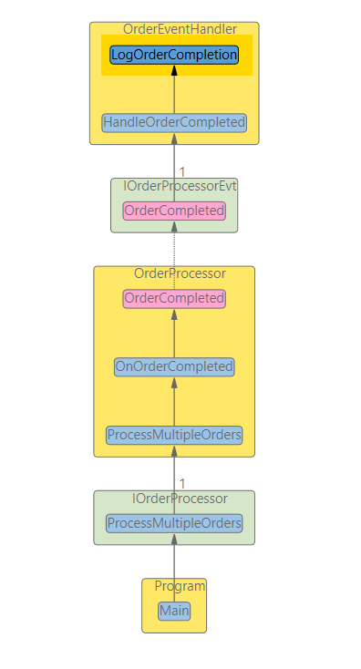

# Finding the origin of a method call

Note that this function is only a heuristic since we can determine the exact behavior only at runtime.

#### Example ####

You want to understand what code may break if you modify the method *LogOrderCompletion*

You start from the method *LogOrderCompletion* and use the Context menu to "**Follow incoming calls (Heuristic)**"

The resulting graph shows you the dependencies that lead to *LogOrderCompletion*.

There are only the directly involved code elements shown. It is often easier to understand if we see the containing classes. We can add these with the context menu in the free area around the graph. Execute **Complete to containing types**.

Now the the picture is more complete.

However, the directions of the dependencies make it difficult to follow an incoming path. This is because interfaces invert the compile-time dependencies. To make the graph more straightforward to understand, you can click the **Flow** button in the Ribbon. 

This mode "reverts" some of the dependencies to mimic the information flow instead of compile-time dependencies.

The graph now lets you see more clearly where the call chain originates from (**Main** at the bottom of the image).

**Main** → **ProcessMultipleOrders** → **OrderProcessor** → **OnOrderCompleted** → 
**OrderCompleted event** → **OrderEventHandler** → **LogOrderCompletion**

The result is not always this straightforward. But in many cases, the **Flow** visualization helps to grasp the graph.
