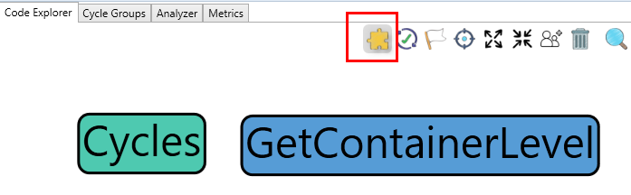
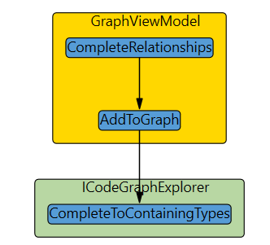

# General concepts

I initially wrote this application to analyze cyclic code structures. However, it provides numerous flexible ways for visualizing and exploring a codebase.

Some concepts are essential to understand. The key ideas are selective element addition, relationship discovery, and interactive graph manipulation.

Many commercial applications are rigid in the code elements you see on the canvas. Most tools allow you, for example, to expand the inheritance tree of a class. But then you may get much uninteresting noise that you cannot remove, or the graph is not interactive. 

I wanted an application where I can add specific code elements and then explore the relationship between them. If the graph gets too crowded, I want to select a subset and focus on this subgraph.

Note: I use graph and canvas synonymously

## Example

In the tree view below, we can see a namespace, a class, and a method. Each of these three is an independent code element.

If you add the namespace and the method to the canvas they are not related yet.

But as soon as you add the class, the hierarchical information is complete, shown in the screenshot below.

You can achieve the same by clicking the **Complete to containing types** tool button.

## Example - Exploring relationships

For the code elements already in the canvas, you can complete the missing relationships. No new code elements are added.

Only what you see in the graph gets connected.

In the screenshot below we have three methods in the canvas

In the tool button area click **Complete relationships**.

This function adds all existing dependencies between the visual code elements.

The method calls alone are sometimes not helpful without context. Again, click the  **Complete to containing types** button. This gives you a better picture. There is one "calls" and one "implements" relationship.

Note:

In the appsettings.json file, there is a setting **called AutomaticallyAddContainingType**, which allows you to automatically add the class or interface of a method to the canvas.

To see the kind of relationship, show the info Tab and hover over an edge. If you click the edge, the info panel keeps the last clicked element or dependency.

If, on the other hand, you want to explore the relationships of a specific code element and add the dependent code elements automatically, you use the context menu on the code element directly. Here you can find various options. The entries in the context menu are context-specific.
The code elements involved in the found relationships are then added to the canvas if not already there.

