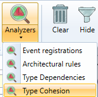
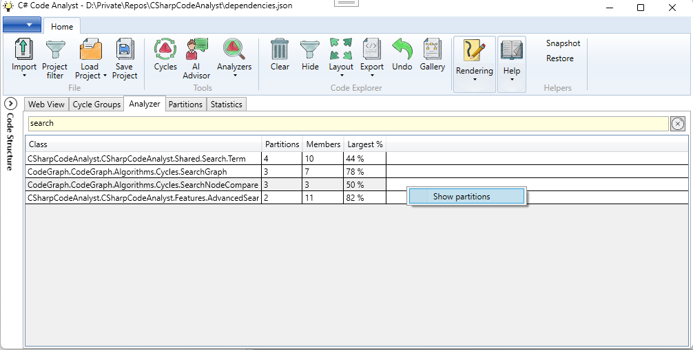
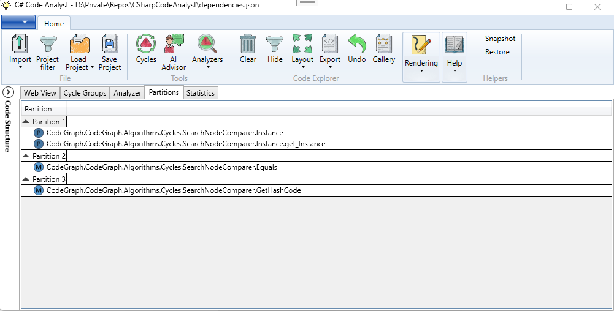

# Partitioning a class

You have a large class you want to split and you want to get a first idea how the internals of the class are grouped together.

Note:

Cohesion within a class measures how closely related its code elements are to each other. High cohesion occurs when methods and fields work together toward a unified purpose—for example, when most methods access the same set of fields. Low cohesion suggests the class may have multiple responsibilities, such as when distinct groups of methods each work with separate sets of fields.

## Example

To calculate the partitions of all classes run the **Type Cohesion** Analyzer from the Ribbon

This presents all classes where partitioning is possible. From here you an double click a row or use the context menu to show the partitions.

The result is shown in the Partitions Tab. 

You can see that this class can fall apart in three independent groups of code elements. This can give you a hint what functionality you can extract from the class.
