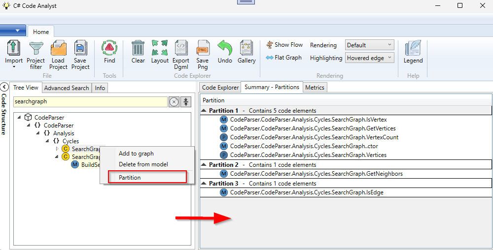

# Partitioning a class

You have a large class you want to split and you want to get a first idea how the internals of the class are grouped together.

Note:

Cohesion within a class measures how closely related its code elements are to each other. High cohesion occurs when methods and fields work together toward a unified purpose—for example, when most methods access the same set of fields. Low cohesion suggests the class may have multiple responsibilities, such as when distinct groups of methods each work with separate sets of fields.

## Example

Find the class you want to analyze in the tree view and select **Partition** in the context menu. The function is implemented only for classes.

The result is shown in the Summary Tab. (Same tab where also cycle groups are summarized)

You can see that this class can fall apart in three independent groups of code elements. This can give you a hint what functionality you can extract from the class.
