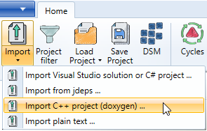
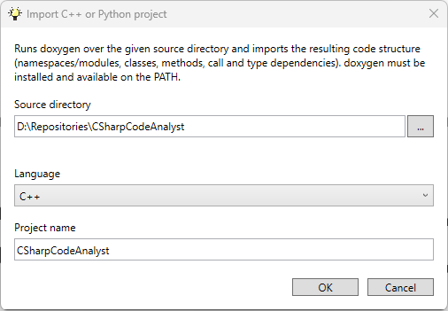

## Other languages

### C++ and Python

To import a directory with C++ or Python files, you need **[doxygen](https://www.doxygen.nl/index.html)** in your search path. We use doxygen to extract the types and dependencies. Python packages and modules appear as namespaces; virtual environments (`venv`, `.venv`, `__pycache__`, `site-packages`) are excluded automatically.

Keep in mind (see Limitations) that C# Code Analyst ignores the folder structure and organizes the code by its namespaces.

Use the "Import C++/Python project (doxygen)" menu.



The wizard asks you for the root directory of your source code, the language, and a project name. The project name results in a single root node containing all code elements.



> Doxygen's Python parser is noticeably more heuristic than the C++ mode. Hierarchy, classes, and inheritance are handled reliably; however, the call references (REFERENCES_RELATION) are more incomplete with dynamic typing—Doxygen often cannot resolve self.foo() on a duck-typed object. As a result, the graph is more likely to have too few edges than incorrect ones.

### Dart and Flutter

Dart projects are not imported via doxygen — doxygen does not support the language at all. Instead
they are analyzed with Dart's own tooling (the `analyzer` package), which gives fully resolved
types, calls and constructor invocations, including into the Flutter SDK.

You need a **Dart or Flutter SDK** in your search path, and the project must already be resolved
with `flutter pub get` (or `dart pub get`) — otherwise `package:` imports do not resolve and the
graph stays almost empty. The import dialog tells you when that is the case.

Use the "Import Dart/Flutter project" menu and select the directory containing `pubspec.yaml`.
There is nothing else to configure: assembly names come from the package names, and the hierarchy
below them follows the directory layout inside the package, with the library file as the last
level. So `package:app/features/auth/login_page.dart` becomes `app` → `features` → `auth` →
`login_page`.

The Dart/Flutter SDK and pub packages appear as separate assemblies marked as external, so you can
see that a widget derives from `StatelessWidget` without pulling all of Flutter into your view.

> The first import prepares the bundled extractor tool (a one-time `dart pub get`), which needs an
> internet connection and takes a few seconds. Note that calls inside closures are recorded as
> `Uses` rather than `Calls` — a builder callback is not executed where it is written. This matches
> how the C# parser treats lambda bodies.

### Java

Use the jdeps too to generate a dependency file. You can import this file directly using the Import menu in the Ribbon.

```
jdeps.exe -verbose:class <bin-folder1> <bin-folder2>...  >jdeps.txt
```

---