# C# Code Analyst

[TOC]

**An interactive dependency graph explorer for C# that helps you find cycles, simulate refactorings, and get AI-powered refactoring advice**

[](https://github.com/ATrefzer/CSharpCodeAnalyst/stargazers)
[](LICENSE)
[](https://github.com/ATrefzer/CSharpCodeAnalyst/releases/latest)

This desktop app helps you explore, understand, and manage large C# codebases, especially when you face complex dependencies or architectural challenges.

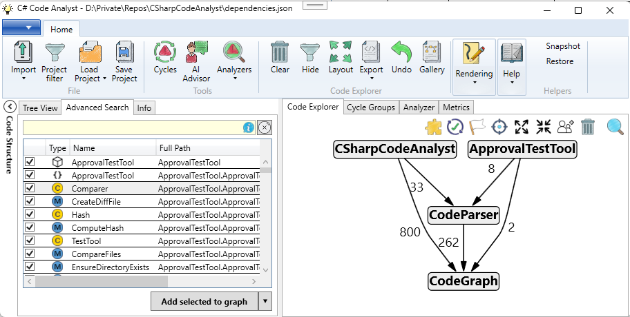

**[Watch the YouTube demo →](https://www.youtube.com/watch?v=o_r1CdQy0tY)** (Cycle analysis)

## Features

- **Deep Code Analysis** – Analyze your entire Visual Studio solution to map out a complete, precise code graph of your dependencies.
- **Circular Dependency Detection** – Instantly pinpoint component cycles and mutual dependencies that break your clean layering and architectural boundaries.
- **AI Refactoring Advisor** – Get intelligent refactoring suggestions to break complex cycles, powered by a Large Language Model (LLM).
- **Incremental Graph Exploration** – Build the exact graph you need to understand a codebase or solve a task. Map out dependencies step by step on demand (e.g., "show all incoming relationships"), and easily filter out unrelated code elements to keep the graph free of visual clutter.
- **Sandbox Code Refactoring** – Experiment with structural changes and simulate cycle-breaking strategies safely, without touching your actual source code.
- **Architectural Guardrails** – Define custom dependency rules and metric thresholds to actively validate and enforce a clean codebase.
- **Multi-Format Exports** – Share your architecture by exporting diagrams to PlantUML, DGML, PNG, SVG, and more.
- **Git History Hotspots** – Uncover hidden technical debt by running hotspot or change-coupling analyses directly on your Git repository history.

## Requirements

- **Windows** (x64)
- **.NET 10 Runtime** (to run the application)
- **.NET SDK or Visual Studio** (provides MSBuild to load your solution)

## Download & Quick Start

1. Download the latest release from the [Releases page](https://github.com/ATrefzer/CSharpCodeAnalyst/releases/latest)
2. Extract the zip and run `CSharpCodeAnalyst.exe`
3. Go to **Home → Import → Import Visual Studio solution**

This builds a complete in-memory graph **model** of your solution including assemblies, namespaces, types, members, and relationships.

> **Good to know:** The tool analyzes the actual code graph, not your file system – meaning the physical directory structure of your source code is completely ignored. Also, external assemblies (like NuGet packages) are excluded by default to keep things fast, but you can enable them in the settings. See [Limitations](#limitations) for details.

### What you can do from here

- **[Find and break dependency cycles](#find-and-break-dependency-cycles)** – detect strongly connected components and get AI suggestions to untangle them.
- **[Explore your codebase interactively](#explore-your-codebase)** –trace method calls, expand inheritance trees, and follow relationships on a visual canvas.
- **[Export your graph](#export-your-graph)** — generate PlantUML, DGML, or PNG/SVG diagrams for your documentation.
- **[Validate architectural rules](#validate-architectural-rules)** —  define custom rules (like DENY or ISOLATE) and automatically check them in the app or your CI pipeline.

Besides the dependency graph tools, you can also analyze GIT history with the **History Tool**.

- **[Analyze a GIT repository](#analyze-a-git-repository)** 

---

## Find and break dependency cycles

**[Read why you should look for and manage cycles in your code.](Documentation/why-look-for-cycles.md)**

The cycle search always runs on the complete model.

1. Click **Cycles** in the ribbon
2. The *Cycle Groups* tab lists all detected cycles with the involved elements
3. **Right-click** a cycle group → *Show in Code Explorer* to visualize it as a graph. The **Code Explorer** (or canvas) is your interactive working area — a whiteboard where you place only the elements you need right now.
4. Optionally, click **AI Advisor** to get ideas on how to break the cycle

**Note:** Under the hood, the cycle search looks for "strongly connected components" (SCCs) rather than individual, elementary cycles. In plain English: it groups everything that is mutually reachable. A single group might contain multiple overlapping cycles, which is why they are bundled together in the UI.

The cycle search result is presented in the **Cycle Groups** Tab.

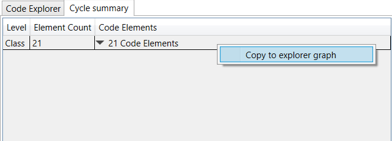

You can analyze a cycle group further in the **Code Explorer.**

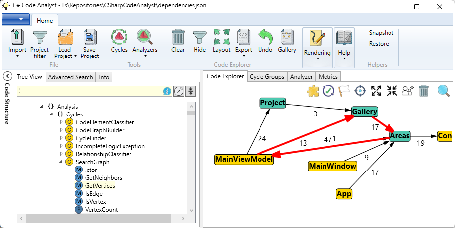

The Code Explorer now offers a wide range of tools to analyze the cycle. A good strategy is to identify a set of dependencies that seem incorrect to you and focus on them first (see ‘Focus on Incoming Dependencies’, ‘Focus on Outgoing Dependencies’, ‘Focus on Selected Elements’, etc.).

### AI Advisor

Once you have loaded a cycle group into the Code Explorer, the **AI Advisor** button in the toolbar sends the cycle to a configured LLM and asks it for ideas on how to resolve or break down the dependency cycle.

To use this feature, open **Settings** and enter your API endpoint and key. The tool supports any OpenAI-compatible endpoint, including local models (e.g., Ollama) and Anthropic's API.

> Take the advice with a grain of salt. The LLM has no idea about your actual business domain, team conventions, or broader system constraints. It might suggest things that are technically incorrect or completely impractical for your specific architecture.

Still, this feature can be very helpful for getting initial ideas when you face a complex cycle and are unsure where to start. The AI often spots structural patterns, like hidden abstractions, circular service dependencies, or missing interfaces, that are worth considering. You can save the advice as a Markdown file for later.

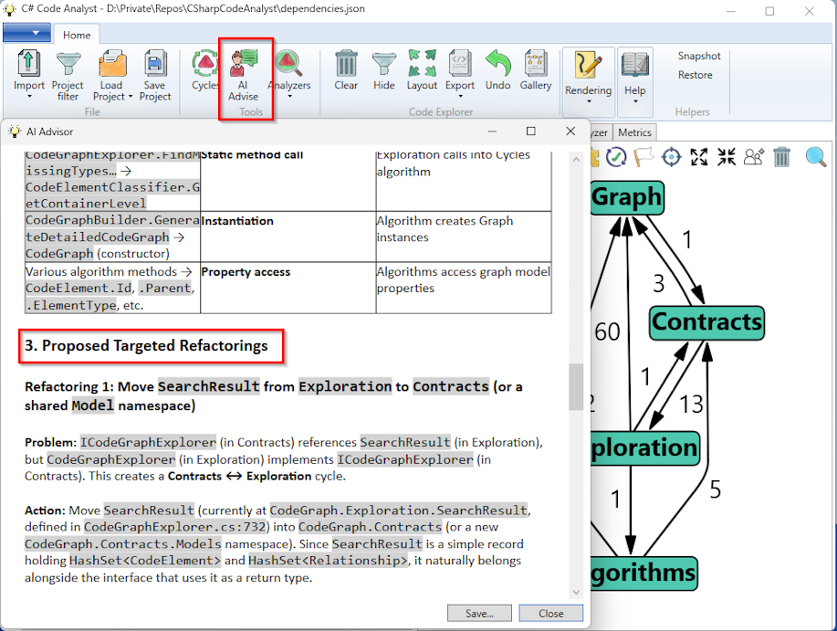

### Simulated refactoring

The refactoring simulation feature is simple but helpful. It lets you see how changes to your code structure affect cyclic dependencies without changing your source code. Often, you might find a large cyclic cluster, make changes in the code, and re-import the solution, only to see the cycle still there. This can be repetitive and time-consuming.

To streamline this, the tree view includes a Refactoring context menu that enables basic refactoring directly on the graph, bypassing the need to edit the source code.

You can explore scenarios such as:

- What happens if you remove a code element?
- What happens if you move a class to another namespace?
- What happens if you cut a dependency between two code elements?

After your modifications, you can rerun the cycle search to observe the impact.

Remember, this is a basic feature, and you can't undo changes to the code graph. It's a good idea to save your work before you begin.

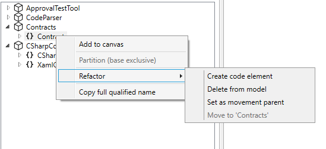

Context Menu Options:

- **Create code element** – Adds a new element to the model.
- **Delete from model** – Removes the selected element from the model.
- **Set as movement parent** – Sets the current element as the parent for subsequent move operations.
- **Move** – Once a movement parent is set, this option moves the selected element and all its children to the chosen parent.

Additionally, in the Code Explorer:

- **Delete edge from model** – Deletes the relationships between two code elements. If the edge is bundled, multiple relationships get deleted.

---

## Explore your codebase

The **Code Explorer** is an interactive canvas where you can explore unfamiliar codebases. You can trace calls, expand inheritance trees, and follow relationships step by step.

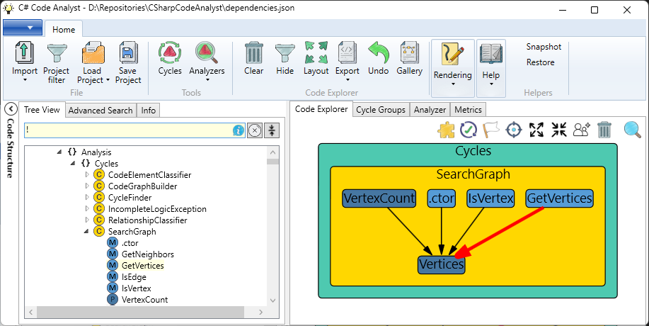

1. Use the **Tree View** or **Advanced Search** tab to search for code elements to add the canvas. The search expression supports `type:class`, `type:method`, `source:intern`, and ReSharper-style camel-case search (e.g. `SC` finds `ShoppingCart`).
2. **Right-click** an element on the canvas to explore its relationships with its neighbors.
3. Use the **tool buttons**  in the Code Explorer to perform operations on multiple selected elements.
4. To keep the graph readable and prevent it from turning into a spaghetti monster, you can use the Hide filters in the ribbon, double-click container nodes to collapse them, or use the context menu to filter down to incoming/outgoing edges.

### Examples

Here are some general examples of how to use the application to explore a code base.

-  [Essential concepts](Documentation/example-general-concepts.md)
-  [Find the call origins of a method](Documentation/example-find-call-origin.md)
-  [Understand how you could split a large class](Documentation/example-partition-class.md)

### Performance tips

If your graph has more than about 200-300 code elements, it may slow down. But seeing that many elements at once usually isn't helpful. You can double-click container elements to collapse or expand them, reducing what's visible. When using Advanced Search to add several code elements, try adding them collapsed to keep things focused and the graph faster.

---

## Export your graph

You can export your code graph (canvas) in various formats:

- **DGML** for further analysis in Visual Studio
- **PNG** or **SVG** image
- **DSI** if you want to import the graph into a dependency structure matrix tool
- **Plain text**
- **PlantUML**

### PlantUML

When documenting code, a UML class diagram is often more useful than a colored code graph. You can create a UML class diagram from the code elements in your graph. All code elements are included in the diagram, even if they're collapsed or not visible.

Select "Copy to PlantUML class diagram" from the Export menu.

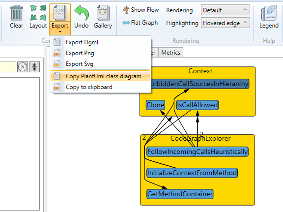

The PlantUML syntax is copied to the clipboard. You can use any online editor to render it.

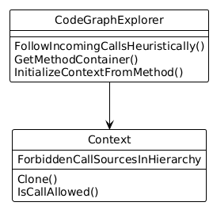

---

### Plain Text

Plain text might sound boring, but it's actually useful. If you feed a large language model your whole source code for refactoring, you’ll quickly run out of tokens or get garbage results. Instead, just give the LLM your prompt along with this text-based dependency graph. This greatly improves results and saves a massive amount of  tokens. The LLM doesn't even need a description of the graph.

## Validate architectural rules

Codebases tend to decay over time if no one monitors the boundaries. With Architectural Rules, you can define strict guardrails (like "UI must not touch the Data layer") and automatically check your solution for violations.

To set them up, open the **Analyzers** tab in the ribbon and click **Architectural Rules**.

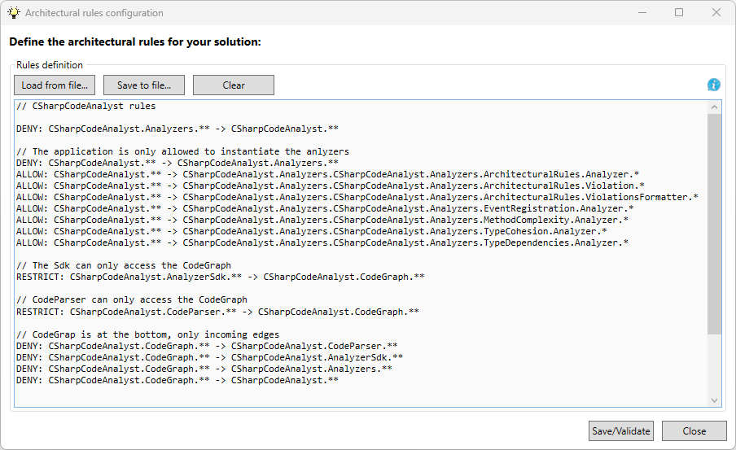

### 1. Dependency Restrictions

These rules control which parts of your application are allowed to talk to each other.

| Rule     | Meaning                                                      |
| -------- | ------------------------------------------------------------ |
| DENY     | Forbids dependencies from source to target.<br />DENY is the only rule that can restrict access to external/third-party code. |
| RESTRICT | Allows **only** the specified target dependencies<br /><br />If multiple `RESTRICT` rules overlap (like `A.**` and `A.B.**`), their allowed targets are merged together. The permitted set widens to the union of the targets. Dependencies to system libraries (like `System.*`) are always allowed automatically. |
| ISOLATE  | Completely isolates the source from external dependencies. Only incoming dependencies are allowed.<br />Dependencies to external code (e.g. System.*) are always allowed. |
| ALLOW    | Defines an architectural exception. An `ALLOW` rule never reports violations on its own. Instead, it suppresses violations triggered by a `DENY` or `RESTRICT` rule. |

### 2. Cycles

| Rule     | Meaning                                                      |
| -------- | ------------------------------------------------------------ |
| NOCYCLES | `NOCYCLES MyApp.Domain`.  Enforces that the specified assembly/namespace and everything below is 100% free of dependency cycles. The path is written without a wildcard. <br /><br />This rule finds cycles that exist between namespaces, unlike MAXCYCLICITY, which measures the plain type graph. <br /><br />If a cycle is found, it reports the same group name as used in the Cycles view, where you can analyze it further. A cycle that lies only partly below the named element is not reported by this rule; write the rule on a higher element to catch it.<br /><br /> ALLOW exceptions do not apply, and violations are not baselined. |

### 3. Metric-based restrictions

**See also [Metrics](Documentation/Metrics.md)**

A metric rule limits a measured value instead of a dependency. It is written as `RULE = value`. `ALLOW` exceptions never affect it. There are two kinds.

**System metric rules** describe the code base as a whole. They take no pattern.

| Rule         | Meaning                                                      |
| ------------ | ------------------------------------------------------------ |
| MAXCYCLICITY | Limits the total percentage of types entangled in cycles.<br />`MAXCYCLICITY = 15` means at most 15% of all types can be part of a cycle. Measured strictly on the type graph, cycles that only exist between namespaces do not count here. Use NOCYCLES for those. |

When accepting a baseline, a system metric rule gets its threshold raised to the currently measured value, so the rule line is rewritten in place.

**Code element metric rules** limit a metric value of every code element they match.

| Rule     | Meaning                                                      |
| -------- | ------------------------------------------------------------ |
| MAXLINES | Limits the maximum lines of code (LOC) for a single method (excluding blanks/comments).  <br />For example, <br />`MAXLINES: MyApp.Business.** = 50` flags every method in the business layer that is longer than 50 lines.<br />`MAXLINES = 50` limits all methods in the system to 50 lines.<br /><br />*Note: The Lines of Code (LOC) metric for methods currently serves as a built-in example of how element-level metrics are enforced. More metrics will follow.* |

Two metric rules of the same kind never override each other. If `MAXLINES = 50` and `MAXLINES MyApp.Legacy.** = 200` are both present, a 120-line legacy method violates the first rule.

When accepting a baseline, a code element metric rule remains untouched. Lifting its limit to the worst offender would repeal it for every other element. This is not a baseline but a repeal. This is different from the system metric rules.

### How patterns work

The source and target side of a rule is a **full path** in the code graph. It starts with the **assembly name**, followed by namespaces, types etc. If the assembly is named like its root namespace, the name appears twice (e.g. `MyApp.MyApp.Business`). This is intentional and correct.

You don't have to type out long C# paths by hand. Just right-click any element in the tree view or canvas and select **"Copy Full Path"** to get the exact string the rules engine expects.

A pattern can end with a wildcard suffix:

- `MyApp.MyApp.Business` → Matches exactly this specific namespace element.
- `MyApp.MyApp.Business.*` → Matches the element and its *direct* children.
- `MyApp.MyApp.Business.**` → Matches the element and *all* deep descendants.

The part before the wildcard is an **anchor**. It must exactly match the full path of one element (the whole path, not a prefix). The wildcard then expands along the tree. It collects the children of that anchor element, not everything whose name merely starts with the same text. For example, `MyApp.**` matches everything inside the assembly `MyApp` but nothing in a sibling assembly `MyApp.Utils` because that assembly is a separate root in the tree and not a child of the anchor.

### Examples

In these examples, the assembly is called `MyApp` and contains the namespaces `Business`, `Data`, ... directly — so the paths start with `MyApp.Business`, not with a duplicated name.

```
// Business layer should not access the Data layer directly
DENY MyApp.Business.** -> MyApp.Data.**

// Controllers may only access Services
RESTRICT MyApp.Controllers.** -> MyApp.Services.**

// Core components may not depend on UI
DENY MyApp.Core.** -> MyApp.UI.**

// Keys should be completely isolated. Use ALLOW to define exceptions.
ISOLATE MyApp.Keys.**

// Specific class restrictions
DENY MyApp.Models.User -> MyApp.Data.Database

// Exceptions: the reporting module may access the Data layer
// even though the Business layer as a whole may not
DENY MyApp.Business.** -> MyApp.Data.**
ALLOW MyApp.Business.Reporting.** -> MyApp.Data.**

// At most 15% of all types may sit inside a dependency cycle
MAXCYCLICITY = 15

// The domain - the element and everything below it - must be free of
// dependency cycles, including cycles that only exist between namespaces
NOCYCLES MyApp.Domain

// No method in the business layer longer than 50 code lines
MAXLINES MyApp.Business.** = 50
```

The result of the analysis is shown in the table output for analyzers.

If a pattern does not match any code element (for example due to a typo), the rule has no effect. The analysis reports a warning for every such pattern, making silently dead rules visible.

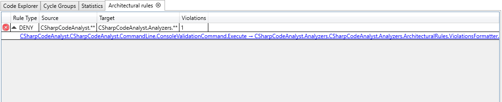

### Accept a baseline

Introducing rules into an existing codebase is hard. The first check often flags hundreds of violations, making it tempting to give up. The **Accept Baseline** button solves this. It becomes available once validation finds violations. Clicking it freezes the *current* state: every violation turns into an explicit `ALLOW` exception appended to your rules (grouped by the rule it came from). Afterward, the rules are re-validated so you immediately see a clean result.

After that, only new violations are reported. The existing ones are treated as technical debt you can fix over time. This makes the feature practical for real projects, not just new code. You can start using architectural rules right away without having to fix everything first.

The exceptions are exact paths down to the member level, so a baseline freezes precisely what exists today. Overloaded methods (which share one path) are all covered by the single exception generated for them.

### Remove unused rules

Over time, after refactoring or deleting baselined elements, some rules might no longer match anything. **Remove unused rules** deletes every rule that currently has no effect (its source or target pattern matches no code element). The cleanup is careful: it never removes a rule that still enforces something, so your checks stay strong.

### Command-line

To integrate the tool into a build pipeline, you can call it without a user interface. You can find the syntax of the command-line here:

[Command-line arguments](Documentation/command-line-arguments.md)

---

## Metrics

C# Code Analyst can calculate a few key metrics that matter.

You can read more about the supported metrics here: [Metrics](Documentation/Metrics.md)

All metrics are accessible via the Analyzer Ribbon, and the results are presented in a table on a separate tab.

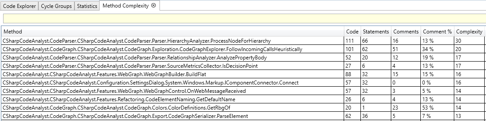

## Other languages

The tool is built for C#, but you can also import Jdeps output to get a basic visualization of Java code.

```
jdeps.exe -verbose:class <bin-folder1> <bin-folder2>...  >jdeps.txt
```

## Analyze a GIT repository

Static analysis is great, but it misses how code evolves over time. Inspired by Adam Tornhill’s *Your Code as a Crime Scene*, this tool includes Git history analysis to uncover architectural patterns that no static analyzer can see – like change coupling and hotspots.  To read more about these ideas, see also my other repository: https://github.com/ATrefzer/Insight. 

Two files are coupled when they often change together. For example, one class encodes a file, and another decodes it. You cannot change one without the other. Such hidden dependencies can be made visible, which fits perfectly into a dependency analyzer tool.

For example, in the first row, 93.1% of commits that contain **Item1** or **Item2**'' committed both items together; therefore, the files may be coupled.

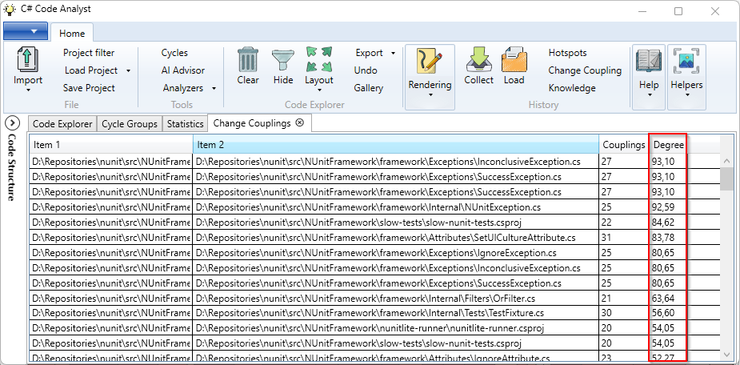

The second analysis is a hotspot analysis. You can see an example in the screenshot below. The size (LOC) of a file is shown by the area of a rectangle, and the number of changes is shown by color. The deeper the color, the more often a file changed over time. Large files that change frequently are called hotspots and are worth keeping an eye on. A file only appears in this analysis if it was committed at least twice.

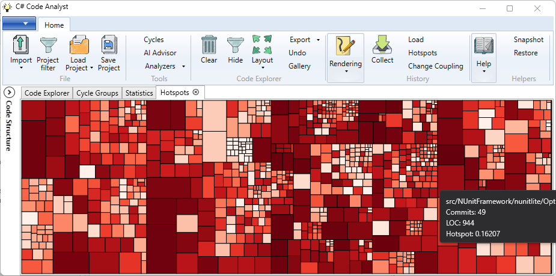

Finally, you can analyze a developer's contribution to a file.

This isn't related to dependency analysis, but it's helpful if you need to know who to ask for help or which parts to document when someone leaves the team.

The developer who contributed most to a file (based on a simple Git blame) is marked as the main developer, and the file is colored accordingly. This doesn't always mean that person knows the file best, but it's a good starting point.

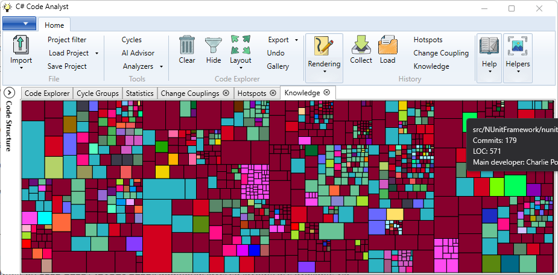

## Dependency Structure Matrix (DSM)

A Dependency Structure Matrix (DSM) displays system dependencies in a compact grid. Based on the convention used here, a numbered cell indicates that the element at the top (column) depends on the element on the left (row). **Note that this is the opposite convention of tools like NDepend.**

To learn how to read the matrix and spot architectural patterns, you can refer to the [DSM Suite Overview](https://dsmsuite.github.io/dsm_overview). Getting used to this view may require a bit of practice.

> **Note:** The matrix does not show the entire raw codebase, but rather the type graph. For example, dependencies between individual methods are lifted to their corresponding types (this is the exact same graph used to calculate our system metrics). This abstraction keeps the DSM focused and clean.

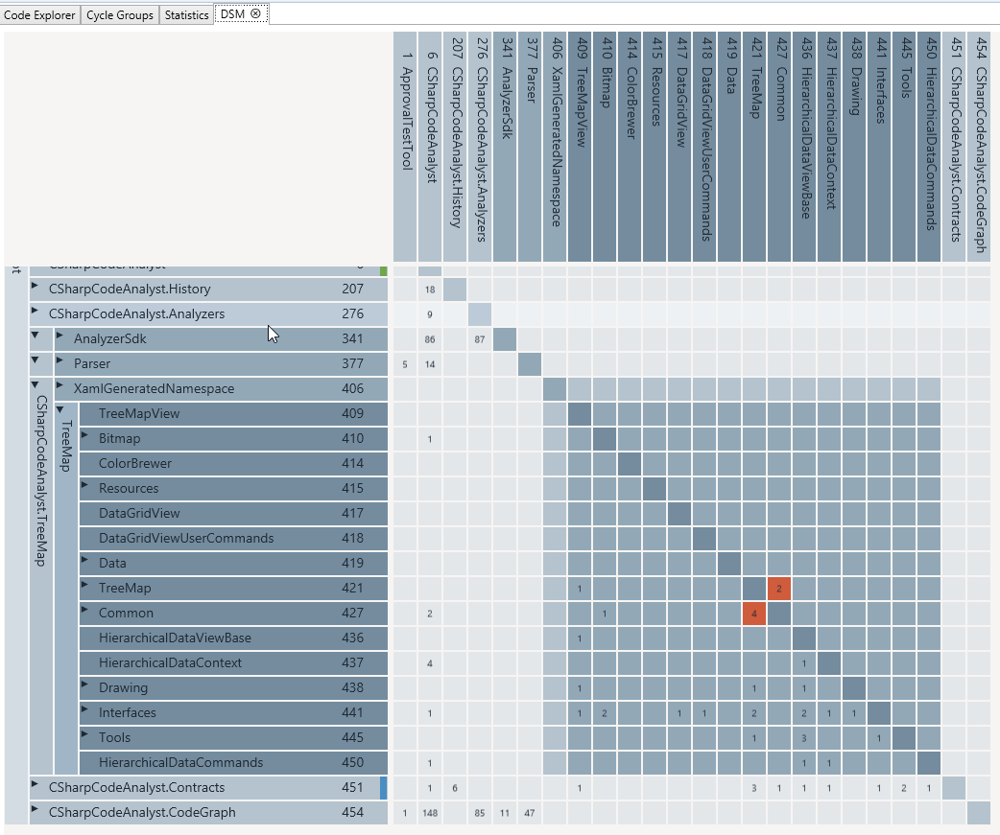

- **Ctrl + mouse wheel** zooms the whole matrix (0.04 – 4.0). Plain wheel scrolls.
- **Click the arrow** in a row header to expand or collapse; hold **shift** and it
  works recursively.

## Limitations

Please keep these points in mind:

- The Roslyn-based parser covers the vast majority of the latest C# syntax. However, since C# syntax evolves rapidly with new versions, some cutting-edge features or edge cases might not yet map perfectly to the graph.
- The directory structure of the source code is completely ignored, so keep this in mind when searching for cycles.
- Source locations are not extracted for all dependencies; only those that are easily extractable are included.
- You can include external code by setting the "Include External Code" option. Only type dependencies are collected.
- A method defining a  lambda expression only has "uses" relationships to types and methods inside the lambda.  This is because I cannot track where the lambda is actually called. I think that is a good compromise.
- Primary constructors of records do not create the properties in the code graph.

## Thank you

- The beautiful **images** in the user interface are <a href="https://de.freepik.com/search">Images from juicy_fish on Freepik</a>.
You can find the direct link to the collection here: [Icon-Portfolio des Autors Juicy_fish | Freepik](https://de.freepik.com/autor/juicy-fish/icons)
- The dependency graphs are rendered with **Cytoscape.js**. The default layout is the **fcose**
extension (built on **cose-base** / **layout-base**); additional layered layouts are available via
**dagre** (with **cytoscape.js-dagre**) and **ELK** (**elkjs** with **cytoscape.js-elk**).
Cytoscape.js, fcose, cose-base, layout-base, dagre, cytoscape.js-dagre and cytoscape.js-elk are
MIT-licensed; **elkjs** is licensed under EPL-2.0.
https://github.com/cytoscape/cytoscape.js / https://github.com/iVis-at-Bilkent/cytoscape.js-fcose /
https://github.com/dagrejs/dagre / https://github.com/kieler/elkjs
- SVG export uses the **cytoscape-svg** extension by kinimesi, licensed under GPL-3.0 (same as this project).
https://github.com/kinimesi/cytoscape-svg
- The minimap (bird's-eye overview) in the web graph view uses the **cytoscape.js-navigator** extension, licensed under MIT.
https://github.com/cytoscape/cytoscape.js-navigator
- Drag and drop functionality is provided by the **gong-wpf-dragdrop** library.
Copyright (c) Jan Karger, Steven Kirk and Contributors. Licensed under BSD-3-Clause.
https://github.com/punker76/gong-wpf-dragdrop
- Markdown rendering in the AI Advisor window is powered by **Markdig.Wpf** and **Markdig**.
Copyright (c) Nicolas Musset and Alexandre Mutel. Licensed under BSD-2-Clause.
https://github.com/Kryptos-FR/markdig.wpf / https://github.com/xoofx/markdig
- The dependency structure matrix on the DSM tab is the viewer from **DsmSuite**, licensed under
GPL-3.0-or-later (same as this project) and originally MIT-licensed by jmuijsenberg. A modified
subset of it is vendored under [ThirdParty/DsmSuite](ThirdParty/DsmSuite/).
https://github.com/ernstaii/dsmsuite.sourcecode / https://github.com/dsmsuite/dsmsuite.sourcecode

For complete third-party license information, see the [ThirdPartyNotices](ThirdPartyNotices/) folder.

## Contributing

Bug reports, feature ideas, and pull requests are welcome!

## License

This project is licensed under the GPL-3.0 License.

**Note:** Versions prior to v0.9.0 were released under the MIT License.

### What this means for you

- ✅ Use it freely in your projects (even commercial)
- ✅ Modify and improve it
- ⚠️ If you distribute modified versions, share your changes under GPL-3.0
- ℹ️ This is a development tool - it won't affect your analyzed code