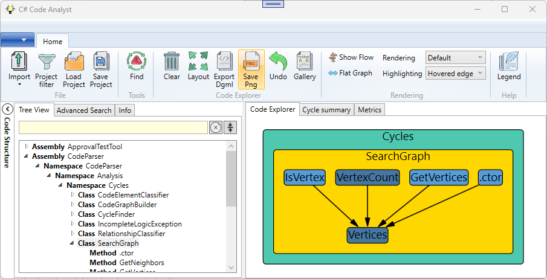

# C# Code Analyst

This application helps you to explore, understand, and maintain C# code.

Here is a [presentation on YouTube](https://www.youtube.com/watch?v=o_r1CdQy0tY) on using the application to analyze cyclic dependencies.

Note: MSBuild must be installed on your computer for the application to work.

## Exploring your codebase

While this application was written to analyze cyclic code structures, it also offers functions to explore and understand the source code.

### General



- Import a C# solution (*.sln). 

- Use the **Tree View** tab to add a single code element to the canvas.

- Use the **Advanced Search** tab to search for code elements via more complex expressions. From the search result, you can add multiple code elements at once to the canvas.

- Explore the relationships between code elements using the context menu. For instance, you can track all incoming method calls or expand the inheritance tree.

- To perform operations on multiple selected elements, use the context menu in the space surrounding the graph. 

- Note: You can also export graphs to DGML format for further analysis in Visual Studio.


### Examples

You can find some general examples of how you can use the application for code exploration  [=> here <=](Documentation\examples.md)

## Find and visualize cycles in your codebase

**Note:  This function finds strongly connected components in the code graph, not the elementary cycles. **


A strongly connected component is a sub-graph where a path exists between any two nodes. There may be more than one elementary cycle in the same strongly connected component.

Use the context menu to copy the related code elements to the explorer graph for further investigation.


### **Why Look for Cycles?**

More than 40 years ago, in his often-cited paper ["Designing software for ease of extension and contraction"](https://courses.cs.washington.edu/courses/cse503/08wi/parnas-1979.pdf) David Parnas suggested organizing software hierarchically, keeping the modules "loop-free." Similarly, Robert C. Martin's Acyclic Dependency Principle pushes in the same direction.

This idea of having cycle-free modules is quite intuitive. Let's look at an example outside the software world: Imagine a project plan with two tasks, A and B, depending on each other, forming a cycle. How would you tackle these tasks? You'd have to do them together as a whole. It's similar in software. If there are cycles in the area you want to change, you might end up reading and understanding all the classes involved in the cycle. Changes can easily have side effects in unexpected areas. Consequently, a software system with circular dependencies is more difficult to maintain.

The preference for hierarchical structures in software isn't arbitrary. It's deeply rooted in how our brains process information:

1. Research in cognitive psychology has consistently shown that the human brain understands and processes hierarchical structures more easily than non-hierarchical or cyclic ones.
2. We naturally organize our knowledge hierarchically, which makes hierarchical code structures more intuitive to understand and remember.

Therefore, I see this advice as a timeless principle. While studies on how we learn and understand things may be old, they will never be outdated. The main tool we use to write software, our brain, will be the same tomorrow.

There are other attributes associated with hierarchical and cycle-free systems like testability, maintainability, etc. For me, the matter of understanding the system is the most important. I doubt that you can have maintainability in a hard-to-understand codebase.

**C# Code Analyst** helps you identify cycles in your code, offering a higher-level perspective on your code structure. By using this tool, you can:

- Gain insights into your code's organization that might not be apparent when working at the detailed level.
- Identify opportunities to refactor and improve your code's structure.
- Enhance the overall readability and maintainability of your codebase.

Remember, the goal isn't to eliminate every cycle but to be aware of your code's structure and make informed decisions about its organization. Some cycles may be intended, even some design patterns use them. By focusing on readability, you're investing in code that's not just functional, but also easier to understand, maintain, and evolve.

**In general, I think it's a good guideline to keep your software system free of cycles at the namespace level.**

## **Performance Tips**

When the graph contains more than ~200 code elements, performance slows down. However, viewing so many elements at once is not helpful. You can collapse and expand container elements by double-clicking them to minimize the number of visible elements. When using the Advanced Search to add multiple code elements, consider adding them in a collapsed state to maintain focus and start with a smaller, faster graph.

## **Other languages**

The tool is written for  C#, but you can also import jdeps output for basic visualization.

```
jdeps.exe -verbose:class <bin-folder1> <bin-folder2>...  >jdeps.txt
```

## Limitations

Please take note of the following issues:

- The directory structure of the source code is completely ignored, so keep this in mind when searching for cycles.
- Source locations are not extracted for all dependencies, only the ones that are easy to extract.
- External code is ignored.
- The C# Roslyn part only focuses on the most common language constructs. However, even the supported language constructs may be incomplete. For any known unsupported syntax, refer to [Uncovered C# Syntax](Documentation/uncovered-csharp-syntax.md) 
- Currently, method calls in lambdas are attributed to the function that creates the lambda and not to the function that invokes the lambda.

## Thank you

- The beautiful **images** in the user interface are <a href="https://de.freepik.com/search">Images from juicy_fish on Freepik</a>
  You can find the direct link to the collection here: [Icon-Portfolio des Autors Juicy_fish | Freepik](https://de.freepik.com/autor/juicy-fish/icons)
- The dependency graphs are created using the **"Automatic Graph Layout" package"**. You can find more information about it at:
  https://github.com/microsoft/automatic-graph-layout

## Supporting this project

If you find any uncovered cases or bugs, please create an issue to support this project.
