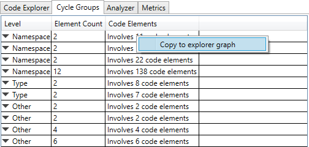
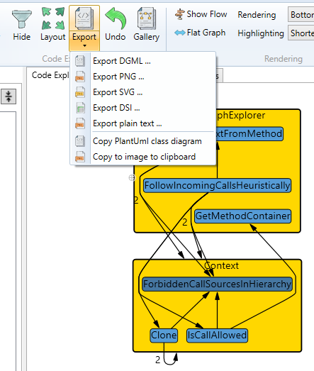

# C# Code Analyst

[TOC]

This application helps you to explore, understand, and maintain C# code.

Here is a [presentation on YouTube](https://www.youtube.com/watch?v=o_r1CdQy0tY) on using the application to analyze cyclic dependencies.

**Note:** You must install MSBuild on your computer for the application to function correctly.

## Exploring your codebase

While this application was written to analyze cyclic code structures, it also offers functions to explore and understand the source code.

### General


- Import a C# solution (*.sln). 

- Use the **Tree View** tab to add a single code element to the canvas.

- Use the **Advanced Search** tab to search for code elements via more complex expressions. From the search result, you can add multiple code elements at once to the canvas.

- Explore the relationships between code elements using the context menu. For instance, you can track all incoming method calls or expand the inheritance tree.

- To perform operations on multiple selected elements, use the context menu in the space surrounding the graph. 

- Note: You can export graphs to DGML format for further analysis in Visual Studio. Also, PlantUML class diagrams are supported.


### Examples

Here are some general examples of how to use the application to explore a code base.

-  [Essential concepts](Documentation/example-general-concepts.md)
-  [Find the call origins of a method](Documentation/example-find-call-origin.md)
-  [Understand how you could split a large class](Documentation/example-partition-class.md)

### Performance Tips

When the graph contains more than ~200 code elements, performance slows down. However, viewing so many elements at once is not helpful. You can collapse and expand container elements by double-clicking them to minimize the number of visible elements. When using the Advanced Search to add multiple code elements, consider adding them in a collapsed state to maintain focus and start with a smaller, faster graph.


## Find and visualize cycles in your codebase

**Note:  This function finds strongly connected components in the code graph, not the elementary cycles. **




A strongly connected component is a sub-graph where a path exists between any two nodes. There may be more than one elementary cycle in the same strongly connected component.

Use the context menu to copy the related code elements to the explorer graph for further investigation.


### Why Look for Cycles?

More than 40 years ago, in his often-cited paper ["Designing software for ease of extension and contraction"](https://courses.cs.washington.edu/courses/cse503/08wi/parnas-1979.pdf) David Parnas suggested organizing software hierarchically, keeping the modules "loop-free." Similarly, Robert C. Martin's Acyclic Dependency Principle pushes in the same direction.

This idea of having cycle-free modules is quite intuitive. Let's look at an example outside the software world: Imagine a project plan with two tasks, A and B, that depend on each other, forming a cycle. How would you tackle these tasks? You'd have to do them together as a whole. It's similar in software. If there are cycles in the area you want to change, you might end up reading and understanding all the classes involved in the cycle. Changes can have unexpected side effects. Consequently, a software system with circular dependencies is more challenging to maintain.

The preference for hierarchical structures in software isn't arbitrary. It's deeply rooted in how our brains process information:

1. Research in cognitive psychology has consistently shown that the human brain understands and processes hierarchical structures more easily than non-hierarchical or cyclic ones.
2. We naturally organize our knowledge hierarchically, which makes hierarchical code structures more intuitive to understand and remember.

Therefore, this advice is a timeless principle. While studies on how we learn and understand things may be old, they will never be outdated. The primary tool we use to write software, our brain, will be the same tomorrow.

There are other attributes associated with hierarchical and cycle-free systems, such as testability and maintainability. To me, understanding the system is the most important aspect. I doubt that you can have maintainability in a hard-to-understand codebase.

**C# Code Analyst** helps you identify cycles in your code, offering a higher-level perspective on your code structure. By using this tool, you can:

- Gain insights into your code's organization that might not be apparent when working at the detailed level.
- Identify opportunities to refactor and improve the structure of your code.
- Enhance the overall readability and maintainability of your codebase to improve its quality.

Remember, the goal isn't to eliminate every cycle but to be aware of your code's structure and make informed decisions about its organization. Some cycles may be intentional, and even some design patterns utilize them. By focusing on readability, you're investing in code that's not just functional, but also easier to understand, maintain, and evolve.

**In general, it's a good guideline to keep your software system free of cycles at the namespace level.**

## Simulated refactoring

The refactoring simulation feature is basic but useful. It helps you to explore how changes to the code structure affect cyclic dependencies without modifying the actual source code. A typical scenario involves identifying a large cyclic cluster, making adjustments in the source code, and re-importing the solution - only to find the cycle still unresolved. This process can be repetitive and time-consuming.

To streamline this, the tree view includes a Refactoring context menu. It enables basic refactoring directly on the graph, bypassing the need to edit the source code.

You can explore scenarios such as:

- What happens if you remove a code element?
- What happens if you move a class to another namespace?

After your modifications, you can rerun the cycle search to observe the impact.

Keep in mind that this is a very basic feature, and you cannot undo modifications to the code graph. So, it's better to save your work before you start.


Context Menu Options:

- **Create code element** – Adds a new element to the model.
- **Delete from model** – Removes the selected element from the model.
- **Set as movement parent** – Sets the current element as the parent for subsequent move operations.
- **Move** – Once a movement parent is set, this option moves the selected element and all its children to the chosen parent.

## Validate your architectural rules

You can define architectural rules and check if they are violated.
In the ribbon, go to Analyzers and there click "Architectural rules". If a project is loaded, this opens a dialog where you can define the rules.


There are three rules supported.

**DENY**: Forbids dependencies from source to target

**RESTRICT**: Allows only specified dependencies

**ISOLATE**: Completely isolates the source from external dependencies

### Examples

```
// Business layer should not access the Data layer directly
DENY: MyApp.Business.** -> MyApp.Data.**

// Controllers may only access Services
RESTRICT: MyApp.Controllers.** -> MyApp.Services.**

// Core components may not depend on UI
DENY: MyApp.Core.** -> MyApp.UI.**

// Domain should be completely isolated
ISOLATE: MyApp.Domain.**

// Specific class restrictions
DENY: MyApp.Models.User -> MyApp.Data.Database
```

You describe the source or target side of a rule with the following pattern.

MyApp.Business → exact match

MyApp.Business.* → element + direct children

MyApp.Business.** → element + all descendants

The result of the analysis is shown in the table output for analyzers.


### Command-line

To integrate the tool into a build pipeline, you can call it without a user interface. You can find the syntax of the command-line here:

[Command-line arguments](Documentation/command-line-arguments.md)

## Generate UML class diagrams

When you document code, a UML class diagram is often more helpful than a colored code graph. You can create a UML class diagram from the code elements in the graph. Note that all code elements are included in the diagram, even if they are collapsed and are not visible at this time.

Select "Copy to PlantUml class diagram" from the Export menu.




The PlantUml syntax is copied to the clipboard. You can use any online online editor to render it.


## Performance Tips

When the graph contains more than ~200 code elements, performance slows down. However, viewing so many elements at once is not helpful. You can collapse and expand container elements by double-clicking them to minimize the number of visible elements. When using the Advanced Search to add multiple code elements, consider adding them in a collapsed state to maintain focus and start with a smaller, faster graph.

## Other languages

The tool is written for  C#, but you can also import jdeps output for basic visualization of Java code.

```
jdeps.exe -verbose:class <bin-folder1> <bin-folder2>...  >jdeps.txt
```

## Limitations

Please take note of the following issues:

- The C# Roslyn part only focuses on the most common language constructs. However, even the supported language constructs may be incomplete. C# has a constantly growing language syntax.
- The directory structure of the source code is completely ignored, so keep this in mind when searching for cycles.
- Source locations are not extracted for all dependencies; only those that are easily extractable are included.
- You can include external code by setting the "Include External Code" option. Only type dependencies are collected.
- Only types used in a lambda expression are extracted. Method calls inside lambdas are not covered. I know that the method that creates the lambda "uses" the found types. But I cannot track where the lambda is actually called. I think that is a good compromise.

## Thank you

- The beautiful **images** in the user interface are <a href="https://de.freepik.com/search">Images from juicy_fish on Freepik</a>.
  You can find the direct link to the collection here: [Icon-Portfolio des Autors Juicy_fish | Freepik](https://de.freepik.com/autor/juicy-fish/icons)
- The dependency graphs are created using the **"Automatic Graph Layout" package"**. 
  MSAGL was developed in Microsoft by Lev Nachmanson, Sergey Pupyrev, Tim Dwyer, Ted Hart, and Roman Prutkin:
  https://github.com/microsoft/automatic-graph-layout
- Drag and drop functionality is provided by the **gong-wpf-dragdrop** library.
  Copyright (c) Jan Karger, Steven Kirk and Contributors. Licensed under BSD-3-Clause.
  https://github.com/punker76/gong-wpf-dragdrop

For complete third-party license information, see the [ThirdPartyNotices](ThirdPartyNotices/) folder.

## Supporting this project

If you find any uncovered cases or bugs, please create an issue to support this project.
