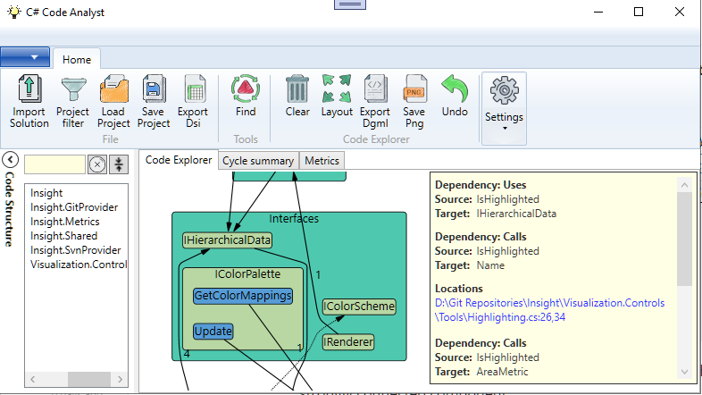

# C# Code Analyst

 **Under development**

This application helps you to explore, understand and maintain C# code.

## Exploring your code base

- Add code elements from the tree view to the canvas.
- Context menu on a code element allows you to explore relationships between code elements.
- Automatically connect all code elements using the context menu in empty space around the graph.
- If the Quick Info Panel is active
  - **Control + Left Mouse Click** keeps the quick help for the clicked element active.

- Panning: **Shift + Left Mouse Button + Move Mouse** in empty canvas space.

- Export graphs to DGML for further analysis in Visual Studio.

## Find and visualize cycles in your code base

**Note:  This function finds strongly connected components in the code graph, not the elementary cycles. **

A strongly connected component is a subgraph where a path exists between any two nodes. There may be more than one elementary cycle in the same strongly connected component.

Use the context menu to copy the related code elements to the explorer graph for further investigation.

## Dependency Structure Matrix (DSM)

**Not tested.**

A **DSM** shows all dependencies in your code base in a compact matrix. It requires time to get used to it.

For some explanation see https://dsmsuite.github.io/.

C# Code Analyst integrates the **DSM Suite Viewer**.

The viewer came from this repository.
https://github.com/ernstaii/dsmsuite.sourcecode
originally forked from
https://github.com/dsmsuite/dsmsuite.sourcecode

## Limitations

- There is currently a bug in the graph layout package that may crash the application when you collapse sub graphs.
-  The graph package does also not support multiple edges between the same code elements when sub graphs are used. The edges are combined in this case.
- Collapsing sub graphs does not re-map the incoming dependencies to the collapsed sub graph. If you want to see this, export the graph to DGML and open in Visual Studio.
- The directory structure of the source code is completely ignored. Keep this in mind when searching for cycles.
- The tree view search may be very slow depending on the result.
- The source locations are not extracted for all dependencies. Just the ones that are easy to extract.
- External code is ignored.
- The C# Roslyn part only focuses on the most common language constructs. But even the supported language constructs may be incomplete. For (known) unsupported syntax see [Documentation\Uncovered C# Syntax.md](Documentation/Uncovered C# Syntax.md)

## Thank you

- All the beautiful **images** in the user interface are <a href="https://de.freepik.com/search">Images from juicy_fish on Freepik</a>
  Direct link to the collection: [Icon-Portfolio des Autors Juicy_fish | Freepik](https://de.freepik.com/autor/juicy-fish/icons)

- Drawing the dependency graphs is possible due to the **"Automatic Graph Layout"** package.
  https://github.com/microsoft/automatic-graph-layout

- The DSM viewer is from the **DSM Suite** project.
  https://github.com/ernstaii/dsmsuite.sourcecode
  https://github.com/dsmsuite/dsmsuite.sourcecode

## Supporting this project

If you want to support this project create an issue when you find uncovered cases or bugs.